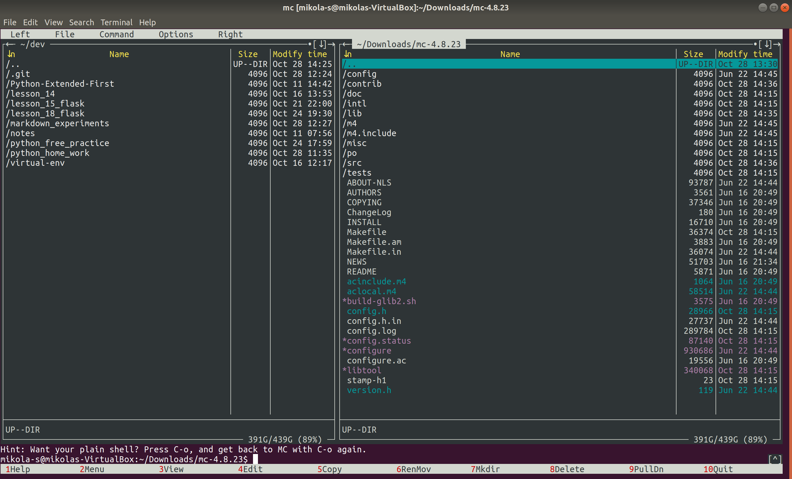

## Домашнее задание №18
### Установить Midnight Commander

#### Скачивание исходника (wget)

<details open="open">
	<summary>wget http://ftp.midnight-commander.org/mc-4.8.23.tar.xz</summary>	

```

mikola-s@mikolas-VirtualBox:~/Downloads$ wget http://ftp.midnight-commander.org/mc-4.8.23.tar.xz
--2019-10-28 13:06:07--  http://ftp.midnight-commander.org/mc-4.8.23.tar.xz
Resolving ftp.midnight-commander.org (ftp.midnight-commander.org)... 140.211.166.134, 64.50.236.52, 64.50.233.100, ...
Connecting to ftp.midnight-commander.org (ftp.midnight-commander.org)|140.211.166.134|:80... connected.
HTTP request sent, awaiting response... 200 OK
Length: 2552944 (2.4M) [application/x-xz]
Saving to: ‘mc-4.8.23.tar.xz’

mc-4.8.23.tar.xz   100%[=============================================================>]   2.43M   419KB/s    in 6.3s    

2019-10-28 13:06:14 (394 KB/s) - ‘mc-4.8.23.tar.xz’ saved [2552944/2552944]

mikola-s@mikolas-VirtualBox:~/Downloads$

```

</details>


#### Распаковка архива (tar)

опции для распаковки 

 -x, --extract, --get       extract files from an archive

 -v, --verbose              verbosely list files processed

 -f, --file=ARCHIVE         use archive file or device ARCHIVE


<details>
	<summary>tar -xvf mc-4.8.23.tar.xz</summary>

```bash

mikola-s@mikolas-VirtualBox:~/Downloads$ tar -xvf mc-4.8.23.tar.xz 
mc-4.8.23/
mc-4.8.23/config/
mc-4.8.23/config/compile
mc-4.8.23/config/config.guess
mc-4.8.23/config/config.rpath
mc-4.8.23/config/config.sub
mc-4.8.23/config/install-sh
mc-4.8.23/config/ltmain.sh
mc-4.8.23/config/missing
mc-4.8.23/config/depcomp
mc-4.8.23/config/test-driver
mc-4.8.23/intl/
mc-4.8.23/intl/Makefile.in
mc-4.8.23/intl/ChangeLog
mc-4.8.23/intl/config.charset
mc-4.8.23/intl/locale.alias
mc-4.8.23/intl/ref-add.sin
mc-4.8.23/intl/ref-del.sin
mc-4.8.23/intl/export.h
mc-4.8.23/intl/libintl.rc
mc-4.8.23/intl/gmo.h
mc-4.8.23/intl/gettextP.h
mc-4.8.23/intl/hash-string.h
mc-4.8.23/intl/loadinfo.h
mc-4.8.23/intl/plural-exp.h
mc-4.8.23/intl/eval-plural.h
mc-4.8.23/intl/localcharset.h
mc-4.8.23/intl/lock.h
mc-4.8.23/intl/relocatable.h
mc-4.8.23/intl/tsearch.h
mc-4.8.23/intl/tsearch.c
mc-4.8.23/intl/xsize.h
mc-4.8.23/intl/printf-args.h
mc-4.8.23/intl/printf-args.c
mc-4.8.23/intl/printf-parse.h
mc-4.8.23/intl/wprintf-parse.h
mc-4.8.23/intl/printf-parse.c
mc-4.8.23/intl/vasnprintf.h
mc-4.8.23/intl/vasnwprintf.h
mc-4.8.23/intl/vasnprintf.c
mc-4.8.23/intl/os2compat.h
mc-4.8.23/intl/libgnuintl.h.in
mc-4.8.23/intl/bindtextdom.c
mc-4.8.23/intl/dcgettext.c
mc-4.8.23/intl/dgettext.c
mc-4.8.23/intl/gettext.c
mc-4.8.23/intl/finddomain.c
mc-4.8.23/intl/hash-string.c
mc-4.8.23/intl/loadmsgcat.c
mc-4.8.23/intl/localealias.c
mc-4.8.23/intl/textdomain.c
mc-4.8.23/intl/l10nflist.c
mc-4.8.23/intl/explodename.c
mc-4.8.23/intl/dcigettext.c
mc-4.8.23/intl/dcngettext.c
mc-4.8.23/intl/dngettext.c
mc-4.8.23/intl/ngettext.c
mc-4.8.23/intl/plural.y
mc-4.8.23/intl/plural-exp.c
mc-4.8.23/intl/localcharset.c
mc-4.8.23/intl/threadlib.c
mc-4.8.23/intl/lock.c
mc-4.8.23/intl/relocatable.c
mc-4.8.23/intl/langprefs.c
mc-4.8.23/intl/localename.c
mc-4.8.23/intl/log.c
mc-4.8.23/intl/printf.c
mc-4.8.23/intl/setlocale.c
mc-4.8.23/intl/version.c
mc-4.8.23/intl/osdep.c
mc-4.8.23/intl/os2compat.c
mc-4.8.23/intl/intl-exports.c
mc-4.8.23/intl/intl-compat.c
mc-4.8.23/intl/plural.c
mc-4.8.23/intl/VERSION
mc-4.8.23/m4/
mc-4.8.23/m4/codeset.m4
mc-4.8.23/m4/fcntl-o.m4
mc-4.8.23/m4/gettext.m4
mc-4.8.23/m4/glibc2.m4
mc-4.8.23/m4/glibc21.m4
mc-4.8.23/m4/iconv.m4
mc-4.8.23/m4/intdiv0.m4
mc-4.8.23/m4/intl.m4
mc-4.8.23/m4/intlmacosx.m4
mc-4.8.23/m4/intmax.m4
mc-4.8.23/m4/inttypes-pri.m4
mc-4.8.23/m4/inttypes_h.m4
mc-4.8.23/m4/lcmessage.m4
mc-4.8.23/m4/lib-ld.m4
mc-4.8.23/m4/lib-link.m4
mc-4.8.23/m4/lib-prefix.m4
mc-4.8.23/m4/libtool.m4
mc-4.8.23/m4/lock.m4
mc-4.8.23/m4/longlong.m4
mc-4.8.23/m4/ltoptions.m4
mc-4.8.23/m4/ltsugar.m4
mc-4.8.23/m4/ltversion.m4
mc-4.8.23/m4/lt~obsolete.m4
mc-4.8.23/m4/nls.m4
mc-4.8.23/m4/po.m4
mc-4.8.23/m4/printf-posix.m4
mc-4.8.23/m4/progtest.m4
mc-4.8.23/m4/size_max.m4
mc-4.8.23/m4/stdint_h.m4
mc-4.8.23/m4/threadlib.m4
mc-4.8.23/m4/uintmax_t.m4
mc-4.8.23/m4/visibility.m4
mc-4.8.23/m4/wchar_t.m4
mc-4.8.23/m4/wint_t.m4
mc-4.8.23/m4/xsize.m4
mc-4.8.23/m4.include/
mc-4.8.23/m4.include/gnulib/
mc-4.8.23/m4.include/gnulib/mode_t.m4
mc-4.8.23/m4.include/gnulib/stat-size.m4
mc-4.8.23/m4.include/gnulib/fstypename.m4
mc-4.8.23/m4.include/gnulib/fsusage.m4
mc-4.8.23/m4.include/gnulib/mountlist.m4
mc-4.8.23/m4.include/gnulib/windows-stat-inodes.m4
mc-4.8.23/m4.include/gnulib/sys_types_h.m4
mc-4.8.23/m4.include/vfs/
mc-4.8.23/m4.include/vfs/rpc.m4
mc-4.8.23/m4.include/vfs/socket.m4
mc-4.8.23/m4.include/vfs/mc-vfs-extfs.m4
mc-4.8.23/m4.include/vfs/mc-vfs-sfs.m4
mc-4.8.23/m4.include/vfs/mc-vfs-ftp.m4
mc-4.8.23/m4.include/vfs/mc-vfs-sftp.m4
mc-4.8.23/m4.include/vfs/mc-vfs-fish.m4
mc-4.8.23/m4.include/vfs/mc-vfs-undelfs.m4
mc-4.8.23/m4.include/vfs/mc-vfs-tarfs.m4
mc-4.8.23/m4.include/vfs/mc-vfs-cpiofs.m4
mc-4.8.23/m4.include/vfs/mc-vfs-samba.m4
mc-4.8.23/m4.include/ax_path_lib_pcre.m4
mc-4.8.23/m4.include/dx_doxygen.m4
mc-4.8.23/m4.include/mc-cflags.m4
mc-4.8.23/m4.include/ax_gcc_func_attribute.m4
mc-4.8.23/m4.include/mc-check-search-type.m4
mc-4.8.23/m4.include/mc-get-fs-info.m4
mc-4.8.23/m4.include/mc-with-x.m4
mc-4.8.23/m4.include/mc-use-termcap.m4
mc-4.8.23/m4.include/mc-with-screen.m4
mc-4.8.23/m4.include/mc-with-screen-ncurses.m4
mc-4.8.23/m4.include/mc-with-screen-slang.m4
mc-4.8.23/m4.include/mc-with-internal-edit.m4
mc-4.8.23/m4.include/mc-subshell.m4
mc-4.8.23/m4.include/mc-background.m4
mc-4.8.23/m4.include/mc-glib.m4
mc-4.8.23/m4.include/mc-vfs.m4
mc-4.8.23/m4.include/mc-version.m4
mc-4.8.23/m4.include/mc-tests.m4
mc-4.8.23/m4.include/mc-i18n.m4
mc-4.8.23/m4.include/mc-assert.m4
mc-4.8.23/tests/
mc-4.8.23/tests/src/
mc-4.8.23/tests/src/vfs/
mc-4.8.23/tests/src/vfs/extfs/
mc-4.8.23/tests/src/vfs/extfs/helpers-list/
mc-4.8.23/tests/src/vfs/extfs/helpers-list/data/
mc-4.8.23/tests/src/vfs/extfs/helpers-list/data/config.sh.in
mc-4.8.23/tests/src/vfs/extfs/helpers-list/data/hp48+.README
mc-4.8.23/tests/src/vfs/extfs/helpers-list/data/hp48+.args
mc-4.8.23/tests/src/vfs/extfs/helpers-list/data/hp48+.input
mc-4.8.23/tests/src/vfs/extfs/helpers-list/data/hp48+.output
mc-4.8.23/tests/src/vfs/extfs/helpers-list/data/lslR.1.spaces.args
mc-4.8.23/tests/src/vfs/extfs/helpers-list/data/lslR.1.spaces.input
mc-4.8.23/tests/src/vfs/extfs/helpers-list/data/lslR.1.spaces.output
mc-4.8.23/tests/src/vfs/extfs/helpers-list/data/lslR.2.spaces-iso.args
mc-4.8.23/tests/src/vfs/extfs/helpers-list/data/lslR.2.spaces-iso.input
mc-4.8.23/tests/src/vfs/extfs/helpers-list/data/lslR.2.spaces-iso.output
mc-4.8.23/tests/src/vfs/extfs/helpers-list/data/lslR.3.spaces-iso-noslash.args
mc-4.8.23/tests/src/vfs/extfs/helpers-list/data/lslR.3.spaces-iso-noslash.input
mc-4.8.23/tests/src/vfs/extfs/helpers-list/data/lslR.3.spaces-iso-noslash.output
mc-4.8.23/tests/src/vfs/extfs/helpers-list/data/lslR.README
mc-4.8.23/tests/src/vfs/extfs/helpers-list/data/rpm.README
mc-4.8.23/tests/src/vfs/extfs/helpers-list/data/rpm.custom.env_vars
mc-4.8.23/tests/src/vfs/extfs/helpers-list/data/rpm.custom.input
mc-4.8.23/tests/src/vfs/extfs/helpers-list/data/rpm.custom.output
mc-4.8.23/tests/src/vfs/extfs/helpers-list/data/rpm.glib.env_vars
mc-4.8.23/tests/src/vfs/extfs/helpers-list/data/rpm.glib.input
mc-4.8.23/tests/src/vfs/extfs/helpers-list/data/rpm.glib.output
mc-4.8.23/tests/src/vfs/extfs/helpers-list/data/rpm.rewrite.sh
mc-4.8.23/tests/src/vfs/extfs/helpers-list/data/u7z.README
mc-4.8.23/tests/src/vfs/extfs/helpers-list/data/u7z.complex.env_vars
mc-4.8.23/tests/src/vfs/extfs/helpers-list/data/u7z.complex.input
mc-4.8.23/tests/src/vfs/extfs/helpers-list/data/u7z.complex.output
mc-4.8.23/tests/src/vfs/extfs/helpers-list/data/u7z.missing-date.env_vars
mc-4.8.23/tests/src/vfs/extfs/helpers-list/data/u7z.missing-date.input
mc-4.8.23/tests/src/vfs/extfs/helpers-list/data/u7z.missing-date.output
mc-4.8.23/tests/src/vfs/extfs/helpers-list/data/u7z.missing-size-and-date.env_vars
mc-4.8.23/tests/src/vfs/extfs/helpers-list/data/u7z.missing-size-and-date.input
mc-4.8.23/tests/src/vfs/extfs/helpers-list/data/u7z.missing-size-and-date.output
mc-4.8.23/tests/src/vfs/extfs/helpers-list/data/u7z.simple.input
mc-4.8.23/tests/src/vfs/extfs/helpers-list/data/u7z.simple.output
mc-4.8.23/tests/src/vfs/extfs/helpers-list/data/uace.README
mc-4.8.23/tests/src/vfs/extfs/helpers-list/data/uace.input
mc-4.8.23/tests/src/vfs/extfs/helpers-list/data/uace.output
mc-4.8.23/tests/src/vfs/extfs/helpers-list/data/uarc.README
mc-4.8.23/tests/src/vfs/extfs/helpers-list/data/uarc.input
mc-4.8.23/tests/src/vfs/extfs/helpers-list/data/uarc.output
mc-4.8.23/tests/src/vfs/extfs/helpers-list/data/urar.README
mc-4.8.23/tests/src/vfs/extfs/helpers-list/data/urar.v4,v3.env_vars
mc-4.8.23/tests/src/vfs/extfs/helpers-list/data/urar.v4,v3.input
mc-4.8.23/tests/src/vfs/extfs/helpers-list/data/urar.v4,v3.output
mc-4.8.23/tests/src/vfs/extfs/helpers-list/data/urar.v5.env_vars
mc-4.8.23/tests/src/vfs/extfs/helpers-list/data/urar.v5.input
mc-4.8.23/tests/src/vfs/extfs/helpers-list/data/urar.v5.output
mc-4.8.23/tests/src/vfs/extfs/helpers-list/data/uzip.README
mc-4.8.23/tests/src/vfs/extfs/helpers-list/data/uzip.with-zipinfo.env_vars
mc-4.8.23/tests/src/vfs/extfs/helpers-list/data/uzip.with-zipinfo.input
mc-4.8.23/tests/src/vfs/extfs/helpers-list/data/uzip.with-zipinfo.output
mc-4.8.23/tests/src/vfs/extfs/helpers-list/data/uzip.without-zipinfo--mdy.env_vars
mc-4.8.23/tests/src/vfs/extfs/helpers-list/data/uzip.without-zipinfo--mdy.input
mc-4.8.23/tests/src/vfs/extfs/helpers-list/data/uzip.without-zipinfo--mdy.output
mc-4.8.23/tests/src/vfs/extfs/helpers-list/data/uzip.without-zipinfo--ymd.env_vars
mc-4.8.23/tests/src/vfs/extfs/helpers-list/data/uzip.without-zipinfo--ymd.input
mc-4.8.23/tests/src/vfs/extfs/helpers-list/data/uzip.without-zipinfo--ymd.output
mc-4.8.23/tests/src/vfs/extfs/helpers-list/data/uzoo.README
mc-4.8.23/tests/src/vfs/extfs/helpers-list/data/uzoo.input
mc-4.8.23/tests/src/vfs/extfs/helpers-list/data/uzoo.output
mc-4.8.23/tests/src/vfs/extfs/helpers-list/data/dummy
mc-4.8.23/tests/src/vfs/extfs/helpers-list/Makefile.am
mc-4.8.23/tests/src/vfs/extfs/helpers-list/Makefile.in
mc-4.8.23/tests/src/vfs/extfs/helpers-list/README
mc-4.8.23/tests/src/vfs/extfs/helpers-list/mc_parse_ls_l.c
mc-4.8.23/tests/src/vfs/extfs/helpers-list/mc_xcat
mc-4.8.23/tests/src/vfs/extfs/helpers-list/test_all
mc-4.8.23/tests/src/vfs/extfs/helpers-list/README.css.inc
mc-4.8.23/tests/src/vfs/extfs/helpers-list/misc/
mc-4.8.23/tests/src/vfs/extfs/helpers-list/misc/rpm/
mc-4.8.23/tests/src/vfs/extfs/helpers-list/misc/rpm/rpm2tags.pl
mc-4.8.23/tests/src/vfs/extfs/helpers-list/misc/rpm/test.spec
mc-4.8.23/tests/src/vfs/extfs/helpers-list/misc/Makefile.am
mc-4.8.23/tests/src/vfs/extfs/helpers-list/misc/Makefile.in
mc-4.8.23/tests/src/vfs/extfs/Makefile.am
mc-4.8.23/tests/src/vfs/extfs/Makefile.in
mc-4.8.23/tests/src/vfs/Makefile.am
mc-4.8.23/tests/src/vfs/Makefile.in
mc-4.8.23/tests/src/Makefile.am
mc-4.8.23/tests/src/Makefile.in
mc-4.8.23/tests/src/execute__execute_external_editor_or_viewer.c
mc-4.8.23/tests/src/execute__execute_get_external_cmd_opts_from_config.c
mc-4.8.23/tests/src/execute__execute_with_vfs_arg.c
mc-4.8.23/tests/src/execute__common.c
mc-4.8.23/tests/src/filemanager/
mc-4.8.23/tests/src/filemanager/hints/
mc-4.8.23/tests/src/filemanager/hints/mc.hint
mc-4.8.23/tests/src/filemanager/Makefile.am
mc-4.8.23/tests/src/filemanager/Makefile.in
mc-4.8.23/tests/src/filemanager/do_cd_command.c
mc-4.8.23/tests/src/filemanager/examine_cd.c
mc-4.8.23/tests/src/filemanager/exec_get_export_variables_ext.c
mc-4.8.23/tests/src/filemanager/filegui_is_wildcarded.c
mc-4.8.23/tests/src/filemanager/get_random_hint.c
mc-4.8.23/tests/src/editor/
mc-4.8.23/tests/src/editor/Makefile.am
mc-4.8.23/tests/src/editor/Makefile.in
mc-4.8.23/tests/src/editor/test-data.txt.in
mc-4.8.23/tests/src/editor/editcmd__edit_complete_word_cmd.c
mc-4.8.23/tests/src/editor/mc.charsets
mc-4.8.23/tests/Makefile.am
mc-4.8.23/tests/Makefile.in
mc-4.8.23/tests/README
mc-4.8.23/tests/mctest.h
mc-4.8.23/tests/lib/
mc-4.8.23/tests/lib/Makefile.am
mc-4.8.23/tests/lib/Makefile.in
mc-4.8.23/tests/lib/library_independ.c
mc-4.8.23/tests/lib/mc_build_filename.c
mc-4.8.23/tests/lib/mc_realpath.c
mc-4.8.23/tests/lib/name_quote.c
mc-4.8.23/tests/lib/serialize.c
mc-4.8.23/tests/lib/utilunix__my_system-fork_child.c
mc-4.8.23/tests/lib/utilunix__my_system-fork_child_shell.c
mc-4.8.23/tests/lib/utilunix__my_system-fork_fail.c
mc-4.8.23/tests/lib/x_basename.c
mc-4.8.23/tests/lib/utilunix__my_system-common.c
mc-4.8.23/tests/lib/mcconfig/
mc-4.8.23/tests/lib/mcconfig/Makefile.am
mc-4.8.23/tests/lib/mcconfig/Makefile.in
mc-4.8.23/tests/lib/mcconfig/config_string.c
mc-4.8.23/tests/lib/mcconfig/user_configs_path.c
mc-4.8.23/tests/lib/search/
mc-4.8.23/tests/lib/search/Makefile.am
mc-4.8.23/tests/lib/search/Makefile.in
mc-4.8.23/tests/lib/search/glob_prepare_replace_str.c
mc-4.8.23/tests/lib/search/glob_translate_to_regex.c
mc-4.8.23/tests/lib/search/hex_translate_to_regex.c
mc-4.8.23/tests/lib/search/regex_process_escape_sequence.c
mc-4.8.23/tests/lib/search/regex_replace_esc_seq.c
mc-4.8.23/tests/lib/search/translate_replace_glob_to_regex.c
mc-4.8.23/tests/lib/strutil/
mc-4.8.23/tests/lib/strutil/Makefile.am
mc-4.8.23/tests/lib/strutil/Makefile.in
mc-4.8.23/tests/lib/strutil/filevercmp.c
mc-4.8.23/tests/lib/strutil/parse_integer.c
mc-4.8.23/tests/lib/strutil/replace__str_replace_all.c
mc-4.8.23/tests/lib/strutil/str_verscmp.c
mc-4.8.23/tests/lib/vfs/
mc-4.8.23/tests/lib/vfs/Makefile.am
mc-4.8.23/tests/lib/vfs/Makefile.in
mc-4.8.23/tests/lib/vfs/canonicalize_pathname.c
mc-4.8.23/tests/lib/vfs/current_dir.c
mc-4.8.23/tests/lib/vfs/path_cmp.c
mc-4.8.23/tests/lib/vfs/path_len.c
mc-4.8.23/tests/lib/vfs/path_manipulations.c
mc-4.8.23/tests/lib/vfs/path_recode.c
mc-4.8.23/tests/lib/vfs/path_serialize.c
mc-4.8.23/tests/lib/vfs/relative_cd.c
mc-4.8.23/tests/lib/vfs/tempdir.c
mc-4.8.23/tests/lib/vfs/vfs_adjust_stat.c
mc-4.8.23/tests/lib/vfs/vfs_get_encoding.c
mc-4.8.23/tests/lib/vfs/vfs_parse_ls_lga.c
mc-4.8.23/tests/lib/vfs/vfs_path_from_str_flags.c
mc-4.8.23/tests/lib/vfs/vfs_path_string_convert.c
mc-4.8.23/tests/lib/vfs/vfs_prefix_to_class.c
mc-4.8.23/tests/lib/vfs/vfs_s_get_path.c
mc-4.8.23/tests/lib/vfs/vfs_setup_cwd.c
mc-4.8.23/tests/lib/vfs/vfs_split.c
mc-4.8.23/tests/lib/vfs/mc.charsets
mc-4.8.23/tests/lib/widget/
mc-4.8.23/tests/lib/widget/Makefile.am
mc-4.8.23/tests/lib/widget/Makefile.in
mc-4.8.23/tests/lib/widget/complete_engine.c
mc-4.8.23/Makefile.am
mc-4.8.23/configure
mc-4.8.23/acinclude.m4
mc-4.8.23/configure.ac
mc-4.8.23/aclocal.m4
mc-4.8.23/build-glib2.sh
mc-4.8.23/version.h
mc-4.8.23/Makefile.in
mc-4.8.23/config.h.in
mc-4.8.23/ABOUT-NLS
mc-4.8.23/AUTHORS
mc-4.8.23/COPYING
mc-4.8.23/ChangeLog
mc-4.8.23/INSTALL
mc-4.8.23/NEWS
mc-4.8.23/README
mc-4.8.23/po/
mc-4.8.23/po/Makefile.in.in
mc-4.8.23/po/remove-potcdate.sin
mc-4.8.23/po/quot.sed
mc-4.8.23/po/boldquot.sed
mc-4.8.23/po/en@quot.header
mc-4.8.23/po/en@boldquot.header
mc-4.8.23/po/insert-header.sin
mc-4.8.23/po/Rules-quot
mc-4.8.23/po/Makevars
mc-4.8.23/po/POTFILES.in
mc-4.8.23/po/az.po
mc-4.8.23/po/be.po
mc-4.8.23/po/bg.po
mc-4.8.23/po/ca.po
mc-4.8.23/po/cs.po
mc-4.8.23/po/da.po
mc-4.8.23/po/de.po
mc-4.8.23/po/de_CH.po
mc-4.8.23/po/el.po
mc-4.8.23/po/en_GB.po
mc-4.8.23/po/eo.po
mc-4.8.23/po/es.po
mc-4.8.23/po/et.po
mc-4.8.23/po/eu.po
mc-4.8.23/po/fa.po
mc-4.8.23/po/fi.po
mc-4.8.23/po/fr.po
mc-4.8.23/po/fr_CA.po
mc-4.8.23/po/gl.po
mc-4.8.23/po/hr.po
mc-4.8.23/po/hu.po
mc-4.8.23/po/ia.po
mc-4.8.23/po/id.po
mc-4.8.23/po/it.po
mc-4.8.23/po/ja.po
mc-4.8.23/po/ka.po
mc-4.8.23/po/kk.po
mc-4.8.23/po/ko.po
mc-4.8.23/po/lt.po
mc-4.8.23/po/lv.po
mc-4.8.23/po/mn.po
mc-4.8.23/po/nb.po
mc-4.8.23/po/nl.po
mc-4.8.23/po/pl.po
mc-4.8.23/po/pt.po
mc-4.8.23/po/pt_BR.po
mc-4.8.23/po/ro.po
mc-4.8.23/po/ru.po
mc-4.8.23/po/sk.po
mc-4.8.23/po/sl.po
mc-4.8.23/po/sr.po
mc-4.8.23/po/sv.po
mc-4.8.23/po/szl.po
mc-4.8.23/po/ta.po
mc-4.8.23/po/te.po
mc-4.8.23/po/tr.po
mc-4.8.23/po/uk.po
mc-4.8.23/po/vi.po
mc-4.8.23/po/wa.po
mc-4.8.23/po/zh_CN.po
mc-4.8.23/po/zh_TW.po
mc-4.8.23/po/az.gmo
mc-4.8.23/po/be.gmo
mc-4.8.23/po/bg.gmo
mc-4.8.23/po/ca.gmo
mc-4.8.23/po/cs.gmo
mc-4.8.23/po/da.gmo
mc-4.8.23/po/de.gmo
mc-4.8.23/po/de_CH.gmo
mc-4.8.23/po/el.gmo
mc-4.8.23/po/en_GB.gmo
mc-4.8.23/po/eo.gmo
mc-4.8.23/po/es.gmo
mc-4.8.23/po/et.gmo
mc-4.8.23/po/eu.gmo
mc-4.8.23/po/fa.gmo
mc-4.8.23/po/fi.gmo
mc-4.8.23/po/fr.gmo
mc-4.8.23/po/fr_CA.gmo
mc-4.8.23/po/gl.gmo
mc-4.8.23/po/hr.gmo
mc-4.8.23/po/hu.gmo
mc-4.8.23/po/ia.gmo
mc-4.8.23/po/id.gmo
mc-4.8.23/po/it.gmo
mc-4.8.23/po/ja.gmo
mc-4.8.23/po/ka.gmo
mc-4.8.23/po/kk.gmo
mc-4.8.23/po/ko.gmo
mc-4.8.23/po/lt.gmo
mc-4.8.23/po/lv.gmo
mc-4.8.23/po/mn.gmo
mc-4.8.23/po/nb.gmo
mc-4.8.23/po/nl.gmo
mc-4.8.23/po/pl.gmo
mc-4.8.23/po/pt.gmo
mc-4.8.23/po/pt_BR.gmo
mc-4.8.23/po/ro.gmo
mc-4.8.23/po/ru.gmo
mc-4.8.23/po/sk.gmo
mc-4.8.23/po/sl.gmo
mc-4.8.23/po/sr.gmo
mc-4.8.23/po/sv.gmo
mc-4.8.23/po/szl.gmo
mc-4.8.23/po/ta.gmo
mc-4.8.23/po/te.gmo
mc-4.8.23/po/tr.gmo
mc-4.8.23/po/uk.gmo
mc-4.8.23/po/vi.gmo
mc-4.8.23/po/wa.gmo
mc-4.8.23/po/zh_CN.gmo
mc-4.8.23/po/zh_TW.gmo
mc-4.8.23/po/mc.pot
mc-4.8.23/po/stamp-po
mc-4.8.23/po/LINGUAS
mc-4.8.23/lib/
mc-4.8.23/lib/Makefile.am
mc-4.8.23/lib/Makefile.in
mc-4.8.23/lib/event.h
mc-4.8.23/lib/event-types.h
mc-4.8.23/lib/filehighlight.h
mc-4.8.23/lib/mcconfig.h
mc-4.8.23/lib/search.h
mc-4.8.23/lib/skin.h
mc-4.8.23/lib/strescape.h
mc-4.8.23/lib/strutil.h
mc-4.8.23/lib/widget.h
mc-4.8.23/lib/utilunix.c
mc-4.8.23/lib/utilunix.h
mc-4.8.23/lib/unixcompat.h
mc-4.8.23/lib/util.c
mc-4.8.23/lib/util.h
mc-4.8.23/lib/fileloc.h
mc-4.8.23/lib/fs.h
mc-4.8.23/lib/hook.c
mc-4.8.23/lib/hook.h
mc-4.8.23/lib/glibcompat.c
mc-4.8.23/lib/glibcompat.h
mc-4.8.23/lib/global.c
mc-4.8.23/lib/global.h
mc-4.8.23/lib/keybind.c
mc-4.8.23/lib/keybind.h
mc-4.8.23/lib/lock.c
mc-4.8.23/lib/lock.h
mc-4.8.23/lib/serialize.c
mc-4.8.23/lib/serialize.h
mc-4.8.23/lib/shell.c
mc-4.8.23/lib/shell.h
mc-4.8.23/lib/stat-size.h
mc-4.8.23/lib/timefmt.c
mc-4.8.23/lib/timefmt.h
mc-4.8.23/lib/timer.c
mc-4.8.23/lib/timer.h
mc-4.8.23/lib/logging.c
mc-4.8.23/lib/logging.h
mc-4.8.23/lib/charsets.c
mc-4.8.23/lib/charsets.h
mc-4.8.23/lib/event/
mc-4.8.23/lib/event/Makefile.am
mc-4.8.23/lib/event/Makefile.in
mc-4.8.23/lib/event/event.c
mc-4.8.23/lib/event/internal.h
mc-4.8.23/lib/event/manage.c
mc-4.8.23/lib/event/raise.c
mc-4.8.23/lib/filehighlight/
mc-4.8.23/lib/filehighlight/Makefile.am
mc-4.8.23/lib/filehighlight/Makefile.in
mc-4.8.23/lib/filehighlight/common.c
mc-4.8.23/lib/filehighlight/get-color.c
mc-4.8.23/lib/filehighlight/ini-file-read.c
mc-4.8.23/lib/filehighlight/internal.h
mc-4.8.23/lib/mcconfig/
mc-4.8.23/lib/mcconfig/Makefile.am
mc-4.8.23/lib/mcconfig/Makefile.in
mc-4.8.23/lib/mcconfig/common.c
mc-4.8.23/lib/mcconfig/get.c
mc-4.8.23/lib/mcconfig/set.c
mc-4.8.23/lib/mcconfig/paths.c
mc-4.8.23/lib/search/
mc-4.8.23/lib/search/Makefile.am
mc-4.8.23/lib/search/Makefile.in
mc-4.8.23/lib/search/search.c
mc-4.8.23/lib/search/internal.h
mc-4.8.23/lib/search/lib.c
mc-4.8.23/lib/search/normal.c
mc-4.8.23/lib/search/regex.c
mc-4.8.23/lib/search/glob.c
mc-4.8.23/lib/search/hex.c
mc-4.8.23/lib/skin/
mc-4.8.23/lib/skin/Makefile.am
mc-4.8.23/lib/skin/Makefile.in
mc-4.8.23/lib/skin/colors.c
mc-4.8.23/lib/skin/colors-old.c
mc-4.8.23/lib/skin/common.c
mc-4.8.23/lib/skin/hc-skins.c
mc-4.8.23/lib/skin/ini-file.c
mc-4.8.23/lib/skin/lines.c
mc-4.8.23/lib/skin/internal.h
mc-4.8.23/lib/tty/
mc-4.8.23/lib/tty/Makefile.am
mc-4.8.23/lib/tty/Makefile.in
mc-4.8.23/lib/tty/color-internal.c
mc-4.8.23/lib/tty/color-internal.h
mc-4.8.23/lib/tty/color.c
mc-4.8.23/lib/tty/color.h
mc-4.8.23/lib/tty/key.c
mc-4.8.23/lib/tty/key.h
mc-4.8.23/lib/tty/keyxdef.c
mc-4.8.23/lib/tty/mouse.c
mc-4.8.23/lib/tty/mouse.h
mc-4.8.23/lib/tty/tty.c
mc-4.8.23/lib/tty/tty.h
mc-4.8.23/lib/tty/tty-internal.h
mc-4.8.23/lib/tty/win.c
mc-4.8.23/lib/tty/win.h
mc-4.8.23/lib/tty/x11conn.c
mc-4.8.23/lib/tty/x11conn.h
mc-4.8.23/lib/tty/color-ncurses.c
mc-4.8.23/lib/tty/tty-ncurses.c
mc-4.8.23/lib/tty/tty-ncurses.h
mc-4.8.23/lib/tty/color-slang.c
mc-4.8.23/lib/tty/color-slang.h
mc-4.8.23/lib/tty/tty-slang.c
mc-4.8.23/lib/tty/tty-slang.h
mc-4.8.23/lib/vfs/
mc-4.8.23/lib/vfs/Makefile.am
mc-4.8.23/lib/vfs/Makefile.in
mc-4.8.23/lib/vfs/README
mc-4.8.23/lib/vfs/direntry.c
mc-4.8.23/lib/vfs/gc.c
mc-4.8.23/lib/vfs/gc.h
mc-4.8.23/lib/vfs/interface.c
mc-4.8.23/lib/vfs/parse_ls_vga.c
mc-4.8.23/lib/vfs/path.c
mc-4.8.23/lib/vfs/path.h
mc-4.8.23/lib/vfs/vfs.c
mc-4.8.23/lib/vfs/vfs.h
mc-4.8.23/lib/vfs/utilvfs.c
mc-4.8.23/lib/vfs/utilvfs.h
mc-4.8.23/lib/vfs/xdirentry.h
mc-4.8.23/lib/vfs/netutil.c
mc-4.8.23/lib/vfs/netutil.h
mc-4.8.23/lib/vfs/HACKING
mc-4.8.23/lib/strutil/
mc-4.8.23/lib/strutil/Makefile.am
mc-4.8.23/lib/strutil/Makefile.in
mc-4.8.23/lib/strutil/filevercmp.c
mc-4.8.23/lib/strutil/replace.c
mc-4.8.23/lib/strutil/strescape.c
mc-4.8.23/lib/strutil/strutil8bit.c
mc-4.8.23/lib/strutil/strutilascii.c
mc-4.8.23/lib/strutil/strutil.c
mc-4.8.23/lib/strutil/strutilutf8.c
mc-4.8.23/lib/strutil/strverscmp.c
mc-4.8.23/lib/strutil/xstrtol.c
mc-4.8.23/lib/widget/
mc-4.8.23/lib/widget/Makefile.am
mc-4.8.23/lib/widget/Makefile.in
mc-4.8.23/lib/widget/button.c
mc-4.8.23/lib/widget/button.h
mc-4.8.23/lib/widget/buttonbar.c
mc-4.8.23/lib/widget/buttonbar.h
mc-4.8.23/lib/widget/check.c
mc-4.8.23/lib/widget/check.h
mc-4.8.23/lib/widget/dialog.c
mc-4.8.23/lib/widget/dialog.h
mc-4.8.23/lib/widget/dialog-switch.c
mc-4.8.23/lib/widget/dialog-switch.h
mc-4.8.23/lib/widget/gauge.c
mc-4.8.23/lib/widget/gauge.h
mc-4.8.23/lib/widget/groupbox.c
mc-4.8.23/lib/widget/groupbox.h
mc-4.8.23/lib/widget/hline.c
mc-4.8.23/lib/widget/hline.h
mc-4.8.23/lib/widget/history.c
mc-4.8.23/lib/widget/history.h
mc-4.8.23/lib/widget/input.c
mc-4.8.23/lib/widget/input.h
mc-4.8.23/lib/widget/input_complete.c
mc-4.8.23/lib/widget/input_complete.h
mc-4.8.23/lib/widget/listbox-window.c
mc-4.8.23/lib/widget/listbox-window.h
mc-4.8.23/lib/widget/listbox.c
mc-4.8.23/lib/widget/listbox.h
mc-4.8.23/lib/widget/label.c
mc-4.8.23/lib/widget/label.h
mc-4.8.23/lib/widget/menu.c
mc-4.8.23/lib/widget/menu.h
mc-4.8.23/lib/widget/mouse.c
mc-4.8.23/lib/widget/mouse.h
mc-4.8.23/lib/widget/quick.c
mc-4.8.23/lib/widget/quick.h
mc-4.8.23/lib/widget/radio.c
mc-4.8.23/lib/widget/radio.h
mc-4.8.23/lib/widget/widget-common.c
mc-4.8.23/lib/widget/widget-common.h
mc-4.8.23/lib/widget/wtools.c
mc-4.8.23/lib/widget/wtools.h
mc-4.8.23/src/
mc-4.8.23/src/consaver/
mc-4.8.23/src/consaver/cons.saver.h
mc-4.8.23/src/consaver/Makefile.am
mc-4.8.23/src/consaver/Makefile.in
mc-4.8.23/src/consaver/cons.saver.c
mc-4.8.23/src/Makefile.am
mc-4.8.23/src/Makefile.in
mc-4.8.23/src/cons.handler.c
mc-4.8.23/src/args.c
mc-4.8.23/src/args.h
mc-4.8.23/src/clipboard.c
mc-4.8.23/src/clipboard.h
mc-4.8.23/src/events_init.c
mc-4.8.23/src/events_init.h
mc-4.8.23/src/execute.c
mc-4.8.23/src/execute.h
mc-4.8.23/src/help.c
mc-4.8.23/src/help.h
mc-4.8.23/src/history.h
mc-4.8.23/src/keybind-defaults.c
mc-4.8.23/src/keybind-defaults.h
mc-4.8.23/src/learn.c
mc-4.8.23/src/learn.h
mc-4.8.23/src/setup.c
mc-4.8.23/src/setup.h
mc-4.8.23/src/textconf.c
mc-4.8.23/src/textconf.h
mc-4.8.23/src/usermenu.c
mc-4.8.23/src/usermenu.h
mc-4.8.23/src/util.c
mc-4.8.23/src/util.h
mc-4.8.23/src/selcodepage.c
mc-4.8.23/src/selcodepage.h
mc-4.8.23/src/background.c
mc-4.8.23/src/background.h
mc-4.8.23/src/main.c
mc-4.8.23/src/filemanager/
mc-4.8.23/src/filemanager/Makefile.am
mc-4.8.23/src/filemanager/Makefile.in
mc-4.8.23/src/filemanager/achown.c
mc-4.8.23/src/filemanager/achown.h
mc-4.8.23/src/filemanager/boxes.c
mc-4.8.23/src/filemanager/boxes.h
mc-4.8.23/src/filemanager/chmod.c
mc-4.8.23/src/filemanager/chmod.h
mc-4.8.23/src/filemanager/chown.c
mc-4.8.23/src/filemanager/chown.h
mc-4.8.23/src/filemanager/cmd.c
mc-4.8.23/src/filemanager/cmd.h
mc-4.8.23/src/filemanager/command.c
mc-4.8.23/src/filemanager/command.h
mc-4.8.23/src/filemanager/dir.c
mc-4.8.23/src/filemanager/dir.h
mc-4.8.23/src/filemanager/ext.c
mc-4.8.23/src/filemanager/ext.h
mc-4.8.23/src/filemanager/file.c
mc-4.8.23/src/filemanager/file.h
mc-4.8.23/src/filemanager/filegui.c
mc-4.8.23/src/filemanager/filegui.h
mc-4.8.23/src/filemanager/filenot.c
mc-4.8.23/src/filemanager/filenot.h
mc-4.8.23/src/filemanager/fileopctx.c
mc-4.8.23/src/filemanager/fileopctx.h
mc-4.8.23/src/filemanager/find.c
mc-4.8.23/src/filemanager/find.h
mc-4.8.23/src/filemanager/hotlist.c
mc-4.8.23/src/filemanager/hotlist.h
mc-4.8.23/src/filemanager/info.c
mc-4.8.23/src/filemanager/info.h
mc-4.8.23/src/filemanager/ioblksize.h
mc-4.8.23/src/filemanager/layout.c
mc-4.8.23/src/filemanager/layout.h
mc-4.8.23/src/filemanager/midnight.h
mc-4.8.23/src/filemanager/midnight.c
mc-4.8.23/src/filemanager/mountlist.c
mc-4.8.23/src/filemanager/mountlist.h
mc-4.8.23/src/filemanager/panelize.c
mc-4.8.23/src/filemanager/panelize.h
mc-4.8.23/src/filemanager/panel.c
mc-4.8.23/src/filemanager/panel.h
mc-4.8.23/src/filemanager/tree.c
mc-4.8.23/src/filemanager/tree.h
mc-4.8.23/src/filemanager/treestore.c
mc-4.8.23/src/filemanager/treestore.h
mc-4.8.23/src/man2hlp/
mc-4.8.23/src/man2hlp/Makefile.am
mc-4.8.23/src/man2hlp/Makefile.in
mc-4.8.23/src/man2hlp/man2hlp.in
mc-4.8.23/src/vfs/
mc-4.8.23/src/vfs/Makefile.am
mc-4.8.23/src/vfs/Makefile.in
mc-4.8.23/src/vfs/plugins_init.c
mc-4.8.23/src/vfs/plugins_init.h
mc-4.8.23/src/vfs/local/
mc-4.8.23/src/vfs/local/Makefile.am
mc-4.8.23/src/vfs/local/Makefile.in
mc-4.8.23/src/vfs/local/local.c
mc-4.8.23/src/vfs/local/local.h
mc-4.8.23/src/vfs/cpio/
mc-4.8.23/src/vfs/cpio/Makefile.am
mc-4.8.23/src/vfs/cpio/Makefile.in
mc-4.8.23/src/vfs/cpio/cpio.c
mc-4.8.23/src/vfs/cpio/cpio.h
mc-4.8.23/src/vfs/extfs/
mc-4.8.23/src/vfs/extfs/Makefile.am
mc-4.8.23/src/vfs/extfs/Makefile.in
mc-4.8.23/src/vfs/extfs/extfs.c
mc-4.8.23/src/vfs/extfs/extfs.h
mc-4.8.23/src/vfs/extfs/helpers/
mc-4.8.23/src/vfs/extfs/helpers/Makefile.am
mc-4.8.23/src/vfs/extfs/helpers/Makefile.in
mc-4.8.23/src/vfs/extfs/helpers/a+.in
mc-4.8.23/src/vfs/extfs/helpers/apt+.in
mc-4.8.23/src/vfs/extfs/helpers/audio.in
mc-4.8.23/src/vfs/extfs/helpers/deb.in
mc-4.8.23/src/vfs/extfs/helpers/deba.in
mc-4.8.23/src/vfs/extfs/helpers/debd.in
mc-4.8.23/src/vfs/extfs/helpers/dpkg+.in
mc-4.8.23/src/vfs/extfs/helpers/hp48+.in
mc-4.8.23/src/vfs/extfs/helpers/iso9660.in
mc-4.8.23/src/vfs/extfs/helpers/lslR.in
mc-4.8.23/src/vfs/extfs/helpers/mailfs.in
mc-4.8.23/src/vfs/extfs/helpers/patchfs.in
mc-4.8.23/src/vfs/extfs/helpers/rpms+.in
mc-4.8.23/src/vfs/extfs/helpers/s3+.in
mc-4.8.23/src/vfs/extfs/helpers/uace.in
mc-4.8.23/src/vfs/extfs/helpers/ualz.in
mc-4.8.23/src/vfs/extfs/helpers/uar.in
mc-4.8.23/src/vfs/extfs/helpers/uarc.in
mc-4.8.23/src/vfs/extfs/helpers/uarj.in
mc-4.8.23/src/vfs/extfs/helpers/uc1541.in
mc-4.8.23/src/vfs/extfs/helpers/ucab.in
mc-4.8.23/src/vfs/extfs/helpers/uha.in
mc-4.8.23/src/vfs/extfs/helpers/ulha.in
mc-4.8.23/src/vfs/extfs/helpers/ulib.in
mc-4.8.23/src/vfs/extfs/helpers/urar.in
mc-4.8.23/src/vfs/extfs/helpers/uzip.in
mc-4.8.23/src/vfs/extfs/helpers/uzoo.in
mc-4.8.23/src/vfs/extfs/helpers/README
mc-4.8.23/src/vfs/extfs/helpers/README.extfs
mc-4.8.23/src/vfs/extfs/helpers/bpp
mc-4.8.23/src/vfs/extfs/helpers/changesetfs
mc-4.8.23/src/vfs/extfs/helpers/gitfs+
mc-4.8.23/src/vfs/extfs/helpers/patchsetfs
mc-4.8.23/src/vfs/extfs/helpers/rpm
mc-4.8.23/src/vfs/extfs/helpers/trpm
mc-4.8.23/src/vfs/extfs/helpers/u7z
mc-4.8.23/src/vfs/fish/
mc-4.8.23/src/vfs/fish/Makefile.am
mc-4.8.23/src/vfs/fish/Makefile.in
mc-4.8.23/src/vfs/fish/fish.c
mc-4.8.23/src/vfs/fish/fish.h
mc-4.8.23/src/vfs/fish/fishdef.h
mc-4.8.23/src/vfs/fish/helpers/
mc-4.8.23/src/vfs/fish/helpers/Makefile.am
mc-4.8.23/src/vfs/fish/helpers/Makefile.in
mc-4.8.23/src/vfs/fish/helpers/README.fish
mc-4.8.23/src/vfs/fish/helpers/ls
mc-4.8.23/src/vfs/fish/helpers/mkdir
mc-4.8.23/src/vfs/fish/helpers/fexists
mc-4.8.23/src/vfs/fish/helpers/unlink
mc-4.8.23/src/vfs/fish/helpers/chown
mc-4.8.23/src/vfs/fish/helpers/chmod
mc-4.8.23/src/vfs/fish/helpers/rmdir
mc-4.8.23/src/vfs/fish/helpers/ln
mc-4.8.23/src/vfs/fish/helpers/mv
mc-4.8.23/src/vfs/fish/helpers/hardlink
mc-4.8.23/src/vfs/fish/helpers/get
mc-4.8.23/src/vfs/fish/helpers/send
mc-4.8.23/src/vfs/fish/helpers/append
mc-4.8.23/src/vfs/fish/helpers/info
mc-4.8.23/src/vfs/fish/helpers/utime
mc-4.8.23/src/vfs/ftpfs/
mc-4.8.23/src/vfs/ftpfs/Makefile.am
mc-4.8.23/src/vfs/ftpfs/Makefile.in
mc-4.8.23/src/vfs/ftpfs/ftpfs.c
mc-4.8.23/src/vfs/ftpfs/ftpfs.h
mc-4.8.23/src/vfs/sftpfs/
mc-4.8.23/src/vfs/sftpfs/Makefile.am
mc-4.8.23/src/vfs/sftpfs/Makefile.in
mc-4.8.23/src/vfs/sftpfs/config_parser.c
mc-4.8.23/src/vfs/sftpfs/connection.c
mc-4.8.23/src/vfs/sftpfs/dir.c
mc-4.8.23/src/vfs/sftpfs/file.c
mc-4.8.23/src/vfs/sftpfs/init.c
mc-4.8.23/src/vfs/sftpfs/init.h
mc-4.8.23/src/vfs/sftpfs/internal.c
mc-4.8.23/src/vfs/sftpfs/internal.h
mc-4.8.23/src/vfs/sftpfs/vfs_class.c
mc-4.8.23/src/vfs/sftpfs/vfs_subclass.c
mc-4.8.23/src/vfs/sfs/
mc-4.8.23/src/vfs/sfs/Makefile.am
mc-4.8.23/src/vfs/sfs/Makefile.in
mc-4.8.23/src/vfs/sfs/sfs.c
mc-4.8.23/src/vfs/sfs/sfs.h
mc-4.8.23/src/vfs/sfs/sfs.ini
mc-4.8.23/src/vfs/smbfs/
mc-4.8.23/src/vfs/smbfs/Makefile.am
mc-4.8.23/src/vfs/smbfs/Makefile.in
mc-4.8.23/src/vfs/smbfs/smbfs.c
mc-4.8.23/src/vfs/smbfs/smbfs.h
mc-4.8.23/src/vfs/smbfs/helpers/
mc-4.8.23/src/vfs/smbfs/helpers/include/
mc-4.8.23/src/vfs/smbfs/helpers/include/byteorder.h
mc-4.8.23/src/vfs/smbfs/helpers/include/charset.h
mc-4.8.23/src/vfs/smbfs/helpers/include/client.h
mc-4.8.23/src/vfs/smbfs/helpers/include/config.h.in
mc-4.8.23/src/vfs/smbfs/helpers/include/includes.h
mc-4.8.23/src/vfs/smbfs/helpers/include/kanji.h
mc-4.8.23/src/vfs/smbfs/helpers/include/local.h
mc-4.8.23/src/vfs/smbfs/helpers/include/nameserv.h
mc-4.8.23/src/vfs/smbfs/helpers/include/nterr.h
mc-4.8.23/src/vfs/smbfs/helpers/include/proto.h
mc-4.8.23/src/vfs/smbfs/helpers/include/smb.h
mc-4.8.23/src/vfs/smbfs/helpers/include/stamp-h.in
mc-4.8.23/src/vfs/smbfs/helpers/include/trans2.h
mc-4.8.23/src/vfs/smbfs/helpers/include/version.h
mc-4.8.23/src/vfs/smbfs/helpers/lib/
mc-4.8.23/src/vfs/smbfs/helpers/lib/charcnv.c
mc-4.8.23/src/vfs/smbfs/helpers/lib/charset.c
mc-4.8.23/src/vfs/smbfs/helpers/lib/debug.c
mc-4.8.23/src/vfs/smbfs/helpers/lib/interface.c
mc-4.8.23/src/vfs/smbfs/helpers/lib/kanji.c
mc-4.8.23/src/vfs/smbfs/helpers/lib/md4.c
mc-4.8.23/src/vfs/smbfs/helpers/lib/netmask.c
mc-4.8.23/src/vfs/smbfs/helpers/lib/slprintf.c
mc-4.8.23/src/vfs/smbfs/helpers/lib/system.c
mc-4.8.23/src/vfs/smbfs/helpers/lib/time.c
mc-4.8.23/src/vfs/smbfs/helpers/lib/username.c
mc-4.8.23/src/vfs/smbfs/helpers/lib/util.c
mc-4.8.23/src/vfs/smbfs/helpers/lib/util_file.c
mc-4.8.23/src/vfs/smbfs/helpers/lib/util_sock.c
mc-4.8.23/src/vfs/smbfs/helpers/lib/util_str.c
mc-4.8.23/src/vfs/smbfs/helpers/libsmb/
mc-4.8.23/src/vfs/smbfs/helpers/libsmb/clientgen.c
mc-4.8.23/src/vfs/smbfs/helpers/libsmb/namequery.c
mc-4.8.23/src/vfs/smbfs/helpers/libsmb/nmblib.c
mc-4.8.23/src/vfs/smbfs/helpers/libsmb/nterr.c
mc-4.8.23/src/vfs/smbfs/helpers/libsmb/pwd_cache.c
mc-4.8.23/src/vfs/smbfs/helpers/libsmb/smbdes.c
mc-4.8.23/src/vfs/smbfs/helpers/libsmb/smbencrypt.c
mc-4.8.23/src/vfs/smbfs/helpers/libsmb/smberr.c
mc-4.8.23/src/vfs/smbfs/helpers/param/
mc-4.8.23/src/vfs/smbfs/helpers/param/loadparm.c
mc-4.8.23/src/vfs/smbfs/helpers/param/params.c
mc-4.8.23/src/vfs/smbfs/helpers/Makefile.in
mc-4.8.23/src/vfs/smbfs/helpers/aclocal.m4
mc-4.8.23/src/vfs/smbfs/helpers/configure.ac
mc-4.8.23/src/vfs/smbfs/helpers/configure
mc-4.8.23/src/vfs/smbfs/helpers/internals.doc
mc-4.8.23/src/vfs/smbfs/helpers/parsing.doc
mc-4.8.23/src/vfs/tar/
mc-4.8.23/src/vfs/tar/Makefile.am
mc-4.8.23/src/vfs/tar/Makefile.in
mc-4.8.23/src/vfs/tar/tar.c
mc-4.8.23/src/vfs/tar/tar.h
mc-4.8.23/src/vfs/undelfs/
mc-4.8.23/src/vfs/undelfs/Makefile.am
mc-4.8.23/src/vfs/undelfs/Makefile.in
mc-4.8.23/src/vfs/undelfs/undelfs.c
mc-4.8.23/src/vfs/undelfs/undelfs.h
mc-4.8.23/src/viewer/
mc-4.8.23/src/viewer/Makefile.am
mc-4.8.23/src/viewer/Makefile.in
mc-4.8.23/src/viewer/actions_cmd.c
mc-4.8.23/src/viewer/ascii.c
mc-4.8.23/src/viewer/coord_cache.c
mc-4.8.23/src/viewer/datasource.c
mc-4.8.23/src/viewer/dialogs.c
mc-4.8.23/src/viewer/display.c
mc-4.8.23/src/viewer/growbuf.c
mc-4.8.23/src/viewer/hex.c
mc-4.8.23/src/viewer/inlines.h
mc-4.8.23/src/viewer/internal.h
mc-4.8.23/src/viewer/lib.c
mc-4.8.23/src/viewer/mcviewer.c
mc-4.8.23/src/viewer/mcviewer.h
mc-4.8.23/src/viewer/move.c
mc-4.8.23/src/viewer/nroff.c
mc-4.8.23/src/viewer/search.c
mc-4.8.23/src/editor/
mc-4.8.23/src/editor/Makefile.am
mc-4.8.23/src/editor/Makefile.in
mc-4.8.23/src/editor/bookmark.c
mc-4.8.23/src/editor/choosesyntax.c
mc-4.8.23/src/editor/edit-impl.h
mc-4.8.23/src/editor/edit.c
mc-4.8.23/src/editor/edit.h
mc-4.8.23/src/editor/editbuffer.c
mc-4.8.23/src/editor/editbuffer.h
mc-4.8.23/src/editor/editcmd.c
mc-4.8.23/src/editor/editcmd_dialogs.c
mc-4.8.23/src/editor/editcmd_dialogs.h
mc-4.8.23/src/editor/editdraw.c
mc-4.8.23/src/editor/editmenu.c
mc-4.8.23/src/editor/editoptions.c
mc-4.8.23/src/editor/editwidget.c
mc-4.8.23/src/editor/editwidget.h
mc-4.8.23/src/editor/etags.c
mc-4.8.23/src/editor/etags.h
mc-4.8.23/src/editor/format.c
mc-4.8.23/src/editor/syntax.c
mc-4.8.23/src/editor/spell.c
mc-4.8.23/src/editor/spell.h
mc-4.8.23/src/editor/spell_dialogs.c
mc-4.8.23/src/editor/spell_dialogs.h
mc-4.8.23/src/diffviewer/
mc-4.8.23/src/diffviewer/Makefile.am
mc-4.8.23/src/diffviewer/Makefile.in
mc-4.8.23/src/diffviewer/internal.h
mc-4.8.23/src/diffviewer/search.c
mc-4.8.23/src/diffviewer/ydiff.c
mc-4.8.23/src/diffviewer/ydiff.h
mc-4.8.23/src/subshell/
mc-4.8.23/src/subshell/Makefile.am
mc-4.8.23/src/subshell/Makefile.in
mc-4.8.23/src/subshell/common.c
mc-4.8.23/src/subshell/internal.h
mc-4.8.23/src/subshell/proxyfunc.c
mc-4.8.23/src/subshell/subshell.h
mc-4.8.23/doc/
mc-4.8.23/doc/Makefile.am
mc-4.8.23/doc/Makefile.in
mc-4.8.23/doc/doxygen-include.am
mc-4.8.23/doc/COPYING
mc-4.8.23/doc/INSTALL
mc-4.8.23/doc/NEWS
mc-4.8.23/doc/README
mc-4.8.23/doc/TODO
mc-4.8.23/doc/doxygen.cfg
mc-4.8.23/doc/FAQ
mc-4.8.23/doc/HACKING
mc-4.8.23/doc/INSTALL.FAST
mc-4.8.23/doc/MAINTAINERS
mc-4.8.23/doc/README.QNX
mc-4.8.23/doc/MIRRORS.txt
mc-4.8.23/doc/hints/
mc-4.8.23/doc/hints/Makefile.am
mc-4.8.23/doc/hints/Makefile.in
mc-4.8.23/doc/hints/mc.hint
mc-4.8.23/doc/hints/l10n/
mc-4.8.23/doc/hints/l10n/Makefile.am
mc-4.8.23/doc/hints/l10n/Makefile.in
mc-4.8.23/doc/hints/l10n/mc.hint.af
mc-4.8.23/doc/hints/l10n/mc.hint.ar
mc-4.8.23/doc/hints/l10n/mc.hint.az
mc-4.8.23/doc/hints/l10n/mc.hint.be
mc-4.8.23/doc/hints/l10n/mc.hint.bg
mc-4.8.23/doc/hints/l10n/mc.hint.br
mc-4.8.23/doc/hints/l10n/mc.hint.ca
mc-4.8.23/doc/hints/l10n/mc.hint.cs
mc-4.8.23/doc/hints/l10n/mc.hint.da
mc-4.8.23/doc/hints/l10n/mc.hint.de
mc-4.8.23/doc/hints/l10n/mc.hint.de_CH
mc-4.8.23/doc/hints/l10n/mc.hint.el
mc-4.8.23/doc/hints/l10n/mc.hint.en_GB
mc-4.8.23/doc/hints/l10n/mc.hint.eo
mc-4.8.23/doc/hints/l10n/mc.hint.es
mc-4.8.23/doc/hints/l10n/mc.hint.et
mc-4.8.23/doc/hints/l10n/mc.hint.eu
mc-4.8.23/doc/hints/l10n/mc.hint.fa
mc-4.8.23/doc/hints/l10n/mc.hint.fi
mc-4.8.23/doc/hints/l10n/mc.hint.fr
mc-4.8.23/doc/hints/l10n/mc.hint.fr_CA
mc-4.8.23/doc/hints/l10n/mc.hint.ga
mc-4.8.23/doc/hints/l10n/mc.hint.gl
mc-4.8.23/doc/hints/l10n/mc.hint.he
mc-4.8.23/doc/hints/l10n/mc.hint.hr
mc-4.8.23/doc/hints/l10n/mc.hint.hu
mc-4.8.23/doc/hints/l10n/mc.hint.ia
mc-4.8.23/doc/hints/l10n/mc.hint.id
mc-4.8.23/doc/hints/l10n/mc.hint.it
mc-4.8.23/doc/hints/l10n/mc.hint.it_IT
mc-4.8.23/doc/hints/l10n/mc.hint.ja
mc-4.8.23/doc/hints/l10n/mc.hint.ka
mc-4.8.23/doc/hints/l10n/mc.hint.kk
mc-4.8.23/doc/hints/l10n/mc.hint.ko
mc-4.8.23/doc/hints/l10n/mc.hint.lt
mc-4.8.23/doc/hints/l10n/mc.hint.nl
mc-4.8.23/doc/hints/l10n/mc.hint.pl
mc-4.8.23/doc/hints/l10n/mc.hint.pt
mc-4.8.23/doc/hints/l10n/mc.hint.pt_BR
mc-4.8.23/doc/hints/l10n/mc.hint.ro
mc-4.8.23/doc/hints/l10n/mc.hint.ru
mc-4.8.23/doc/hints/l10n/mc.hint.sk
mc-4.8.23/doc/hints/l10n/mc.hint.sl
mc-4.8.23/doc/hints/l10n/mc.hint.sr
mc-4.8.23/doc/hints/l10n/mc.hint.sv
mc-4.8.23/doc/hints/l10n/mc.hint.sv_SE
mc-4.8.23/doc/hints/l10n/mc.hint.szl
mc-4.8.23/doc/hints/l10n/mc.hint.te
mc-4.8.23/doc/hints/l10n/mc.hint.tr
mc-4.8.23/doc/hints/l10n/mc.hint.uk
mc-4.8.23/doc/hints/l10n/mc.hint.uz
mc-4.8.23/doc/hints/l10n/mc.hint.zh
mc-4.8.23/doc/hints/l10n/mc.hint.zh_CN
mc-4.8.23/doc/man/
mc-4.8.23/doc/man/Makefile.am
mc-4.8.23/doc/man/Makefile.in
mc-4.8.23/doc/man/date-of-man-include.am
mc-4.8.23/doc/man/mc.1.in
mc-4.8.23/doc/man/mcedit.1.in
mc-4.8.23/doc/man/mcview.1.in
mc-4.8.23/doc/man/es/
mc-4.8.23/doc/man/es/Makefile.am
mc-4.8.23/doc/man/es/Makefile.in
mc-4.8.23/doc/man/es/mc.1.in
mc-4.8.23/doc/man/hu/
mc-4.8.23/doc/man/hu/Makefile.am
mc-4.8.23/doc/man/hu/Makefile.in
mc-4.8.23/doc/man/hu/mc.1.in
mc-4.8.23/doc/man/it/
mc-4.8.23/doc/man/it/Makefile.am
mc-4.8.23/doc/man/it/Makefile.in
mc-4.8.23/doc/man/it/mc.1.in
mc-4.8.23/doc/man/pl/
mc-4.8.23/doc/man/pl/Makefile.am
mc-4.8.23/doc/man/pl/Makefile.in
mc-4.8.23/doc/man/pl/mc.1.in
mc-4.8.23/doc/man/ru/
mc-4.8.23/doc/man/ru/Makefile.am
mc-4.8.23/doc/man/ru/Makefile.in
mc-4.8.23/doc/man/ru/mc.1.in
mc-4.8.23/doc/man/sr/
mc-4.8.23/doc/man/sr/Makefile.am
mc-4.8.23/doc/man/sr/Makefile.in
mc-4.8.23/doc/man/sr/mc.1.in
mc-4.8.23/doc/hlp/
mc-4.8.23/doc/hlp/Makefile.am
mc-4.8.23/doc/hlp/Makefile.in
mc-4.8.23/doc/hlp/xnc.hlp
mc-4.8.23/doc/hlp/es/
mc-4.8.23/doc/hlp/es/Makefile.am
mc-4.8.23/doc/hlp/es/Makefile.in
mc-4.8.23/doc/hlp/es/xnc.hlp
mc-4.8.23/doc/hlp/hlp-lang-include.am
mc-4.8.23/doc/hlp/hu/
mc-4.8.23/doc/hlp/hu/Makefile.am
mc-4.8.23/doc/hlp/hu/Makefile.in
mc-4.8.23/doc/hlp/hu/xnc.hlp
mc-4.8.23/doc/hlp/it/
mc-4.8.23/doc/hlp/it/Makefile.am
mc-4.8.23/doc/hlp/it/Makefile.in
mc-4.8.23/doc/hlp/it/xnc.hlp
mc-4.8.23/doc/hlp/pl/
mc-4.8.23/doc/hlp/pl/Makefile.am
mc-4.8.23/doc/hlp/pl/Makefile.in
mc-4.8.23/doc/hlp/pl/xnc.hlp
mc-4.8.23/doc/hlp/ru/
mc-4.8.23/doc/hlp/ru/Makefile.am
mc-4.8.23/doc/hlp/ru/Makefile.in
mc-4.8.23/doc/hlp/ru/xnc.hlp
mc-4.8.23/doc/hlp/sr/
mc-4.8.23/doc/hlp/sr/Makefile.am
mc-4.8.23/doc/hlp/sr/Makefile.in
mc-4.8.23/doc/hlp/sr/xnc.hlp
mc-4.8.23/contrib/
mc-4.8.23/contrib/Makefile.am
mc-4.8.23/contrib/Makefile.in
mc-4.8.23/contrib/mc.csh.in
mc-4.8.23/contrib/mc.sh.in
mc-4.8.23/contrib/mc-wrapper.csh.in
mc-4.8.23/contrib/mc-wrapper.sh.in
mc-4.8.23/contrib/README.xterm
mc-4.8.23/contrib/dist/
mc-4.8.23/contrib/dist/Makefile.am
mc-4.8.23/contrib/dist/Makefile.in
mc-4.8.23/contrib/dist/pkginfo.in
mc-4.8.23/contrib/dist/prototype.in
mc-4.8.23/contrib/dist/gentoo/
mc-4.8.23/contrib/dist/gentoo/Makefile.am
mc-4.8.23/contrib/dist/gentoo/Makefile.in
mc-4.8.23/contrib/dist/gentoo/README
mc-4.8.23/contrib/dist/redhat/
mc-4.8.23/contrib/dist/redhat/Makefile.am
mc-4.8.23/contrib/dist/redhat/Makefile.in
mc-4.8.23/contrib/dist/redhat/mc.spec.in
mc-4.8.23/misc/
mc-4.8.23/misc/Makefile.am
mc-4.8.23/misc/Makefile.in
mc-4.8.23/misc/mc.ext.in
mc-4.8.23/misc/mc.menu.in
mc-4.8.23/misc/mcedit.menu.in
mc-4.8.23/misc/filehighlight.ini
mc-4.8.23/misc/mc.default.keymap
mc-4.8.23/misc/mc.emacs.keymap
mc-4.8.23/misc/edit.indent.rc
mc-4.8.23/misc/xterm.ad
mc-4.8.23/misc/mc.lib
mc-4.8.23/misc/mc.charsets
mc-4.8.23/misc/ext.d/
mc-4.8.23/misc/ext.d/Makefile.am
mc-4.8.23/misc/ext.d/Makefile.in
mc-4.8.23/misc/ext.d/doc.sh.in
mc-4.8.23/misc/ext.d/misc.sh.in
mc-4.8.23/misc/ext.d/text.sh.in
mc-4.8.23/misc/ext.d/web.sh.in
mc-4.8.23/misc/ext.d/archive.sh
mc-4.8.23/misc/ext.d/image.sh
mc-4.8.23/misc/ext.d/package.sh
mc-4.8.23/misc/ext.d/sound.sh
mc-4.8.23/misc/ext.d/video.sh
mc-4.8.23/misc/macros.d/
mc-4.8.23/misc/macros.d/Makefile.am
mc-4.8.23/misc/macros.d/Makefile.in
mc-4.8.23/misc/macros.d/macro.0.sh
mc-4.8.23/misc/macros.d/macro.1.sh
mc-4.8.23/misc/macros.d/macro.3.sh
mc-4.8.23/misc/macros.d/macro.4.sh
mc-4.8.23/misc/macros.d/macro.5.sh
mc-4.8.23/misc/macros.d/macro.6.sh
mc-4.8.23/misc/macros.d/macro.7.sh
mc-4.8.23/misc/skins/
mc-4.8.23/misc/skins/Makefile.am
mc-4.8.23/misc/skins/Makefile.in
mc-4.8.23/misc/skins/dark.ini
mc-4.8.23/misc/skins/darkfar.ini
mc-4.8.23/misc/skins/default.ini
mc-4.8.23/misc/skins/double-lines.ini
mc-4.8.23/misc/skins/featured-plus.ini
mc-4.8.23/misc/skins/featured.ini
mc-4.8.23/misc/skins/gotar.ini
mc-4.8.23/misc/skins/gray-green-purple256.ini
mc-4.8.23/misc/skins/gray-orange-blue256.ini
mc-4.8.23/misc/skins/mc46.ini
mc-4.8.23/misc/skins/modarcon16-defbg.ini
mc-4.8.23/misc/skins/modarcon16.ini
mc-4.8.23/misc/skins/modarcon16root-defbg.ini
mc-4.8.23/misc/skins/modarcon16root.ini
mc-4.8.23/misc/skins/modarin256-defbg.ini
mc-4.8.23/misc/skins/modarin256.ini
mc-4.8.23/misc/skins/modarin256root-defbg.ini
mc-4.8.23/misc/skins/modarin256root.ini
mc-4.8.23/misc/skins/nicedark.ini
mc-4.8.23/misc/skins/sand256.ini
mc-4.8.23/misc/skins/seasons-autumn16M.ini
mc-4.8.23/misc/skins/seasons-spring16M.ini
mc-4.8.23/misc/skins/seasons-summer16M.ini
mc-4.8.23/misc/skins/seasons-winter16M.ini
mc-4.8.23/misc/skins/xoria256.ini
mc-4.8.23/misc/skins/yadt256-defbg.ini
mc-4.8.23/misc/skins/yadt256.ini
mc-4.8.23/misc/syntax/
mc-4.8.23/misc/syntax/Makefile.am
mc-4.8.23/misc/syntax/Makefile.in
mc-4.8.23/misc/syntax/Syntax.in
mc-4.8.23/misc/syntax/PKGBUILD.syntax
mc-4.8.23/misc/syntax/ada95.syntax
mc-4.8.23/misc/syntax/as.syntax
mc-4.8.23/misc/syntax/aspx.syntax
mc-4.8.23/misc/syntax/assembler.syntax
mc-4.8.23/misc/syntax/awk.syntax
mc-4.8.23/misc/syntax/c.syntax
mc-4.8.23/misc/syntax/cabal.syntax
mc-4.8.23/misc/syntax/changelog.syntax
mc-4.8.23/misc/syntax/cmake.syntax
mc-4.8.23/misc/syntax/cs.syntax
mc-4.8.23/misc/syntax/css.syntax
mc-4.8.23/misc/syntax/cuda.syntax
mc-4.8.23/misc/syntax/cxx.syntax
mc-4.8.23/misc/syntax/cython.syntax
mc-4.8.23/misc/syntax/d.syntax
mc-4.8.23/misc/syntax/debian-changelog.syntax
mc-4.8.23/misc/syntax/debian-control.syntax
mc-4.8.23/misc/syntax/debian-description.syntax
mc-4.8.23/misc/syntax/debian-sources-list.syntax
mc-4.8.23/misc/syntax/diff.syntax
mc-4.8.23/misc/syntax/dlink.syntax
mc-4.8.23/misc/syntax/dos.syntax
mc-4.8.23/misc/syntax/ebuild.syntax
mc-4.8.23/misc/syntax/eiffel.syntax
mc-4.8.23/misc/syntax/erlang.syntax
mc-4.8.23/misc/syntax/f90.syntax
mc-4.8.23/misc/syntax/filehighlight.syntax
mc-4.8.23/misc/syntax/fortran.syntax
mc-4.8.23/misc/syntax/glsl.syntax
mc-4.8.23/misc/syntax/go.syntax
mc-4.8.23/misc/syntax/haskell.syntax
mc-4.8.23/misc/syntax/hive.syntax
mc-4.8.23/misc/syntax/html.syntax
mc-4.8.23/misc/syntax/idl.syntax
mc-4.8.23/misc/syntax/ini.syntax
mc-4.8.23/misc/syntax/j.syntax
mc-4.8.23/misc/syntax/jal.syntax
mc-4.8.23/misc/syntax/java.syntax
mc-4.8.23/misc/syntax/js.syntax
mc-4.8.23/misc/syntax/latex.syntax
mc-4.8.23/misc/syntax/lisp.syntax
mc-4.8.23/misc/syntax/lkr.syntax
mc-4.8.23/misc/syntax/lsm.syntax
mc-4.8.23/misc/syntax/lua.syntax
mc-4.8.23/misc/syntax/m4.syntax
mc-4.8.23/misc/syntax/mail.syntax
mc-4.8.23/misc/syntax/makefile.syntax
mc-4.8.23/misc/syntax/markdown.syntax
mc-4.8.23/misc/syntax/ml.syntax
mc-4.8.23/misc/syntax/meson.syntax
mc-4.8.23/misc/syntax/named.syntax
mc-4.8.23/misc/syntax/nemerle.syntax
mc-4.8.23/misc/syntax/nroff.syntax
mc-4.8.23/misc/syntax/octave.syntax
mc-4.8.23/misc/syntax/opencl.syntax
mc-4.8.23/misc/syntax/osl.syntax
mc-4.8.23/misc/syntax/pascal.syntax
mc-4.8.23/misc/syntax/perl.syntax
mc-4.8.23/misc/syntax/php.syntax
mc-4.8.23/misc/syntax/po.syntax
mc-4.8.23/misc/syntax/povray.syntax
mc-4.8.23/misc/syntax/procmail.syntax
mc-4.8.23/misc/syntax/properties.syntax
mc-4.8.23/misc/syntax/protobuf.syntax
mc-4.8.23/misc/syntax/puppet.syntax
mc-4.8.23/misc/syntax/python.syntax
mc-4.8.23/misc/syntax/r.syntax
mc-4.8.23/misc/syntax/ruby.syntax
mc-4.8.23/misc/syntax/rust.syntax
mc-4.8.23/misc/syntax/sh.syntax
mc-4.8.23/misc/syntax/slang.syntax
mc-4.8.23/misc/syntax/smalltalk.syntax
mc-4.8.23/misc/syntax/spec.syntax
mc-4.8.23/misc/syntax/sql.syntax
mc-4.8.23/misc/syntax/strace.syntax
mc-4.8.23/misc/syntax/swig.syntax
mc-4.8.23/misc/syntax/syntax.syntax
mc-4.8.23/misc/syntax/tcl.syntax
mc-4.8.23/misc/syntax/texinfo.syntax
mc-4.8.23/misc/syntax/ts.syntax
mc-4.8.23/misc/syntax/tt.syntax
mc-4.8.23/misc/syntax/unknown.syntax
mc-4.8.23/misc/syntax/verilog.syntax
mc-4.8.23/misc/syntax/vhdl.syntax
mc-4.8.23/misc/syntax/xml.syntax
mc-4.8.23/misc/syntax/yaml.syntax
mc-4.8.23/misc/syntax/yum-repo.syntax
mc-4.8.23/misc/syntax/yxx.syntax
mikola-s@mikolas-VirtualBox:~/Downloads$ 


```

</details>


#### ./configure (первый заход)

<details>
	<summary> ./configure </summary>

```bash

mikola-s@mikolas-VirtualBox:~/Downloads/mc-4.8.23$ ./configure
checking for a BSD-compatible install... /usr/bin/install -c
checking whether build environment is sane... yes
checking for a thread-safe mkdir -p... /bin/mkdir -p
checking for gawk... no
checking for mawk... mawk
checking whether make sets $(MAKE)... yes
checking whether make supports nested variables... yes
checking whether make supports nested variables... (cached) yes
checking whether to enable maintainer-specific portions of Makefiles... no
checking build system type... x86_64-pc-linux-gnu
checking host system type... x86_64-pc-linux-gnu
checking whether make supports the include directive... yes (GNU style)
checking for gcc... gcc
checking whether the C compiler works... yes
checking for C compiler default output file name... a.out
checking for suffix of executables... 
checking whether we are cross compiling... no
checking for suffix of object files... o
checking whether we are using the GNU C compiler... yes
checking whether gcc accepts -g... yes
checking for gcc option to accept ISO C89... none needed
checking whether gcc understands -c and -o together... yes
checking dependency style of gcc... gcc3
checking how to run the C preprocessor... gcc -E
checking for grep that handles long lines and -e... /bin/grep
checking for egrep... /bin/grep -E
checking for ANSI C header files... yes
checking for sys/types.h... yes
checking for sys/stat.h... yes
checking for stdlib.h... yes
checking for string.h... yes
checking for memory.h... yes
checking for strings.h... yes
checking for inttypes.h... yes
checking for stdint.h... yes
checking for unistd.h... yes
checking minix/config.h usability... no
checking minix/config.h presence... no
checking for minix/config.h... no
checking whether it is safe to define __EXTENSIONS__... yes
checking for gcc option to accept ISO C99... none needed
checking for gcc option to accept ISO Standard C... (cached) none needed
checking whether gcc accepts -fdiagnostics-show-option... yes
checking whether gcc accepts -Wassign-enum... no
checking whether gcc accepts -Wbad-function-cast... yes
checking whether gcc accepts -Wcomment... yes
checking whether gcc accepts -Wconditional-uninitialized... no
checking whether gcc accepts -Wdeclaration-after-statement... yes
checking whether gcc accepts -Wfloat-conversion... yes
checking whether gcc accepts -Wfloat-equal... yes
checking whether gcc accepts -Wformat... yes
checking whether gcc accepts -Wformat-security... yes
checking whether gcc accepts -Wformat-signedness... yes
checking whether gcc accepts -Wimplicit... yes
checking whether gcc accepts -Wimplicit-fallthrough... yes
checking whether gcc accepts -Wignored-qualifiers... yes
checking whether gcc accepts -Wlogical-not-parentheses... yes
checking whether gcc accepts -Wmaybe-uninitialized... yes
checking whether gcc accepts -Wmissing-braces... yes
checking whether gcc accepts -Wmissing-declarations... yes
checking whether gcc accepts -Wmissing-field-initializers... yes
checking whether gcc accepts -Wmissing-format-attribute... yes
checking whether gcc accepts -Wmissing-parameter-type... yes
checking whether gcc accepts -Wmissing-prototypes... yes
checking whether gcc accepts -Wmissing-variable-declarations... no
checking whether gcc accepts -Wnested-externs... yes
checking whether gcc accepts -Wno-long-long... yes
checking whether gcc accepts -Wno-unreachable-code... yes
checking whether gcc accepts -Wparentheses... yes
checking whether gcc accepts -Wpointer-arith... yes
checking whether gcc accepts -Wpointer-sign... yes
checking whether gcc accepts -Wredundant-decls... yes
checking whether gcc accepts -Wreturn-type... yes
checking whether gcc accepts -Wsequence-point... yes
checking whether gcc accepts -Wshadow... yes
checking whether gcc accepts -Wsign-compare... yes
checking whether gcc accepts -Wstrict-prototypes... yes
checking whether gcc accepts -Wswitch... yes
checking whether gcc accepts -Wswitch-default... yes
checking whether gcc accepts -Wtype-limits... yes
checking whether gcc accepts -Wundef... yes
checking whether gcc accepts -Wuninitialized... yes
checking whether gcc accepts -Wunreachable-code... yes
checking whether gcc accepts -Wunused-but-set-variable... yes
checking whether gcc accepts -Wunused-function... yes
checking whether gcc accepts -Wunused-label... yes
checking whether gcc accepts -Wunused-parameter... yes
checking whether gcc accepts -Wunused-result... yes
checking whether gcc accepts -Wunused-value... yes
checking whether gcc accepts -Wunused-variable... yes
checking whether gcc accepts -Wwrite-strings... yes
checking for __attribute__((fallthrough))... yes
checking how to print strings... printf
checking for a sed that does not truncate output... /bin/sed
checking for fgrep... /bin/grep -F
checking for ld used by gcc... /usr/bin/ld
checking if the linker (/usr/bin/ld) is GNU ld... yes
checking for BSD- or MS-compatible name lister (nm)... /usr/bin/nm -B
checking the name lister (/usr/bin/nm -B) interface... BSD nm
checking whether ln -s works... yes
checking the maximum length of command line arguments... 1572864
checking how to convert x86_64-pc-linux-gnu file names to x86_64-pc-linux-gnu format... func_convert_file_noop
checking how to convert x86_64-pc-linux-gnu file names to toolchain format... func_convert_file_noop
checking for /usr/bin/ld option to reload object files... -r
checking for objdump... objdump
checking how to recognize dependent libraries... pass_all
checking for dlltool... no
checking how to associate runtime and link libraries... printf %s\n
checking for ar... ar
checking for archiver @FILE support... @
checking for strip... strip
checking for ranlib... ranlib
checking command to parse /usr/bin/nm -B output from gcc object... ok
checking for sysroot... no
checking for a working dd... /bin/dd
checking how to truncate binary pipes... /bin/dd bs=4096 count=1
checking for mt... mt
checking if mt is a manifest tool... no
checking for dlfcn.h... yes
checking for objdir... .libs
checking if gcc supports -fno-rtti -fno-exceptions... no
checking for gcc option to produce PIC... -fPIC -DPIC
checking if gcc PIC flag -fPIC -DPIC works... yes
checking if gcc static flag -static works... yes
checking if gcc supports -c -o file.o... yes
checking if gcc supports -c -o file.o... (cached) yes
checking whether the gcc linker (/usr/bin/ld -m elf_x86_64) supports shared libraries... yes
checking whether -lc should be explicitly linked in... no
checking dynamic linker characteristics... GNU/Linux ld.so
checking how to hardcode library paths into programs... immediate
checking whether stripping libraries is possible... yes
checking if libtool supports shared libraries... yes
checking whether to build shared libraries... yes
checking whether to build static libraries... yes
checking for pkg-config... /usr/bin/pkg-config
checking pkg-config is at least version 0.9.0... yes
checking whether ln -s works... yes
checking for nroff... true
checking for manual formatting macros... -mandoc
checking for option to disable ANSI color in manuals... none
checking if nroff accepts -Tlatin1 or -Tascii... -Tlatin1
checking for file... true
checking for -L option to file command... yes
checking for gnome-moz-remote... no
checking for mozilla... no
checking for firefox... firefox
checking for ar... (cached) ar
checking for CHECK... no
configure: WARNING: 'Check' testing framework not found. Check your environment
checking for sighandler_t... yes
checking for GLIB... no
configure: error: glib-2.0 not found or version too old (must be >= 2.26)


```

</details>

**результат:** `configure: error: glib-2.0 not found or version too old (must be >= 2.26)`

#### Установка glib-2.0 

<details>
	<summary> sudo apt install glib2.0 </summary>

```bash

mikola-s@mikolas-VirtualBox:~/Downloads/mc-4.8.23$ sudo apt install glib2.0
[sudo] password for mikola-s: 
Reading package lists... Done
Building dependency tree       
Reading state information... Done
Note, selecting 'libglib2.0-cil-dev' for regex 'glib2.0'
Note, selecting 'libglib2.0-tests' for regex 'glib2.0'
Note, selecting 'libglib2.0-0-dbg' for regex 'glib2.0'
Note, selecting 'libglib2.0-dev-bin' for regex 'glib2.0'
Note, selecting 'libdbus-glib2.0-cil-dev' for regex 'glib2.0'
Note, selecting 'libtaglib2.0-cil' for regex 'glib2.0'
Note, selecting 'libglib2.0-bin' for regex 'glib2.0'
Note, selecting 'libglib2.0-cil' for regex 'glib2.0'
Note, selecting 'libglib2.0-dev' for regex 'glib2.0'
Note, selecting 'libdbus-glib2.0-cil' for regex 'glib2.0'
Note, selecting 'libglib2.0-doc' for regex 'glib2.0'
Note, selecting 'libglib2.0-data' for regex 'glib2.0'
Note, selecting 'libglib2.0-0' for regex 'glib2.0'
libglib2.0-0 is already the newest version (2.56.4-0ubuntu0.18.04.4).
libglib2.0-0 set to manually installed.
libglib2.0-bin is already the newest version (2.56.4-0ubuntu0.18.04.4).
libglib2.0-bin set to manually installed.
libglib2.0-data is already the newest version (2.56.4-0ubuntu0.18.04.4).
libglib2.0-data set to manually installed.
The following packages were automatically installed and are no longer required:
  fonts-open-sans libminizip1 libopenal-data libopenal1 libtgvoip1.0.3
Use 'sudo apt autoremove' to remove them.
The following additional packages will be installed:
  binfmt-support ca-certificates-mono cli-common libdbus2.0-cil libdbus2.0-cil-dev libmono-corlib4.5-cil libmono-i18n-west4.0-cil libmono-i18n4.0-cil
  libmono-posix4.0-cil libmono-security4.0-cil libmono-system-configuration4.0-cil libmono-system-core4.0-cil libmono-system-security4.0-cil
  libmono-system-xml4.0-cil libmono-system4.0-cil libpcre16-3 libpcre3-dev libpcre32-3 libpcrecpp0v5 mono-4.0-gac mono-gac mono-runtime mono-runtime-common
  mono-runtime-sgen zlib1g-dev
Suggested packages:
  monodoc-gtk2.0-manual devhelp libmono-i18n4.0-all libgamin0
The following NEW packages will be installed:
  binfmt-support ca-certificates-mono cli-common libdbus-glib2.0-cil libdbus-glib2.0-cil-dev libdbus2.0-cil libdbus2.0-cil-dev libglib2.0-cil
  libglib2.0-cil-dev libglib2.0-dev libglib2.0-dev-bin libglib2.0-doc libglib2.0-tests libmono-corlib4.5-cil libmono-i18n-west4.0-cil libmono-i18n4.0-cil
  libmono-posix4.0-cil libmono-security4.0-cil libmono-system-configuration4.0-cil libmono-system-core4.0-cil libmono-system-security4.0-cil
  libmono-system-xml4.0-cil libmono-system4.0-cil libpcre16-3 libpcre3-dev libpcre32-3 libpcrecpp0v5 mono-4.0-gac mono-gac mono-runtime mono-runtime-common
  mono-runtime-sgen zlib1g-dev
0 upgraded, 33 newly installed, 0 to remove and 0 not upgraded.
Need to get 10.3 MB of archives.
After this operation, 61.6 MB of additional disk space will be used.
Do you want to continue? [Y/n] y 
Get:1 http://archive.ubuntu.com/ubuntu bionic/main amd64 binfmt-support amd64 2.1.8-2 [51.6 kB]
Get:2 http://archive.ubuntu.com/ubuntu bionic/universe amd64 libmono-corlib4.5-cil all 4.6.2.7+dfsg-1ubuntu1 [1,025 kB]
Get:3 http://archive.ubuntu.com/ubuntu bionic/universe amd64 libmono-system-xml4.0-cil all 4.6.2.7+dfsg-1ubuntu1 [811 kB]
Get:4 http://archive.ubuntu.com/ubuntu bionic/universe amd64 libmono-system-security4.0-cil all 4.6.2.7+dfsg-1ubuntu1 [53.3 kB]
Get:5 http://archive.ubuntu.com/ubuntu bionic/universe amd64 libmono-system-configuration4.0-cil all 4.6.2.7+dfsg-1ubuntu1 [52.4 kB]
Get:6 http://archive.ubuntu.com/ubuntu bionic/universe amd64 libmono-system4.0-cil all 4.6.2.7+dfsg-1ubuntu1 [707 kB]
Get:7 http://archive.ubuntu.com/ubuntu bionic/universe amd64 libmono-security4.0-cil all 4.6.2.7+dfsg-1ubuntu1 [226 kB]
Get:8 http://archive.ubuntu.com/ubuntu bionic/universe amd64 mono-4.0-gac all 4.6.2.7+dfsg-1ubuntu1 [20.6 kB]
Get:9 http://archive.ubuntu.com/ubuntu bionic/universe amd64 mono-gac all 4.6.2.7+dfsg-1ubuntu1 [16.3 kB]
Get:10 http://archive.ubuntu.com/ubuntu bionic/universe amd64 mono-runtime-common amd64 4.6.2.7+dfsg-1ubuntu1 [211 kB]
Get:11 http://archive.ubuntu.com/ubuntu bionic/universe amd64 mono-runtime-sgen amd64 4.6.2.7+dfsg-1ubuntu1 [1,361 kB]
Get:12 http://archive.ubuntu.com/ubuntu bionic/universe amd64 mono-runtime amd64 4.6.2.7+dfsg-1ubuntu1 [12.3 kB]
Get:13 http://archive.ubuntu.com/ubuntu bionic/universe amd64 ca-certificates-mono all 4.6.2.7+dfsg-1ubuntu1 [15.5 kB]
Get:14 http://archive.ubuntu.com/ubuntu bionic/universe amd64 cli-common all 0.9+nmu1 [171 kB]
Get:15 http://archive.ubuntu.com/ubuntu bionic/universe amd64 libmono-posix4.0-cil all 4.6.2.7+dfsg-1ubuntu1 [79.4 kB]
Get:16 http://archive.ubuntu.com/ubuntu bionic/universe amd64 libmono-system-core4.0-cil all 4.6.2.7+dfsg-1ubuntu1 [250 kB]
Get:17 http://archive.ubuntu.com/ubuntu bionic/universe amd64 libdbus2.0-cil all 0.8.1-2 [50.1 kB]
Get:18 http://archive.ubuntu.com/ubuntu bionic/universe amd64 libdbus-glib2.0-cil all 0.6.0-1build1 [7,398 B]
Get:19 http://archive.ubuntu.com/ubuntu bionic/universe amd64 libdbus2.0-cil-dev all 0.8.1-2 [2,642 B]
Get:20 http://archive.ubuntu.com/ubuntu bionic/universe amd64 libdbus-glib2.0-cil-dev all 0.6.0-1build1 [2,658 B]
Get:21 http://archive.ubuntu.com/ubuntu bionic/universe amd64 libglib2.0-cil amd64 2.12.40-2 [43.8 kB]
Get:22 http://archive.ubuntu.com/ubuntu bionic/universe amd64 libglib2.0-cil-dev amd64 2.12.40-2 [2,432 B]                                                   
Get:23 http://archive.ubuntu.com/ubuntu bionic-updates/main amd64 libglib2.0-dev-bin amd64 2.56.4-0ubuntu0.18.04.4 [102 kB]                                  
Get:24 http://archive.ubuntu.com/ubuntu bionic/main amd64 libpcre16-3 amd64 2:8.39-9 [147 kB]                                                                
Get:25 http://archive.ubuntu.com/ubuntu bionic/main amd64 libpcre32-3 amd64 2:8.39-9 [138 kB]                                                                
Get:26 http://archive.ubuntu.com/ubuntu bionic/main amd64 libpcrecpp0v5 amd64 2:8.39-9 [15.3 kB]                                                             
Get:27 http://archive.ubuntu.com/ubuntu bionic/main amd64 libpcre3-dev amd64 2:8.39-9 [537 kB]                                                               
Get:28 http://archive.ubuntu.com/ubuntu bionic/main amd64 zlib1g-dev amd64 1:1.2.11.dfsg-0ubuntu2 [176 kB]                                                   
Get:29 http://archive.ubuntu.com/ubuntu bionic-updates/main amd64 libglib2.0-dev amd64 2.56.4-0ubuntu0.18.04.4 [1,385 kB]                                    
Get:30 http://archive.ubuntu.com/ubuntu bionic-updates/main amd64 libglib2.0-doc all 2.56.4-0ubuntu0.18.04.4 [1,390 kB]                                      
Get:31 http://archive.ubuntu.com/ubuntu bionic-updates/universe amd64 libglib2.0-tests amd64 2.56.4-0ubuntu0.18.04.4 [1,209 kB]                              
Get:32 http://archive.ubuntu.com/ubuntu bionic/universe amd64 libmono-i18n4.0-cil all 4.6.2.7+dfsg-1ubuntu1 [20.5 kB]                                        
Get:33 http://archive.ubuntu.com/ubuntu bionic/universe amd64 libmono-i18n-west4.0-cil all 4.6.2.7+dfsg-1ubuntu1 [23.6 kB]                                   
Fetched 10.3 MB in 10s (1,049 kB/s)                                                                                                                          
Extracting templates from packages: 100%
Selecting previously unselected package binfmt-support.
(Reading database ... 188428 files and directories currently installed.)
Preparing to unpack .../00-binfmt-support_2.1.8-2_amd64.deb ...
Unpacking binfmt-support (2.1.8-2) ...
Selecting previously unselected package libmono-corlib4.5-cil.
Preparing to unpack .../01-libmono-corlib4.5-cil_4.6.2.7+dfsg-1ubuntu1_all.deb ...
Unpacking libmono-corlib4.5-cil (4.6.2.7+dfsg-1ubuntu1) ...
Selecting previously unselected package libmono-system-xml4.0-cil.
Preparing to unpack .../02-libmono-system-xml4.0-cil_4.6.2.7+dfsg-1ubuntu1_all.deb ...
Unpacking libmono-system-xml4.0-cil (4.6.2.7+dfsg-1ubuntu1) ...
Selecting previously unselected package libmono-system-security4.0-cil.
Preparing to unpack .../03-libmono-system-security4.0-cil_4.6.2.7+dfsg-1ubuntu1_all.deb ...
Unpacking libmono-system-security4.0-cil (4.6.2.7+dfsg-1ubuntu1) ...
Selecting previously unselected package libmono-system-configuration4.0-cil.
Preparing to unpack .../04-libmono-system-configuration4.0-cil_4.6.2.7+dfsg-1ubuntu1_all.deb ...
Unpacking libmono-system-configuration4.0-cil (4.6.2.7+dfsg-1ubuntu1) ...
Selecting previously unselected package libmono-system4.0-cil.
Preparing to unpack .../05-libmono-system4.0-cil_4.6.2.7+dfsg-1ubuntu1_all.deb ...
Unpacking libmono-system4.0-cil (4.6.2.7+dfsg-1ubuntu1) ...
Selecting previously unselected package libmono-security4.0-cil.
Preparing to unpack .../06-libmono-security4.0-cil_4.6.2.7+dfsg-1ubuntu1_all.deb ...
Unpacking libmono-security4.0-cil (4.6.2.7+dfsg-1ubuntu1) ...
Selecting previously unselected package mono-4.0-gac.
Preparing to unpack .../07-mono-4.0-gac_4.6.2.7+dfsg-1ubuntu1_all.deb ...
Unpacking mono-4.0-gac (4.6.2.7+dfsg-1ubuntu1) ...
Selecting previously unselected package mono-gac.
Preparing to unpack .../08-mono-gac_4.6.2.7+dfsg-1ubuntu1_all.deb ...
Unpacking mono-gac (4.6.2.7+dfsg-1ubuntu1) ...
Selecting previously unselected package mono-runtime-common.
Preparing to unpack .../09-mono-runtime-common_4.6.2.7+dfsg-1ubuntu1_amd64.deb ...
Unpacking mono-runtime-common (4.6.2.7+dfsg-1ubuntu1) ...
Selecting previously unselected package mono-runtime-sgen.
Preparing to unpack .../10-mono-runtime-sgen_4.6.2.7+dfsg-1ubuntu1_amd64.deb ...
Unpacking mono-runtime-sgen (4.6.2.7+dfsg-1ubuntu1) ...
Selecting previously unselected package mono-runtime.
Preparing to unpack .../11-mono-runtime_4.6.2.7+dfsg-1ubuntu1_amd64.deb ...
Unpacking mono-runtime (4.6.2.7+dfsg-1ubuntu1) ...
Selecting previously unselected package ca-certificates-mono.
Preparing to unpack .../12-ca-certificates-mono_4.6.2.7+dfsg-1ubuntu1_all.deb ...
Unpacking ca-certificates-mono (4.6.2.7+dfsg-1ubuntu1) ...
Selecting previously unselected package cli-common.
Preparing to unpack .../13-cli-common_0.9+nmu1_all.deb ...
Unpacking cli-common (0.9+nmu1) ...
Selecting previously unselected package libmono-posix4.0-cil.
Preparing to unpack .../14-libmono-posix4.0-cil_4.6.2.7+dfsg-1ubuntu1_all.deb ...
Unpacking libmono-posix4.0-cil (4.6.2.7+dfsg-1ubuntu1) ...
Selecting previously unselected package libmono-system-core4.0-cil.
Preparing to unpack .../15-libmono-system-core4.0-cil_4.6.2.7+dfsg-1ubuntu1_all.deb ...
Unpacking libmono-system-core4.0-cil (4.6.2.7+dfsg-1ubuntu1) ...
Selecting previously unselected package libdbus2.0-cil.
Preparing to unpack .../16-libdbus2.0-cil_0.8.1-2_all.deb ...
Unpacking libdbus2.0-cil (0.8.1-2) ...
Selecting previously unselected package libdbus-glib2.0-cil.
Preparing to unpack .../17-libdbus-glib2.0-cil_0.6.0-1build1_all.deb ...
Unpacking libdbus-glib2.0-cil (0.6.0-1build1) ...
Selecting previously unselected package libdbus2.0-cil-dev.
Preparing to unpack .../18-libdbus2.0-cil-dev_0.8.1-2_all.deb ...
Unpacking libdbus2.0-cil-dev (0.8.1-2) ...
Selecting previously unselected package libdbus-glib2.0-cil-dev.
Preparing to unpack .../19-libdbus-glib2.0-cil-dev_0.6.0-1build1_all.deb ...
Unpacking libdbus-glib2.0-cil-dev (0.6.0-1build1) ...
Selecting previously unselected package libglib2.0-cil.
Preparing to unpack .../20-libglib2.0-cil_2.12.40-2_amd64.deb ...
Unpacking libglib2.0-cil (2.12.40-2) ...
Selecting previously unselected package libglib2.0-cil-dev.
Preparing to unpack .../21-libglib2.0-cil-dev_2.12.40-2_amd64.deb ...
Unpacking libglib2.0-cil-dev (2.12.40-2) ...
Selecting previously unselected package libglib2.0-dev-bin.
Preparing to unpack .../22-libglib2.0-dev-bin_2.56.4-0ubuntu0.18.04.4_amd64.deb ...
Unpacking libglib2.0-dev-bin (2.56.4-0ubuntu0.18.04.4) ...
Selecting previously unselected package libpcre16-3:amd64.
Preparing to unpack .../23-libpcre16-3_2%3a8.39-9_amd64.deb ...
Unpacking libpcre16-3:amd64 (2:8.39-9) ...
Selecting previously unselected package libpcre32-3:amd64.
Preparing to unpack .../24-libpcre32-3_2%3a8.39-9_amd64.deb ...
Unpacking libpcre32-3:amd64 (2:8.39-9) ...
Selecting previously unselected package libpcrecpp0v5:amd64.
Preparing to unpack .../25-libpcrecpp0v5_2%3a8.39-9_amd64.deb ...
Unpacking libpcrecpp0v5:amd64 (2:8.39-9) ...
Selecting previously unselected package libpcre3-dev:amd64.
Preparing to unpack .../26-libpcre3-dev_2%3a8.39-9_amd64.deb ...
Unpacking libpcre3-dev:amd64 (2:8.39-9) ...
Selecting previously unselected package zlib1g-dev:amd64.
Preparing to unpack .../27-zlib1g-dev_1%3a1.2.11.dfsg-0ubuntu2_amd64.deb ...
Unpacking zlib1g-dev:amd64 (1:1.2.11.dfsg-0ubuntu2) ...
Selecting previously unselected package libglib2.0-dev:amd64.
Preparing to unpack .../28-libglib2.0-dev_2.56.4-0ubuntu0.18.04.4_amd64.deb ...
Unpacking libglib2.0-dev:amd64 (2.56.4-0ubuntu0.18.04.4) ...
Selecting previously unselected package libglib2.0-doc.
Preparing to unpack .../29-libglib2.0-doc_2.56.4-0ubuntu0.18.04.4_all.deb ...
Unpacking libglib2.0-doc (2.56.4-0ubuntu0.18.04.4) ...
Selecting previously unselected package libglib2.0-tests.
Preparing to unpack .../30-libglib2.0-tests_2.56.4-0ubuntu0.18.04.4_amd64.deb ...
Unpacking libglib2.0-tests (2.56.4-0ubuntu0.18.04.4) ...
Selecting previously unselected package libmono-i18n4.0-cil.
Preparing to unpack .../31-libmono-i18n4.0-cil_4.6.2.7+dfsg-1ubuntu1_all.deb ...
Unpacking libmono-i18n4.0-cil (4.6.2.7+dfsg-1ubuntu1) ...
Selecting previously unselected package libmono-i18n-west4.0-cil.
Preparing to unpack .../32-libmono-i18n-west4.0-cil_4.6.2.7+dfsg-1ubuntu1_all.deb ...
Unpacking libmono-i18n-west4.0-cil (4.6.2.7+dfsg-1ubuntu1) ...
Setting up binfmt-support (2.1.8-2) ...
update-binfmts: warning: /usr/share/binfmts/cli: no executable /usr/bin/cli found, but continuing anyway as you request
Created symlink /etc/systemd/system/multi-user.target.wants/binfmt-support.service → /lib/systemd/system/binfmt-support.service.
Setting up libglib2.0-doc (2.56.4-0ubuntu0.18.04.4) ...
Setting up libglib2.0-dev-bin (2.56.4-0ubuntu0.18.04.4) ...
Setting up libglib2.0-tests (2.56.4-0ubuntu0.18.04.4) ...
Setting up libpcrecpp0v5:amd64 (2:8.39-9) ...
Setting up libpcre32-3:amd64 (2:8.39-9) ...
Setting up libpcre16-3:amd64 (2:8.39-9) ...
Setting up cli-common (0.9+nmu1) ...
Setting up zlib1g-dev:amd64 (1:1.2.11.dfsg-0ubuntu2) ...
Setting up libpcre3-dev:amd64 (2:8.39-9) ...
Setting up libglib2.0-dev:amd64 (2.56.4-0ubuntu0.18.04.4) ...
Setting up libmono-security4.0-cil (4.6.2.7+dfsg-1ubuntu1) ...
Setting up mono-runtime-sgen (4.6.2.7+dfsg-1ubuntu1) ...
Setting up mono-4.0-gac (4.6.2.7+dfsg-1ubuntu1) ...
Setting up mono-runtime (4.6.2.7+dfsg-1ubuntu1) ...
update-alternatives: using /usr/bin/mono to provide /usr/bin/cli (cli) in auto mode
Setting up mono-gac (4.6.2.7+dfsg-1ubuntu1) ...
update-alternatives: using /usr/bin/gacutil to provide /usr/bin/cli-gacutil (global-assembly-cache-tool) in auto mode
Setting up mono-runtime-common (4.6.2.7+dfsg-1ubuntu1) ...
Setting up libmono-corlib4.5-cil (4.6.2.7+dfsg-1ubuntu1) ...
Setting up ca-certificates-mono (4.6.2.7+dfsg-1ubuntu1) ...
Setting up libmono-i18n4.0-cil (4.6.2.7+dfsg-1ubuntu1) ...
Setting up libmono-system-xml4.0-cil (4.6.2.7+dfsg-1ubuntu1) ...
Setting up libmono-system4.0-cil (4.6.2.7+dfsg-1ubuntu1) ...
Setting up libmono-i18n-west4.0-cil (4.6.2.7+dfsg-1ubuntu1) ...
Setting up libglib2.0-cil (2.12.40-2) ...
* Installing 1 assembly from libglib2.0-cil into Mono
Setting up libmono-posix4.0-cil (4.6.2.7+dfsg-1ubuntu1) ...
Setting up libmono-system-security4.0-cil (4.6.2.7+dfsg-1ubuntu1) ...
Setting up libglib2.0-cil-dev (2.12.40-2) ...
Setting up libmono-system-core4.0-cil (4.6.2.7+dfsg-1ubuntu1) ...
Setting up libmono-system-configuration4.0-cil (4.6.2.7+dfsg-1ubuntu1) ...
Setting up libdbus2.0-cil (0.8.1-2) ...
* Installing 1 assembly from libdbus2.0-cil into Mono
Setting up libdbus-glib2.0-cil (0.6.0-1build1) ...
* Installing 1 assembly from libdbus-glib2.0-cil into Mono
Setting up libdbus2.0-cil-dev (0.8.1-2) ...
Setting up libdbus-glib2.0-cil-dev (0.6.0-1build1) ...
Processing triggers for libc-bin (2.27-3ubuntu1) ...
Processing triggers for systemd (237-3ubuntu10.31) ...
Processing triggers for man-db (2.8.3-2ubuntu0.1) ...
Processing triggers for gnome-menus (3.13.3-11ubuntu1.1) ...
Processing triggers for ca-certificates (20180409) ...
Updating certificates in /etc/ssl/certs...
0 added, 0 removed; done.
Running hooks in /etc/ca-certificates/update.d...
Updating Mono key store
Linux Cert Store Sync - version 4.6.2.0
Synchronize local certs with certs from local Linux trust store.
Copyright 2002, 2003 Motus Technologies. Copyright 2004-2008 Novell. BSD licensed.

I already trust 0, your new list has 133
Certificate added: CN=ACCVRAIZ1, OU=PKIACCV, O=ACCV, C=ES
Certificate added: C=ES, O=FNMT-RCM, OU=AC RAIZ FNMT-RCM
Certificate added: C=IT, L=Milan, O=Actalis S.p.A./03358520967, CN=Actalis Authentication Root CA
Certificate added: C=SE, O=AddTrust AB, OU=AddTrust External TTP Network, CN=AddTrust External CA Root
Certificate added: C=US, O=AffirmTrust, CN=AffirmTrust Commercial
Certificate added: C=US, O=AffirmTrust, CN=AffirmTrust Networking
Certificate added: C=US, O=AffirmTrust, CN=AffirmTrust Premium
Certificate added: C=US, O=AffirmTrust, CN=AffirmTrust Premium ECC
Certificate added: C=US, O=Amazon, CN=Amazon Root CA 1
Certificate added: C=US, O=Amazon, CN=Amazon Root CA 2
Certificate added: C=US, O=Amazon, CN=Amazon Root CA 3
Certificate added: C=US, O=Amazon, CN=Amazon Root CA 4
Certificate added: CN=Atos TrustedRoot 2011, O=Atos, C=DE
Certificate added: C=ES, CN=Autoridad de Certificacion Firmaprofesional CIF A62634068
Certificate added: C=IE, O=Baltimore, OU=CyberTrust, CN=Baltimore CyberTrust Root
Certificate added: C=NO, O=Buypass AS-983163327, CN=Buypass Class 2 Root CA
Certificate added: C=NO, O=Buypass AS-983163327, CN=Buypass Class 3 Root CA
Certificate added: C=SK, L=Bratislava, O=Disig a.s., CN=CA Disig Root R2
Certificate added: C=CN, O=China Financial Certification Authority, CN=CFCA EV ROOT
Certificate added: C=GB, S=Greater Manchester, L=Salford, O=COMODO CA Limited, CN=COMODO Certification Authority
Certificate added: C=GB, S=Greater Manchester, L=Salford, O=COMODO CA Limited, CN=COMODO ECC Certification Authority
Certificate added: C=GB, S=Greater Manchester, L=Salford, O=COMODO CA Limited, CN=COMODO RSA Certification Authority
Certificate added: C=FR, O=Dhimyotis, CN=Certigna
Certificate added: C=FR, O=Certinomis, OU=0002 433998903, CN=Certinomis - Root CA
Certificate added: C=FR, O=Certplus, CN=Class 2 Primary CA
Certificate added: C=FR, O=Certplus, CN=Certplus Root CA G1
Certificate added: C=FR, O=Certplus, CN=Certplus Root CA G2
Certificate added: C=PL, O=Unizeto Technologies S.A., OU=Certum Certification Authority, CN=Certum Trusted Network CA
Certificate added: C=PL, O=Unizeto Technologies S.A., OU=Certum Certification Authority, CN=Certum Trusted Network CA 2
Certificate added: C=EU, L=Madrid (see current address at www.camerfirma.com/address), OID.2.5.4.5=A82743287, O=AC Camerfirma S.A., CN=Chambers of Commerce Root - 2008
Certificate added: C=GB, S=Greater Manchester, L=Salford, O=Comodo CA Limited, CN=AAA Certificate Services
Certificate added: O="Cybertrust, Inc", CN=Cybertrust Global Root
Certificate added: C=DE, O=D-Trust GmbH, CN=D-TRUST Root Class 3 CA 2 2009
Certificate added: C=DE, O=D-Trust GmbH, CN=D-TRUST Root Class 3 CA 2 EV 2009
Certificate added: O=Digital Signature Trust Co., CN=DST Root CA X3
Certificate added: C=DE, O=Deutsche Telekom AG, OU=T-TeleSec Trust Center, CN=Deutsche Telekom Root CA 2
Certificate added: C=US, O=DigiCert Inc, OU=www.digicert.com, CN=DigiCert Assured ID Root CA
Certificate added: C=US, O=DigiCert Inc, OU=www.digicert.com, CN=DigiCert Assured ID Root G2
Certificate added: C=US, O=DigiCert Inc, OU=www.digicert.com, CN=DigiCert Assured ID Root G3
Certificate added: C=US, O=DigiCert Inc, OU=www.digicert.com, CN=DigiCert Global Root CA
Certificate added: C=US, O=DigiCert Inc, OU=www.digicert.com, CN=DigiCert Global Root G2
Certificate added: C=US, O=DigiCert Inc, OU=www.digicert.com, CN=DigiCert Global Root G3
Certificate added: C=US, O=DigiCert Inc, OU=www.digicert.com, CN=DigiCert High Assurance EV Root CA
Certificate added: C=US, O=DigiCert Inc, OU=www.digicert.com, CN=DigiCert Trusted Root G4
Certificate added: C=TR, L=Ankara, O=E-Tuğra EBG Bilişim Teknolojileri ve Hizmetleri A.Ş., OU=E-Tugra Sertifikasyon Merkezi, CN=E-Tugra Certification Authority
Certificate added: C=ES, O=Agencia Catalana de Certificacio (NIF Q-0801176-I), OU=Serveis Publics de Certificacio, OU=Vegeu https://www.catcert.net/verarrel (c)03, OU=Jerarquia Entitats de Certificacio Catalanes, CN=EC-ACC
Certificate added: C=EE, O=AS Sertifitseerimiskeskus, CN=EE Certification Centre Root CA, E=pki@sk.ee
Certificate added: O=Entrust.net, OU=www.entrust.net/CPS_2048 incorp. by ref. (limits liab.), OU=(c) 1999 Entrust.net Limited, CN=Entrust.net Certification Authority (2048)
Certificate added: C=US, O="Entrust, Inc.", OU=www.entrust.net/CPS is incorporated by reference, OU="(c) 2006 Entrust, Inc.", CN=Entrust Root Certification Authority
Certificate added: C=US, O="Entrust, Inc.", OU=See www.entrust.net/legal-terms, OU="(c) 2012 Entrust, Inc. - for authorized use only", CN=Entrust Root Certification Authority - EC1
Certificate added: C=US, O="Entrust, Inc.", OU=See www.entrust.net/legal-terms, OU="(c) 2009 Entrust, Inc. - for authorized use only", CN=Entrust Root Certification Authority - G2
Certificate added: C=CN, O="GUANG DONG CERTIFICATE AUTHORITY CO.,LTD.", CN=GDCA TrustAUTH R5 ROOT
Certificate added: C=US, O=GeoTrust Inc., CN=GeoTrust Global CA
Certificate added: C=US, O=GeoTrust Inc., CN=GeoTrust Primary Certification Authority
Certificate added: C=US, O=GeoTrust Inc., OU=(c) 2007 GeoTrust Inc. - For authorized use only, CN=GeoTrust Primary Certification Authority - G2
Certificate added: C=US, O=GeoTrust Inc., OU=(c) 2008 GeoTrust Inc. - For authorized use only, CN=GeoTrust Primary Certification Authority - G3
Certificate added: C=US, O=GeoTrust Inc., CN=GeoTrust Universal CA
Certificate added: C=US, O=GeoTrust Inc., CN=GeoTrust Universal CA 2
Certificate added: OU=GlobalSign ECC Root CA - R4, O=GlobalSign, CN=GlobalSign
Certificate added: OU=GlobalSign ECC Root CA - R5, O=GlobalSign, CN=GlobalSign
Certificate added: C=BE, O=GlobalSign nv-sa, OU=Root CA, CN=GlobalSign Root CA
Certificate added: OU=GlobalSign Root CA - R2, O=GlobalSign, CN=GlobalSign
Certificate added: OU=GlobalSign Root CA - R3, O=GlobalSign, CN=GlobalSign
Certificate added: C=EU, L=Madrid (see current address at www.camerfirma.com/address), OID.2.5.4.5=A82743287, O=AC Camerfirma S.A., CN=Global Chambersign Root - 2008
Certificate added: C=US, O="The Go Daddy Group, Inc.", OU=Go Daddy Class 2 Certification Authority
Certificate added: C=US, S=Arizona, L=Scottsdale, O="GoDaddy.com, Inc.", CN=Go Daddy Root Certificate Authority - G2
Certificate added: C=GR, L=Athens, O=Hellenic Academic and Research Institutions Cert. Authority, CN=Hellenic Academic and Research Institutions ECC RootCA 2015
Certificate added: C=GR, O=Hellenic Academic and Research Institutions Cert. Authority, CN=Hellenic Academic and Research Institutions RootCA 2011
Certificate added: C=GR, L=Athens, O=Hellenic Academic and Research Institutions Cert. Authority, CN=Hellenic Academic and Research Institutions RootCA 2015
Certificate added: C=HK, O=Hongkong Post, CN=Hongkong Post Root CA 1
Certificate added: C=US, O=Internet Security Research Group, CN=ISRG Root X1
Certificate added: C=US, O=IdenTrust, CN=IdenTrust Commercial Root CA 1
Certificate added: C=US, O=IdenTrust, CN=IdenTrust Public Sector Root CA 1
Certificate added: C=ES, O=IZENPE S.A., CN=Izenpe.com
Certificate added: C=LU, O=LuxTrust S.A., CN=LuxTrust Global Root 2
Certificate added: C=HU, L=Budapest, O=Microsec Ltd., CN=Microsec e-Szigno Root CA 2009, E=info@e-szigno.hu
Certificate added: C=HU, L=Budapest, O=NetLock Kft., OU=Tanúsítványkiadók (Certification Services), CN=NetLock Arany (Class Gold) Főtanúsítvány
Certificate added: C=US, O=Network Solutions L.L.C., CN=Network Solutions Certificate Authority
Certificate added: C=CH, O=WISeKey, OU=Copyright (c) 2005, OU=OISTE Foundation Endorsed, CN=OISTE WISeKey Global Root GA CA
Certificate added: C=CH, O=WISeKey, OU=OISTE Foundation Endorsed, CN=OISTE WISeKey Global Root GB CA
Certificate added: C=FR, O=OpenTrust, CN=OpenTrust Root CA G1
Certificate added: C=FR, O=OpenTrust, CN=OpenTrust Root CA G2
Certificate added: C=FR, O=OpenTrust, CN=OpenTrust Root CA G3
Certificate added: C=BM, O=QuoVadis Limited, OU=Root Certification Authority, CN=QuoVadis Root Certification Authority
Certificate added: C=BM, O=QuoVadis Limited, CN=QuoVadis Root CA 1 G3
Certificate added: C=BM, O=QuoVadis Limited, CN=QuoVadis Root CA 2
Certificate added: C=BM, O=QuoVadis Limited, CN=QuoVadis Root CA 2 G3
Certificate added: C=BM, O=QuoVadis Limited, CN=QuoVadis Root CA 3
Certificate added: C=BM, O=QuoVadis Limited, CN=QuoVadis Root CA 3 G3
Certificate added: C=US, S=Texas, L=Houston, O=SSL Corporation, CN=SSL.com EV Root Certification Authority ECC
Certificate added: C=US, S=Texas, L=Houston, O=SSL Corporation, CN=SSL.com EV Root Certification Authority RSA R2
Certificate added: C=US, S=Texas, L=Houston, O=SSL Corporation, CN=SSL.com Root Certification Authority ECC
Certificate added: C=US, S=Texas, L=Houston, O=SSL Corporation, CN=SSL.com Root Certification Authority RSA
Certificate added: C=PL, O=Krajowa Izba Rozliczeniowa S.A., CN=SZAFIR ROOT CA2
Certificate added: C=JP, O="Japan Certification Services, Inc.", CN=SecureSign RootCA11
Certificate added: C=US, O=SecureTrust Corporation, CN=SecureTrust CA
Certificate added: C=US, O=SecureTrust Corporation, CN=Secure Global CA
Certificate added: C=JP, O="SECOM Trust Systems CO.,LTD.", OU=Security Communication RootCA2
Certificate added: C=JP, O=SECOM Trust.net, OU=Security Communication RootCA1
Certificate added: C=FI, O=Sonera, CN=Sonera Class2 CA
Certificate added: C=NL, O=Staat der Nederlanden, CN=Staat der Nederlanden EV Root CA
Certificate added: C=NL, O=Staat der Nederlanden, CN=Staat der Nederlanden Root CA - G2
Certificate added: C=NL, O=Staat der Nederlanden, CN=Staat der Nederlanden Root CA - G3
Certificate added: C=US, O="Starfield Technologies, Inc.", OU=Starfield Class 2 Certification Authority
Certificate added: C=US, S=Arizona, L=Scottsdale, O="Starfield Technologies, Inc.", CN=Starfield Root Certificate Authority - G2
Certificate added: C=US, S=Arizona, L=Scottsdale, O="Starfield Technologies, Inc.", CN=Starfield Services Root Certificate Authority - G2
Certificate added: C=CH, O=SwissSign AG, CN=SwissSign Gold CA - G2
Certificate added: C=CH, O=SwissSign AG, CN=SwissSign Silver CA - G2
Certificate added: C=DE, O=T-Systems Enterprise Services GmbH, OU=T-Systems Trust Center, CN=T-TeleSec GlobalRoot Class 2
Certificate added: C=DE, O=T-Systems Enterprise Services GmbH, OU=T-Systems Trust Center, CN=T-TeleSec GlobalRoot Class 3
Certificate added: C=TR, L=Gebze - Kocaeli, O=Turkiye Bilimsel ve Teknolojik Arastirma Kurumu - TUBITAK, OU=Kamu Sertifikasyon Merkezi - Kamu SM, CN=TUBITAK Kamu SM SSL Kok Sertifikasi - Surum 1
Certificate added: C=TW, O=TAIWAN-CA, OU=Root CA, CN=TWCA Global Root CA
Certificate added: C=TW, O=TAIWAN-CA, OU=Root CA, CN=TWCA Root Certification Authority
Certificate added: C=TW, O=Government Root Certification Authority
Certificate added: O=TeliaSonera, CN=TeliaSonera Root CA v1
Certificate added: C=PA, S=Panama, L=Panama City, O=TrustCor Systems S. de R.L., OU=TrustCor Certificate Authority, CN=TrustCor ECA-1
Certificate added: C=PA, S=Panama, L=Panama City, O=TrustCor Systems S. de R.L., OU=TrustCor Certificate Authority, CN=TrustCor RootCert CA-1
Certificate added: C=PA, S=Panama, L=Panama City, O=TrustCor Systems S. de R.L., OU=TrustCor Certificate Authority, CN=TrustCor RootCert CA-2
Certificate added: C=GB, O=Trustis Limited, OU=Trustis FPS Root CA
Certificate added: C=TR, L=Ankara, O=TÜRKTRUST Bilgi İletişim ve Bilişim Güvenliği Hizmetleri A.Ş., CN=TÜRKTRUST Elektronik Sertifika Hizmet Sağlayıcısı H5
Certificate added: C=US, S=New Jersey, L=Jersey City, O=The USERTRUST Network, CN=USERTrust ECC Certification Authority
Certificate added: C=US, S=New Jersey, L=Jersey City, O=The USERTRUST Network, CN=USERTrust RSA Certification Authority
Certificate added: C=US, O="VeriSign, Inc.", OU=VeriSign Trust Network, OU="(c) 2007 VeriSign, Inc. - For authorized use only", CN=VeriSign Class 3 Public Primary Certification Authority - G4
Certificate added: C=US, O="VeriSign, Inc.", OU=VeriSign Trust Network, OU="(c) 2006 VeriSign, Inc. - For authorized use only", CN=VeriSign Class 3 Public Primary Certification Authority - G5
Certificate added: C=US, O="VeriSign, Inc.", OU=VeriSign Trust Network, OU="(c) 2008 VeriSign, Inc. - For authorized use only", CN=VeriSign Universal Root Certification Authority
Certificate added: C=US, O="VeriSign, Inc.", OU=VeriSign Trust Network, OU="(c) 1999 VeriSign, Inc. - For authorized use only", CN=VeriSign Class 3 Public Primary Certification Authority - G3
Certificate added: C=US, O=VISA, OU=Visa International Service Association, CN=Visa eCommerce Root
Certificate added: C=US, OU=www.xrampsecurity.com, O=XRamp Security Services Inc, CN=XRamp Global Certification Authority
Certificate added: C=RO, O=certSIGN, OU=certSIGN ROOT CA
Certificate added: C=TW, O="Chunghwa Telecom Co., Ltd.", OU=ePKI Root Certification Authority
Certificate added: C=US, O="thawte, Inc.", OU=Certification Services Division, OU="(c) 2006 thawte, Inc. - For authorized use only", CN=thawte Primary Root CA
Certificate added: C=US, O="thawte, Inc.", OU="(c) 2007 thawte, Inc. - For authorized use only", CN=thawte Primary Root CA - G2
Certificate added: C=US, O="thawte, Inc.", OU=Certification Services Division, OU="(c) 2008 thawte, Inc. - For authorized use only", CN=thawte Primary Root CA - G3
133 new root certificates were added to your trust store.
Import process completed.
Done
done.
Processing triggers for mime-support (3.60ubuntu1) ...
Processing triggers for ureadahead (0.100.0-21) ...
Processing triggers for desktop-file-utils (0.23-1ubuntu3.18.04.2) ...
Processing triggers for libglib2.0-0:amd64 (2.56.4-0ubuntu0.18.04.4) ...


```

</details>

#### ./configure (второй заход)

<details>
	<summary>./configure </summary>

```bash

mikola-s@mikolas-VirtualBox:~/Downloads/mc-4.8.23$ ./configure
checking for a BSD-compatible install... /usr/bin/install -c
checking whether build environment is sane... yes
checking for a thread-safe mkdir -p... /bin/mkdir -p
checking for gawk... no
checking for mawk... mawk
checking whether make sets $(MAKE)... yes
checking whether make supports nested variables... yes
checking whether make supports nested variables... (cached) yes
checking whether to enable maintainer-specific portions of Makefiles... no
checking build system type... x86_64-pc-linux-gnu
checking host system type... x86_64-pc-linux-gnu
checking whether make supports the include directive... yes (GNU style)
checking for gcc... gcc
checking whether the C compiler works... yes
checking for C compiler default output file name... a.out
checking for suffix of executables... 
checking whether we are cross compiling... no
checking for suffix of object files... o
checking whether we are using the GNU C compiler... yes
checking whether gcc accepts -g... yes
checking for gcc option to accept ISO C89... none needed
checking whether gcc understands -c and -o together... yes
checking dependency style of gcc... gcc3
checking how to run the C preprocessor... gcc -E
checking for grep that handles long lines and -e... /bin/grep
checking for egrep... /bin/grep -E
checking for ANSI C header files... yes
checking for sys/types.h... yes
checking for sys/stat.h... yes
checking for stdlib.h... yes
checking for string.h... yes
checking for memory.h... yes
checking for strings.h... yes
checking for inttypes.h... yes
checking for stdint.h... yes
checking for unistd.h... yes
checking minix/config.h usability... no
checking minix/config.h presence... no
checking for minix/config.h... no
checking whether it is safe to define __EXTENSIONS__... yes
checking for gcc option to accept ISO C99... none needed
checking for gcc option to accept ISO Standard C... (cached) none needed
checking whether gcc accepts -fdiagnostics-show-option... yes
checking whether gcc accepts -Wassign-enum... no
checking whether gcc accepts -Wbad-function-cast... yes
checking whether gcc accepts -Wcomment... yes
checking whether gcc accepts -Wconditional-uninitialized... no
checking whether gcc accepts -Wdeclaration-after-statement... yes
checking whether gcc accepts -Wfloat-conversion... yes
checking whether gcc accepts -Wfloat-equal... yes
checking whether gcc accepts -Wformat... yes
checking whether gcc accepts -Wformat-security... yes
checking whether gcc accepts -Wformat-signedness... yes
checking whether gcc accepts -Wimplicit... yes
checking whether gcc accepts -Wimplicit-fallthrough... yes
checking whether gcc accepts -Wignored-qualifiers... yes
checking whether gcc accepts -Wlogical-not-parentheses... yes
checking whether gcc accepts -Wmaybe-uninitialized... yes
checking whether gcc accepts -Wmissing-braces... yes
checking whether gcc accepts -Wmissing-declarations... yes
checking whether gcc accepts -Wmissing-field-initializers... yes
checking whether gcc accepts -Wmissing-format-attribute... yes
checking whether gcc accepts -Wmissing-parameter-type... yes
checking whether gcc accepts -Wmissing-prototypes... yes
checking whether gcc accepts -Wmissing-variable-declarations... no
checking whether gcc accepts -Wnested-externs... yes
checking whether gcc accepts -Wno-long-long... yes
checking whether gcc accepts -Wno-unreachable-code... yes
checking whether gcc accepts -Wparentheses... yes
checking whether gcc accepts -Wpointer-arith... yes
checking whether gcc accepts -Wpointer-sign... yes
checking whether gcc accepts -Wredundant-decls... yes
checking whether gcc accepts -Wreturn-type... yes
checking whether gcc accepts -Wsequence-point... yes
checking whether gcc accepts -Wshadow... yes
checking whether gcc accepts -Wsign-compare... yes
checking whether gcc accepts -Wstrict-prototypes... yes
checking whether gcc accepts -Wswitch... yes
checking whether gcc accepts -Wswitch-default... yes
checking whether gcc accepts -Wtype-limits... yes
checking whether gcc accepts -Wundef... yes
checking whether gcc accepts -Wuninitialized... yes
checking whether gcc accepts -Wunreachable-code... yes
checking whether gcc accepts -Wunused-but-set-variable... yes
checking whether gcc accepts -Wunused-function... yes
checking whether gcc accepts -Wunused-label... yes
checking whether gcc accepts -Wunused-parameter... yes
checking whether gcc accepts -Wunused-result... yes
checking whether gcc accepts -Wunused-value... yes
checking whether gcc accepts -Wunused-variable... yes
checking whether gcc accepts -Wwrite-strings... yes
checking for __attribute__((fallthrough))... yes
checking how to print strings... printf
checking for a sed that does not truncate output... /bin/sed
checking for fgrep... /bin/grep -F
checking for ld used by gcc... /usr/bin/ld
checking if the linker (/usr/bin/ld) is GNU ld... yes
checking for BSD- or MS-compatible name lister (nm)... /usr/bin/nm -B
checking the name lister (/usr/bin/nm -B) interface... BSD nm
checking whether ln -s works... yes
checking the maximum length of command line arguments... 1572864
checking how to convert x86_64-pc-linux-gnu file names to x86_64-pc-linux-gnu format... func_convert_file_noop
checking how to convert x86_64-pc-linux-gnu file names to toolchain format... func_convert_file_noop
checking for /usr/bin/ld option to reload object files... -r
checking for objdump... objdump
checking how to recognize dependent libraries... pass_all
checking for dlltool... no
checking how to associate runtime and link libraries... printf %s\n
checking for ar... ar
checking for archiver @FILE support... @
checking for strip... strip
checking for ranlib... ranlib
checking command to parse /usr/bin/nm -B output from gcc object... ok
checking for sysroot... no
checking for a working dd... /bin/dd
checking how to truncate binary pipes... /bin/dd bs=4096 count=1
checking for mt... mt
checking if mt is a manifest tool... no
checking for dlfcn.h... yes
checking for objdir... .libs
checking if gcc supports -fno-rtti -fno-exceptions... no
checking for gcc option to produce PIC... -fPIC -DPIC
checking if gcc PIC flag -fPIC -DPIC works... yes
checking if gcc static flag -static works... yes
checking if gcc supports -c -o file.o... yes
checking if gcc supports -c -o file.o... (cached) yes
checking whether the gcc linker (/usr/bin/ld -m elf_x86_64) supports shared libraries... yes
checking whether -lc should be explicitly linked in... no
checking dynamic linker characteristics... GNU/Linux ld.so
checking how to hardcode library paths into programs... immediate
checking whether stripping libraries is possible... yes
checking if libtool supports shared libraries... yes
checking whether to build shared libraries... yes
checking whether to build static libraries... yes
checking for pkg-config... /usr/bin/pkg-config
checking pkg-config is at least version 0.9.0... yes
checking whether ln -s works... yes
checking for nroff... true
checking for manual formatting macros... -mandoc
checking for option to disable ANSI color in manuals... none
checking if nroff accepts -Tlatin1 or -Tascii... -Tlatin1
checking for file... true
checking for -L option to file command... yes
checking for gnome-moz-remote... no
checking for mozilla... no
checking for firefox... firefox
checking for ar... (cached) ar
checking for CHECK... no
configure: WARNING: 'Check' testing framework not found. Check your environment
checking for sighandler_t... yes
checking for GLIB... yes
checking for GMODULE... yes
checking for SLANG... no
checking S-Lang headers in /usr ...
checking for slang.h... no
checking for slang/slang.h... no
checking for S-Lang version 2.0 or newer... no
checking S-Lang headers in /usr/local ...
checking for slang.h... no
checking for slang/slang.h... no
checking for S-Lang version 2.0 or newer... no
configure: error: S-Lang library version 2.0 or newer not found


```
</details>

**Результат:** `configure: error: S-Lang library version 2.0 or newer not found`

#### Установка S-lang


<details>
	<summary> sudo apt install libslang2-dev </summary>

```bash

mikola-s@mikolas-VirtualBox:~/Downloads/mc-4.8.23$ sudo apt install libslang2-dev
Reading package lists... Done
Building dependency tree       
Reading state information... Done
The following packages were automatically installed and are no longer required:
  fonts-open-sans libminizip1 libopenal-data libopenal1 libtgvoip1.0.3
Use 'sudo apt autoremove' to remove them.
The following additional packages will be installed:
  libpng-dev libpng-tools
The following NEW packages will be installed:
  libpng-dev libpng-tools libslang2-dev
0 upgraded, 3 newly installed, 0 to remove and 0 not upgraded.
Need to get 596 kB of archives.
After this operation, 3,028 kB of additional disk space will be used.
Do you want to continue? [Y/n] Y
Get:1 http://archive.ubuntu.com/ubuntu bionic-updates/main amd64 libpng-dev amd64 1.6.34-1ubuntu0.18.04.2 [177 kB]
Get:2 http://archive.ubuntu.com/ubuntu bionic-updates/main amd64 libpng-tools amd64 1.6.34-1ubuntu0.18.04.2 [25.6 kB]
Get:3 http://archive.ubuntu.com/ubuntu bionic/main amd64 libslang2-dev amd64 2.3.1a-3ubuntu1 [393 kB]
Fetched 596 kB in 1s (428 kB/s)        
Selecting previously unselected package libpng-dev:amd64.
(Reading database ... 190412 files and directories currently installed.)
Preparing to unpack .../libpng-dev_1.6.34-1ubuntu0.18.04.2_amd64.deb ...
Unpacking libpng-dev:amd64 (1.6.34-1ubuntu0.18.04.2) ...
Selecting previously unselected package libpng-tools.
Preparing to unpack .../libpng-tools_1.6.34-1ubuntu0.18.04.2_amd64.deb ...
Unpacking libpng-tools (1.6.34-1ubuntu0.18.04.2) ...
Selecting previously unselected package libslang2-dev:amd64.
Preparing to unpack .../libslang2-dev_2.3.1a-3ubuntu1_amd64.deb ...
Unpacking libslang2-dev:amd64 (2.3.1a-3ubuntu1) ...
Setting up libpng-tools (1.6.34-1ubuntu0.18.04.2) ...
Setting up libpng-dev:amd64 (1.6.34-1ubuntu0.18.04.2) ...
Setting up libslang2-dev:amd64 (2.3.1a-3ubuntu1) ...
Processing triggers for man-db (2.8.3-2ubuntu0.1) ...


```

</details>

#### ./configure (третий заход)

<details>
	<summary>./configure</summary>

```bash

mikola-s@mikolas-VirtualBox:~/Downloads/mc-4.8.23$ ./configure
checking for a BSD-compatible install... /usr/bin/install -c
checking whether build environment is sane... yes
checking for a thread-safe mkdir -p... /bin/mkdir -p
checking for gawk... no
checking for mawk... mawk
checking whether make sets $(MAKE)... yes
checking whether make supports nested variables... yes
checking whether make supports nested variables... (cached) yes
checking whether to enable maintainer-specific portions of Makefiles... no
checking build system type... x86_64-pc-linux-gnu
checking host system type... x86_64-pc-linux-gnu
checking whether make supports the include directive... yes (GNU style)
checking for gcc... gcc
checking whether the C compiler works... yes
checking for C compiler default output file name... a.out
checking for suffix of executables... 
checking whether we are cross compiling... no
checking for suffix of object files... o
checking whether we are using the GNU C compiler... yes
checking whether gcc accepts -g... yes
checking for gcc option to accept ISO C89... none needed
checking whether gcc understands -c and -o together... yes
checking dependency style of gcc... gcc3
checking how to run the C preprocessor... gcc -E
checking for grep that handles long lines and -e... /bin/grep
checking for egrep... /bin/grep -E
checking for ANSI C header files... yes
checking for sys/types.h... yes
checking for sys/stat.h... yes
checking for stdlib.h... yes
checking for string.h... yes
checking for memory.h... yes
checking for strings.h... yes
checking for inttypes.h... yes
checking for stdint.h... yes
checking for unistd.h... yes
checking minix/config.h usability... no
checking minix/config.h presence... no
checking for minix/config.h... no
checking whether it is safe to define __EXTENSIONS__... yes
checking for gcc option to accept ISO C99... none needed
checking for gcc option to accept ISO Standard C... (cached) none needed
checking whether gcc accepts -fdiagnostics-show-option... yes
checking whether gcc accepts -Wassign-enum... no
checking whether gcc accepts -Wbad-function-cast... yes
checking whether gcc accepts -Wcomment... yes
checking whether gcc accepts -Wconditional-uninitialized... no
checking whether gcc accepts -Wdeclaration-after-statement... yes
checking whether gcc accepts -Wfloat-conversion... yes
checking whether gcc accepts -Wfloat-equal... yes
checking whether gcc accepts -Wformat... yes
checking whether gcc accepts -Wformat-security... yes
checking whether gcc accepts -Wformat-signedness... yes
checking whether gcc accepts -Wimplicit... yes
checking whether gcc accepts -Wimplicit-fallthrough... yes
checking whether gcc accepts -Wignored-qualifiers... yes
checking whether gcc accepts -Wlogical-not-parentheses... yes
checking whether gcc accepts -Wmaybe-uninitialized... yes
checking whether gcc accepts -Wmissing-braces... yes
checking whether gcc accepts -Wmissing-declarations... yes
checking whether gcc accepts -Wmissing-field-initializers... yes
checking whether gcc accepts -Wmissing-format-attribute... yes
checking whether gcc accepts -Wmissing-parameter-type... yes
checking whether gcc accepts -Wmissing-prototypes... yes
checking whether gcc accepts -Wmissing-variable-declarations... no
checking whether gcc accepts -Wnested-externs... yes
checking whether gcc accepts -Wno-long-long... yes
checking whether gcc accepts -Wno-unreachable-code... yes
checking whether gcc accepts -Wparentheses... yes
checking whether gcc accepts -Wpointer-arith... yes
checking whether gcc accepts -Wpointer-sign... yes
checking whether gcc accepts -Wredundant-decls... yes
checking whether gcc accepts -Wreturn-type... yes
checking whether gcc accepts -Wsequence-point... yes
checking whether gcc accepts -Wshadow... yes
checking whether gcc accepts -Wsign-compare... yes
checking whether gcc accepts -Wstrict-prototypes... yes
checking whether gcc accepts -Wswitch... yes
checking whether gcc accepts -Wswitch-default... yes
checking whether gcc accepts -Wtype-limits... yes
checking whether gcc accepts -Wundef... yes
checking whether gcc accepts -Wuninitialized... yes
checking whether gcc accepts -Wunreachable-code... yes
checking whether gcc accepts -Wunused-but-set-variable... yes
checking whether gcc accepts -Wunused-function... yes
checking whether gcc accepts -Wunused-label... yes
checking whether gcc accepts -Wunused-parameter... yes
checking whether gcc accepts -Wunused-result... yes
checking whether gcc accepts -Wunused-value... yes
checking whether gcc accepts -Wunused-variable... yes
checking whether gcc accepts -Wwrite-strings... yes
checking for __attribute__((fallthrough))... yes
checking how to print strings... printf
checking for a sed that does not truncate output... /bin/sed
checking for fgrep... /bin/grep -F
checking for ld used by gcc... /usr/bin/ld
checking if the linker (/usr/bin/ld) is GNU ld... yes
checking for BSD- or MS-compatible name lister (nm)... /usr/bin/nm -B
checking the name lister (/usr/bin/nm -B) interface... BSD nm
checking whether ln -s works... yes
checking the maximum length of command line arguments... 1572864
checking how to convert x86_64-pc-linux-gnu file names to x86_64-pc-linux-gnu format... func_convert_file_noop
checking how to convert x86_64-pc-linux-gnu file names to toolchain format... func_convert_file_noop
checking for /usr/bin/ld option to reload object files... -r
checking for objdump... objdump
checking how to recognize dependent libraries... pass_all
checking for dlltool... no
checking how to associate runtime and link libraries... printf %s\n
checking for ar... ar
checking for archiver @FILE support... @
checking for strip... strip
checking for ranlib... ranlib
checking command to parse /usr/bin/nm -B output from gcc object... ok
checking for sysroot... no
checking for a working dd... /bin/dd
checking how to truncate binary pipes... /bin/dd bs=4096 count=1
checking for mt... mt
checking if mt is a manifest tool... no
checking for dlfcn.h... yes
checking for objdir... .libs
checking if gcc supports -fno-rtti -fno-exceptions... no
checking for gcc option to produce PIC... -fPIC -DPIC
checking if gcc PIC flag -fPIC -DPIC works... yes
checking if gcc static flag -static works... yes
checking if gcc supports -c -o file.o... yes
checking if gcc supports -c -o file.o... (cached) yes
checking whether the gcc linker (/usr/bin/ld -m elf_x86_64) supports shared libraries... yes
checking whether -lc should be explicitly linked in... no
checking dynamic linker characteristics... GNU/Linux ld.so
checking how to hardcode library paths into programs... immediate
checking whether stripping libraries is possible... yes
checking if libtool supports shared libraries... yes
checking whether to build shared libraries... yes
checking whether to build static libraries... yes
checking for pkg-config... /usr/bin/pkg-config
checking pkg-config is at least version 0.9.0... yes
checking whether ln -s works... yes
checking for nroff... true
checking for manual formatting macros... -mandoc
checking for option to disable ANSI color in manuals... none
checking if nroff accepts -Tlatin1 or -Tascii... -Tlatin1
checking for file... true
checking for -L option to file command... yes
checking for gnome-moz-remote... no
checking for mozilla... no
checking for firefox... firefox
checking for ar... (cached) ar
checking for CHECK... no
configure: WARNING: 'Check' testing framework not found. Check your environment
checking for sighandler_t... yes
checking for GLIB... yes
checking for GMODULE... yes
checking for SLANG... yes
checking for slang/slang.h... no
checking for X... libraries , headers 
checking for gethostbyname... yes
checking for connect... yes
checking for remove... yes
checking for shmat... yes
checking for IceConnectionNumber in -lICE... no
checking for string.h... (cached) yes
checking for memory.h... (cached) yes
checking limits.h usability... yes
checking limits.h presence... yes
checking for limits.h... yes
checking malloc.h usability... yes
checking malloc.h presence... yes
checking for malloc.h... yes
checking utime.h usability... yes
checking utime.h presence... yes
checking for utime.h... yes
checking sys/statfs.h usability... yes
checking sys/statfs.h presence... yes
checking for sys/statfs.h... yes
checking sys/vfs.h usability... yes
checking sys/vfs.h presence... yes
checking for sys/vfs.h... yes
checking sys/select.h usability... yes
checking sys/select.h presence... yes
checking for sys/select.h... yes
checking sys/ioctl.h usability... yes
checking sys/ioctl.h presence... yes
checking for sys/ioctl.h... yes
checking stropts.h usability... yes
checking stropts.h presence... yes
checking for stropts.h... yes
checking arpa/inet.h usability... yes
checking arpa/inet.h presence... yes
checking for arpa/inet.h... yes
checking sys/socket.h usability... yes
checking sys/socket.h presence... yes
checking for sys/socket.h... yes
checking for sys/types.h... (cached) yes
checking for sys/param.h... yes
checking for stdlib.h... (cached) yes
checking for unistd.h... (cached) yes
checking for sys/statvfs.h... yes
checking for sys/vfs.h... (cached) yes
checking for sys/fs_types.h... no
checking for OS.h... no
checking for netinet/in.h... yes
checking sys/mkdev.h usability... no
checking sys/mkdev.h presence... no
checking for sys/mkdev.h... no
checking sys/sysmacros.h usability... yes
checking sys/sysmacros.h presence... yes
checking for sys/sysmacros.h... yes
checking for special C compiler options needed for large files... no
checking for _FILE_OFFSET_BITS value needed for large files... no
checking size of long... 8
checking for unsigned long long int... yes
checking for uintmax_t... yes
checking size of uintmax_t... 8
checking for off_t... yes
checking size of off_t... 8
checking for mode_t... yes
checking for promoted mode_t type... mode_t
checking for pid_t... yes
checking for uid_t in sys/types.h... yes
checking for struct stat.st_blocks... yes
checking for struct stat.st_blksize... yes
checking for struct stat.st_rdev... yes
checking for struct stat.st_mtim... yes
checking for sig_atomic_t in signal.h... yes, non volatile
checking for strverscmp... yes
checking for strncasecmp... yes
checking for realpath... yes
checking for posix_openpt... yes
checking for grantpt... yes
checking for statlstat... no
checking for getpagesize... yes
checking for working mmap... yes
checking for get_process_stats in -lseq... no
checking fcntl.h usability... yes
checking fcntl.h presence... yes
checking for fcntl.h... yes
checking for utime.h... (cached) yes
checking for listmntent... no
checking for sys/ucred.h... no
checking for sys/mount.h... yes
checking mntent.h usability... yes
checking mntent.h presence... yes
checking for mntent.h... yes
checking for sys/fs_types.h... (cached) no
checking for struct fsstat.f_fstypename... no
checking for library containing getmntent... none required
checking for getmntent... yes
checking for mntctl function and struct vmount... no
checking for one-argument getmntent function... yes
checking for setmntent... yes
checking for endmntent... yes
checking for hasmntopt... yes
checking sys/mntent.h usability... no
checking sys/mntent.h presence... no
checking for sys/mntent.h... no
checking for sys/mkdev.h... (cached) no
checking for sys/sysmacros.h... (cached) yes
checking for struct statfs.f_fstypename... no
checking for sys/mount.h... (cached) yes
checking how to get file system space usage... checking for statvfs function (SVR4)... yes
checking whether to use statvfs64... no
checking for two-argument statfs with statfs.f_frsize member... yes
checking sys/fs/s5param.h usability... no
checking sys/fs/s5param.h presence... no
checking for sys/fs/s5param.h... no
checking for sys/statfs.h... (cached) yes
checking for statfs that truncates block counts... no
checking for struct statfs.f_fstypename... (cached) no
checking nfs/vfs.h usability... no
checking nfs/vfs.h presence... no
checking for nfs/vfs.h... no
checking for struct statvfs.f_basetype... no
checking for struct statvfs.f_fstypename... no
checking for struct statvfs.f_type... no
checking for struct statfs.f_namelen... yes
checking for struct statfs.f_type... yes
checking for struct statfs.f_frsize... yes
checking whether NLS is requested... yes
checking for msgfmt... /usr/bin/msgfmt
checking for gmsgfmt... /usr/bin/msgfmt
checking for xgettext... /usr/bin/xgettext
checking for msgmerge... /usr/bin/msgmerge
checking whether we are using the GNU C Library 2 or newer... yes
checking for ranlib... (cached) ranlib
checking whether the -Werror option is usable... yes
checking for simple visibility declarations... yes
checking for inline... inline
checking for size_t... yes
checking for stdint.h... yes
checking for working alloca.h... yes
checking for alloca... yes
checking whether integer division by zero raises SIGFPE... yes
checking for inttypes.h... yes
checking for inttypes.h... (cached) yes
checking whether the inttypes.h PRIxNN macros are broken... no
checking for ld used by GCC... /usr/bin/ld -m elf_x86_64
checking if the linker (/usr/bin/ld -m elf_x86_64) is GNU ld... yes
checking for shared library run path origin... done
checking whether imported symbols can be declared weak... yes
checking pthread.h usability... yes
checking pthread.h presence... yes
checking for pthread.h... yes
checking for pthread_kill in -lpthread... yes
checking for multithread API to use... posix
checking for pthread_rwlock_t... yes
checking for iconv... yes
checking for working iconv... yes
checking for iconv declaration... 
         extern size_t iconv (iconv_t cd, char * *inbuf, size_t *inbytesleft, char * *outbuf, size_t *outbytesleft);
checking argz.h usability... yes
checking argz.h presence... yes
checking for argz.h... yes
checking for inttypes.h... (cached) yes
checking for limits.h... (cached) yes
checking for unistd.h... (cached) yes
checking for sys/param.h... (cached) yes
checking for getcwd... yes
checking for getegid... yes
checking for geteuid... yes
checking for getgid... yes
checking for getuid... yes
checking for mempcpy... yes
checking for munmap... yes
checking for stpcpy... yes
checking for strcasecmp... yes
checking for strdup... yes
checking for strtoul... yes
checking for tsearch... yes
checking for uselocale... yes
checking for argz_count... yes
checking for argz_stringify... yes
checking for argz_next... yes
checking for __fsetlocking... yes
checking whether feof_unlocked is declared... yes
checking whether fgets_unlocked is declared... yes
checking for bison... no
checking for long long int... yes
checking for wchar_t... yes
checking for wint_t... yes
checking for intmax_t... yes
checking whether printf() supports POSIX/XSI format strings... yes
checking whether we are using the GNU C Library 2.1 or newer... yes
checking for stdint.h... (cached) yes
checking for SIZE_MAX... yes
checking for stdint.h... (cached) yes
checking for working fcntl.h... yes
checking for CFPreferencesCopyAppValue... no
checking for CFLocaleCopyCurrent... no
checking for ptrdiff_t... yes
checking stddef.h usability... yes
checking stddef.h presence... yes
checking for stddef.h... yes
checking for stdlib.h... (cached) yes
checking for string.h... (cached) yes
checking for asprintf... yes
checking for fwprintf... yes
checking for newlocale... yes
checking for putenv... yes
checking for setenv... yes
checking for setlocale... yes
checking for snprintf... yes
checking for strnlen... yes
checking for wcslen... yes
checking for wcsnlen... yes
checking for mbrtowc... yes
checking for wcrtomb... yes
checking whether _snprintf is declared... no
checking whether _snwprintf is declared... no
checking whether getc_unlocked is declared... yes
checking for nl_langinfo and CODESET... yes
checking for LC_MESSAGES... yes
checking for CFPreferencesCopyAppValue... (cached) no
checking for CFLocaleCopyCurrent... (cached) no
checking whether included gettext is requested... no
checking for GNU gettext in libc... yes
checking whether to use NLS... yes
checking where the gettext function comes from... libc
checking for perl... /usr/bin/perl
checking for python... /usr/bin/python
checking for ruby... /usr/bin/ruby
checking for AIX defines... no
checking for utimensat... yes
checking linux/fs.h usability... yes
checking linux/fs.h presence... yes
checking for linux/fs.h... yes
checking for Gpm_Repeat in -lgpm... no
configure: WARNING: libgpm is missing or older than 0.18
configure: using internal editor
configure: using diff viewer
checking for subshell support... checking pty.h usability... yes
checking pty.h presence... yes
checking for pty.h... yes
checking libutil.h usability... no
checking libutil.h presence... no
checking for libutil.h... no
checking util.h usability... no
checking util.h presence... no
checking for util.h... no
checking for openpty... no
checking for openpty in -lutil... yes
yes
configure: Enabling VFS code
checking for zip... /usr/bin/zip
checking for unzip... /usr/bin/unzip
checking for zipinfo code in unzip... no
checking for LIBSSH... no
checking for library containing socket... none required
checking for library containing gethostbyname... none required
checking for struct linger.l_linger... yes
checking for nlink_t... yes
checking for socklen_t... yes
checking for pmap_set... yes
checking for pmap_getport... yes
checking for pmap_getmaps... yes
checking for rresvport... yes
checking for rpc/pmap_clnt.h... yes
checking for doxygen... no
configure: WARNING: doxygen not found - will not generate any doxygen documentation
checking for perl... /usr/bin/perl
checking that generated files are newer than configure... done
configure: creating ./config.status
config.status: creating src/man2hlp/man2hlp
config.status: creating Makefile
config.status: creating contrib/Makefile
config.status: creating contrib/dist/Makefile
config.status: creating contrib/dist/gentoo/Makefile
config.status: creating contrib/dist/redhat/Makefile
config.status: creating contrib/dist/redhat/mc.spec
config.status: creating contrib/dist/pkginfo
config.status: creating contrib/dist/prototype
config.status: creating misc/Makefile
config.status: creating misc/mc.menu
config.status: creating misc/mcedit.menu
config.status: creating misc/skins/Makefile
config.status: creating misc/ext.d/Makefile
config.status: creating misc/ext.d/doc.sh
config.status: creating misc/ext.d/misc.sh
config.status: creating misc/ext.d/text.sh
config.status: creating misc/ext.d/web.sh
config.status: creating misc/macros.d/Makefile
config.status: creating misc/mc.ext
config.status: creating src/Makefile
config.status: creating src/consaver/Makefile
config.status: creating src/editor/Makefile
config.status: creating src/man2hlp/Makefile
config.status: creating src/subshell/Makefile
config.status: creating src/viewer/Makefile
config.status: creating src/diffviewer/Makefile
config.status: creating src/filemanager/Makefile
config.status: creating src/vfs/Makefile
config.status: creating src/vfs/cpio/Makefile
config.status: creating src/vfs/extfs/Makefile
config.status: creating src/vfs/extfs/helpers/Makefile
config.status: creating src/vfs/extfs/helpers/a+
config.status: creating src/vfs/extfs/helpers/apt+
config.status: creating src/vfs/extfs/helpers/audio
config.status: creating src/vfs/extfs/helpers/deb
config.status: creating src/vfs/extfs/helpers/deba
config.status: creating src/vfs/extfs/helpers/debd
config.status: creating src/vfs/extfs/helpers/dpkg+
config.status: creating src/vfs/extfs/helpers/iso9660
config.status: creating src/vfs/extfs/helpers/hp48+
config.status: creating src/vfs/extfs/helpers/lslR
config.status: creating src/vfs/extfs/helpers/mailfs
config.status: creating src/vfs/extfs/helpers/patchfs
config.status: creating src/vfs/extfs/helpers/rpms+
config.status: creating src/vfs/extfs/helpers/s3+
config.status: creating src/vfs/extfs/helpers/uace
config.status: creating src/vfs/extfs/helpers/ualz
config.status: creating src/vfs/extfs/helpers/uar
config.status: creating src/vfs/extfs/helpers/uarc
config.status: creating src/vfs/extfs/helpers/uarj
config.status: creating src/vfs/extfs/helpers/uc1541
config.status: creating src/vfs/extfs/helpers/ucab
config.status: creating src/vfs/extfs/helpers/uha
config.status: creating src/vfs/extfs/helpers/ulha
config.status: creating src/vfs/extfs/helpers/ulib
config.status: creating src/vfs/extfs/helpers/urar
config.status: creating src/vfs/extfs/helpers/uzip
config.status: creating src/vfs/extfs/helpers/uzoo
config.status: creating src/vfs/fish/Makefile
config.status: creating src/vfs/fish/helpers/Makefile
config.status: creating src/vfs/ftpfs/Makefile
config.status: creating src/vfs/sftpfs/Makefile
config.status: creating src/vfs/local/Makefile
config.status: creating src/vfs/sfs/Makefile
config.status: creating src/vfs/smbfs/Makefile
config.status: creating src/vfs/tar/Makefile
config.status: creating src/vfs/undelfs/Makefile
config.status: creating lib/Makefile
config.status: creating lib/event/Makefile
config.status: creating lib/filehighlight/Makefile
config.status: creating lib/mcconfig/Makefile
config.status: creating lib/search/Makefile
config.status: creating lib/skin/Makefile
config.status: creating lib/strutil/Makefile
config.status: creating lib/tty/Makefile
config.status: creating lib/vfs/Makefile
config.status: creating lib/widget/Makefile
config.status: creating misc/syntax/Makefile
config.status: creating misc/syntax/Syntax
config.status: creating doc/Makefile
config.status: creating doc/hints/Makefile
config.status: creating doc/hints/l10n/Makefile
config.status: creating doc/man/Makefile
config.status: creating doc/man/es/Makefile
config.status: creating doc/man/hu/Makefile
config.status: creating doc/man/it/Makefile
config.status: creating doc/man/pl/Makefile
config.status: creating doc/man/ru/Makefile
config.status: creating doc/man/sr/Makefile
config.status: creating doc/hlp/Makefile
config.status: creating doc/hlp/es/Makefile
config.status: creating doc/hlp/hu/Makefile
config.status: creating doc/hlp/it/Makefile
config.status: creating doc/hlp/pl/Makefile
config.status: creating doc/hlp/ru/Makefile
config.status: creating doc/hlp/sr/Makefile
config.status: creating intl/Makefile
config.status: creating po/Makefile.in
config.status: creating tests/Makefile
config.status: creating tests/lib/Makefile
config.status: creating tests/lib/mcconfig/Makefile
config.status: creating tests/lib/search/Makefile
config.status: creating tests/lib/strutil/Makefile
config.status: creating tests/lib/vfs/Makefile
config.status: creating tests/lib/widget/Makefile
config.status: creating tests/src/Makefile
config.status: creating tests/src/filemanager/Makefile
config.status: creating tests/src/editor/Makefile
config.status: creating tests/src/editor/test-data.txt
config.status: creating tests/src/vfs/Makefile
config.status: creating tests/src/vfs/extfs/Makefile
config.status: creating tests/src/vfs/extfs/helpers-list/Makefile
config.status: creating tests/src/vfs/extfs/helpers-list/data/config.sh
config.status: creating tests/src/vfs/extfs/helpers-list/misc/Makefile
config.status: creating config.h
config.status: executing depfiles commands
config.status: executing libtool commands
config.status: executing po-directories commands
config.status: creating po/POTFILES
config.status: creating po/Makefile
configure:

Configuration:

  Source code location:       .
  Compiler:                   gcc
  Compiler flags:              -fdiagnostics-show-option -Wbad-function-cast -Wcomment -Wdeclaration-after-statement -Wfloat-conversion -Wfloat-equal -Wformat -Wformat-security -Wformat-signedness -Wimplicit -Wimplicit-fallthrough -Wignored-qualifiers -Wlogical-not-parentheses -Wmaybe-uninitialized -Wmissing-braces -Wmissing-declarations -Wmissing-field-initializers -Wmissing-format-attribute -Wmissing-parameter-type -Wmissing-prototypes -Wnested-externs -Wno-long-long -Wno-unreachable-code -Wparentheses -Wpointer-arith -Wpointer-sign -Wredundant-decls -Wreturn-type -Wsequence-point -Wshadow -Wsign-compare -Wstrict-prototypes -Wswitch -Wswitch-default -Wtype-limits -Wundef -Wuninitialized -Wunreachable-code -Wunused-but-set-variable -Wunused-function -Wunused-label -Wunused-parameter -Wunused-result -Wunused-value -Wunused-variable -Wwrite-strings  -g -O2
  Assertions:                 yes
  Unit tests:                 no ('Check' testing framework not found)
  File system:                Midnight Commander Virtual Filesystem
                              cpio, extfs, fish, ftp, sfs, tar
  Screen library:             S-Lang
  Mouse support:              xterm only
  X11 events support:         yes
  With subshell support:      yes
  With background operations: yes
  Internal editor:            yes
  Diff viewer:                yes
  Support for charset:        yes
  Search type:                glib-regexp


```
</details>

<details open="open">
	<summary>
		<b>Результат:**</b> 
	</summary>

```bash

Configuration:

  Source code location:       .
  Compiler:                   gcc
  Compiler flags:              -fdiagnostics-show-option -Wbad-function-cast -Wcomment -Wdeclaration-after-statement -Wfloat-conversion -Wfloat-equal -Wformat -Wformat-security -Wformat-signedness -Wimplicit -Wimplicit-fallthrough -Wignored-qualifiers -Wlogical-not-parentheses -Wmaybe-uninitialized -Wmissing-braces -Wmissing-declarations -Wmissing-field-initializers -Wmissing-format-attribute -Wmissing-parameter-type -Wmissing-prototypes -Wnested-externs -Wno-long-long -Wno-unreachable-code -Wparentheses -Wpointer-arith -Wpointer-sign -Wredundant-decls -Wreturn-type -Wsequence-point -Wshadow -Wsign-compare -Wstrict-prototypes -Wswitch -Wswitch-default -Wtype-limits -Wundef -Wuninitialized -Wunreachable-code -Wunused-but-set-variable -Wunused-function -Wunused-label -Wunused-parameter -Wunused-result -Wunused-value -Wunused-variable -Wwrite-strings  -g -O2
  Assertions:                 yes
  Unit tests:                 no ('Check' testing framework not found)
  File system:                Midnight Commander Virtual Filesystem
                              cpio, extfs, fish, ftp, sfs, tar
  Screen library:             S-Lang
  Mouse support:              xterm only
  X11 events support:         yes
  With subshell support:      yes
  With background operations: yes
  Internal editor:            yes
  Diff viewer:                yes
  Support for charset:        yes
  Search type:                glib-regexp


```
</details>

#### make

<details>
	<summary>make</summary>

```bash

mikola-s@mikolas-VirtualBox:~/Downloads/mc-4.8.23$ make
make  all-recursive
make[1]: Entering directory '/home/mikola-s/Downloads/mc-4.8.23'
Making all in intl
make[2]: Entering directory '/home/mikola-s/Downloads/mc-4.8.23/intl'
make[2]: Nothing to be done for 'all'.
make[2]: Leaving directory '/home/mikola-s/Downloads/mc-4.8.23/intl'
Making all in po
make[2]: Entering directory '/home/mikola-s/Downloads/mc-4.8.23/po'
make[2]: Leaving directory '/home/mikola-s/Downloads/mc-4.8.23/po'
Making all in lib
make[2]: Entering directory '/home/mikola-s/Downloads/mc-4.8.23/lib'
Making all in event
make[3]: Entering directory '/home/mikola-s/Downloads/mc-4.8.23/lib/event'
  CC       event.lo
  CC       manage.lo
  CC       raise.lo
  CCLD     libmcevent.la
ar: `u' modifier ignored since `D' is the default (see `U')
make[3]: Leaving directory '/home/mikola-s/Downloads/mc-4.8.23/lib/event'
Making all in filehighlight
make[3]: Entering directory '/home/mikola-s/Downloads/mc-4.8.23/lib/filehighlight'
  CC       common.lo
  CC       get-color.lo
  CC       ini-file-read.lo
  CCLD     libmcfilehighlight.la
ar: `u' modifier ignored since `D' is the default (see `U')
make[3]: Leaving directory '/home/mikola-s/Downloads/mc-4.8.23/lib/filehighlight'
Making all in mcconfig
make[3]: Entering directory '/home/mikola-s/Downloads/mc-4.8.23/lib/mcconfig'
  CC       common.lo
  CC       get.lo
  CC       set.lo
  CC       paths.lo
  CCLD     libmcconfig.la
ar: `u' modifier ignored since `D' is the default (see `U')
make[3]: Leaving directory '/home/mikola-s/Downloads/mc-4.8.23/lib/mcconfig'
Making all in search
make[3]: Entering directory '/home/mikola-s/Downloads/mc-4.8.23/lib/search'
  CC       search.lo
  CC       lib.lo
  CC       normal.lo
  CC       regex.lo
  CC       glob.lo
  CC       hex.lo
  CCLD     libsearch.la
ar: `u' modifier ignored since `D' is the default (see `U')
make[3]: Leaving directory '/home/mikola-s/Downloads/mc-4.8.23/lib/search'
Making all in skin
make[3]: Entering directory '/home/mikola-s/Downloads/mc-4.8.23/lib/skin'
  CC       colors.lo
  CC       colors-old.lo
  CC       common.lo
  CC       hc-skins.lo
  CC       ini-file.lo
  CC       lines.lo
  CCLD     libmcskin.la
ar: `u' modifier ignored since `D' is the default (see `U')
make[3]: Leaving directory '/home/mikola-s/Downloads/mc-4.8.23/lib/skin'
Making all in tty
make[3]: Entering directory '/home/mikola-s/Downloads/mc-4.8.23/lib/tty'
  CC       color-internal.lo
  CC       color.lo
  CC       key.lo
  CC       keyxdef.lo
  CC       mouse.lo
  CC       tty.lo
  CC       win.lo
  CC       x11conn.lo
  CC       color-slang.lo
  CC       tty-slang.lo
  CCLD     libmctty.la
ar: `u' modifier ignored since `D' is the default (see `U')
make[3]: Leaving directory '/home/mikola-s/Downloads/mc-4.8.23/lib/tty'
Making all in vfs
make[3]: Entering directory '/home/mikola-s/Downloads/mc-4.8.23/lib/vfs'
  CC       direntry.lo
  CC       gc.lo
  CC       interface.lo
  CC       parse_ls_vga.lo
  CC       path.lo
  CC       vfs.lo
  CC       utilvfs.lo
  CC       netutil.lo
  CCLD     libmcvfs.la
ar: `u' modifier ignored since `D' is the default (see `U')
make[3]: Leaving directory '/home/mikola-s/Downloads/mc-4.8.23/lib/vfs'
Making all in strutil
make[3]: Entering directory '/home/mikola-s/Downloads/mc-4.8.23/lib/strutil'
  CC       filevercmp.lo
  CC       replace.lo
  CC       strescape.lo
  CC       strutil8bit.lo
  CC       strutilascii.lo
  CC       strutil.lo
  CC       strutilutf8.lo
  CC       strverscmp.lo
  CC       xstrtol.lo
  CCLD     libmcstrutil.la
ar: `u' modifier ignored since `D' is the default (see `U')
make[3]: Leaving directory '/home/mikola-s/Downloads/mc-4.8.23/lib/strutil'
Making all in widget
make[3]: Entering directory '/home/mikola-s/Downloads/mc-4.8.23/lib/widget'
  CC       button.lo
  CC       buttonbar.lo
  CC       check.lo
  CC       dialog.lo
  CC       dialog-switch.lo
  CC       gauge.lo
  CC       groupbox.lo
  CC       hline.lo
  CC       history.lo
  CC       input.lo
  CC       input_complete.lo
  CC       listbox-window.lo
  CC       listbox.lo
  CC       label.lo
  CC       menu.lo
  CC       mouse.lo
  CC       quick.lo
  CC       radio.lo
  CC       widget-common.lo
  CC       wtools.lo
  CCLD     libmcwidget.la
ar: `u' modifier ignored since `D' is the default (see `U')
make[3]: Leaving directory '/home/mikola-s/Downloads/mc-4.8.23/lib/widget'
Making all in .
make[3]: Entering directory '/home/mikola-s/Downloads/mc-4.8.23/lib'
  CC       utilunix.lo
  CC       util.lo
  CC       hook.lo
  CC       glibcompat.lo
  CC       global.lo
  CC       keybind.lo
  CC       lock.lo
  CC       serialize.lo
  CC       shell.lo
  CC       timefmt.lo
  CC       timer.lo
  CC       charsets.lo
  CCLD     libmc.la
copying selected object files to avoid basename conflicts...
ar: `u' modifier ignored since `D' is the default (see `U')
make[3]: Leaving directory '/home/mikola-s/Downloads/mc-4.8.23/lib'
make[2]: Leaving directory '/home/mikola-s/Downloads/mc-4.8.23/lib'
Making all in src
make[2]: Entering directory '/home/mikola-s/Downloads/mc-4.8.23/src'
Making all in filemanager
make[3]: Entering directory '/home/mikola-s/Downloads/mc-4.8.23/src/filemanager'
  CC       achown.lo
  CC       boxes.lo
  CC       chmod.lo
  CC       chown.lo
  CC       cmd.lo
  CC       command.lo
  CC       dir.lo
  CC       ext.lo
  CC       file.lo
  CC       filegui.lo
  CC       filenot.lo
  CC       fileopctx.lo
  CC       find.lo
  CC       hotlist.lo
  CC       info.lo
  CC       layout.lo
  CC       midnight.lo
  CC       mountlist.lo
  CC       panelize.lo
  CC       panel.lo
  CC       tree.lo
  CC       treestore.lo
  CCLD     libmcfilemanager.la
ar: `u' modifier ignored since `D' is the default (see `U')
make[3]: Leaving directory '/home/mikola-s/Downloads/mc-4.8.23/src/filemanager'
Making all in man2hlp
make[3]: Entering directory '/home/mikola-s/Downloads/mc-4.8.23/src/man2hlp'
make[3]: Nothing to be done for 'all'.
make[3]: Leaving directory '/home/mikola-s/Downloads/mc-4.8.23/src/man2hlp'
Making all in vfs
make[3]: Entering directory '/home/mikola-s/Downloads/mc-4.8.23/src/vfs'
Making all in local
make[4]: Entering directory '/home/mikola-s/Downloads/mc-4.8.23/src/vfs/local'
  CC       local.lo
  CCLD     libvfs-local.la
ar: `u' modifier ignored since `D' is the default (see `U')
make[4]: Leaving directory '/home/mikola-s/Downloads/mc-4.8.23/src/vfs/local'
Making all in cpio
make[4]: Entering directory '/home/mikola-s/Downloads/mc-4.8.23/src/vfs/cpio'
  CC       cpio.lo
  CCLD     libvfs-cpio.la
ar: `u' modifier ignored since `D' is the default (see `U')
make[4]: Leaving directory '/home/mikola-s/Downloads/mc-4.8.23/src/vfs/cpio'
Making all in extfs
make[4]: Entering directory '/home/mikola-s/Downloads/mc-4.8.23/src/vfs/extfs'
Making all in helpers
make[5]: Entering directory '/home/mikola-s/Downloads/mc-4.8.23/src/vfs/extfs/helpers'
make[5]: Nothing to be done for 'all'.
make[5]: Leaving directory '/home/mikola-s/Downloads/mc-4.8.23/src/vfs/extfs/helpers'
make[5]: Entering directory '/home/mikola-s/Downloads/mc-4.8.23/src/vfs/extfs'
  CC       extfs.lo
  CCLD     libvfs-extfs.la
ar: `u' modifier ignored since `D' is the default (see `U')
make[5]: Leaving directory '/home/mikola-s/Downloads/mc-4.8.23/src/vfs/extfs'
make[4]: Leaving directory '/home/mikola-s/Downloads/mc-4.8.23/src/vfs/extfs'
Making all in fish
make[4]: Entering directory '/home/mikola-s/Downloads/mc-4.8.23/src/vfs/fish'
Making all in helpers
make[5]: Entering directory '/home/mikola-s/Downloads/mc-4.8.23/src/vfs/fish/helpers'
make[5]: Nothing to be done for 'all'.
make[5]: Leaving directory '/home/mikola-s/Downloads/mc-4.8.23/src/vfs/fish/helpers'
make[5]: Entering directory '/home/mikola-s/Downloads/mc-4.8.23/src/vfs/fish'
  CC       fish.lo
  CCLD     libvfs-fish.la
ar: `u' modifier ignored since `D' is the default (see `U')
make[5]: Leaving directory '/home/mikola-s/Downloads/mc-4.8.23/src/vfs/fish'
make[4]: Leaving directory '/home/mikola-s/Downloads/mc-4.8.23/src/vfs/fish'
Making all in ftpfs
make[4]: Entering directory '/home/mikola-s/Downloads/mc-4.8.23/src/vfs/ftpfs'
  CC       ftpfs.lo
  CCLD     libvfs-ftpfs.la
ar: `u' modifier ignored since `D' is the default (see `U')
make[4]: Leaving directory '/home/mikola-s/Downloads/mc-4.8.23/src/vfs/ftpfs'
Making all in sfs
make[4]: Entering directory '/home/mikola-s/Downloads/mc-4.8.23/src/vfs/sfs'
  CC       sfs.lo
  CCLD     libvfs-sfs.la
ar: `u' modifier ignored since `D' is the default (see `U')
make[4]: Leaving directory '/home/mikola-s/Downloads/mc-4.8.23/src/vfs/sfs'
Making all in tar
make[4]: Entering directory '/home/mikola-s/Downloads/mc-4.8.23/src/vfs/tar'
  CC       tar.lo
  CCLD     libvfs-tar.la
ar: `u' modifier ignored since `D' is the default (see `U')
make[4]: Leaving directory '/home/mikola-s/Downloads/mc-4.8.23/src/vfs/tar'
make[4]: Entering directory '/home/mikola-s/Downloads/mc-4.8.23/src/vfs'
  CC       plugins_init.lo
  CCLD     libmc-vfs.la
ar: `u' modifier ignored since `D' is the default (see `U')
make[4]: Leaving directory '/home/mikola-s/Downloads/mc-4.8.23/src/vfs'
make[3]: Leaving directory '/home/mikola-s/Downloads/mc-4.8.23/src/vfs'
Making all in viewer
make[3]: Entering directory '/home/mikola-s/Downloads/mc-4.8.23/src/viewer'
  CC       actions_cmd.lo
  CC       ascii.lo
  CC       coord_cache.lo
  CC       datasource.lo
  CC       dialogs.lo
  CC       display.lo
  CC       growbuf.lo
  CC       hex.lo
  CC       lib.lo
  CC       mcviewer.lo
  CC       move.lo
  CC       nroff.lo
  CC       search.lo
  CCLD     libmcviewer.la
copying selected object files to avoid basename conflicts...
ar: `u' modifier ignored since `D' is the default (see `U')
make[3]: Leaving directory '/home/mikola-s/Downloads/mc-4.8.23/src/viewer'
Making all in editor
make[3]: Entering directory '/home/mikola-s/Downloads/mc-4.8.23/src/editor'
  CC       bookmark.lo
  CC       choosesyntax.lo
  CC       edit.lo
  CC       editbuffer.lo
  CC       editcmd.lo
  CC       editcmd_dialogs.lo
  CC       editdraw.lo
  CC       editmenu.lo
  CC       editoptions.lo
  CC       editwidget.lo
  CC       etags.lo
  CC       format.lo
  CC       syntax.lo
  CCLD     libedit.la
ar: `u' modifier ignored since `D' is the default (see `U')
make[3]: Leaving directory '/home/mikola-s/Downloads/mc-4.8.23/src/editor'
Making all in diffviewer
make[3]: Entering directory '/home/mikola-s/Downloads/mc-4.8.23/src/diffviewer'
  CC       search.lo
  CC       ydiff.lo
  CCLD     libdiffviewer.la
copying selected object files to avoid basename conflicts...
ar: `u' modifier ignored since `D' is the default (see `U')
make[3]: Leaving directory '/home/mikola-s/Downloads/mc-4.8.23/src/diffviewer'
Making all in subshell
make[3]: Entering directory '/home/mikola-s/Downloads/mc-4.8.23/src/subshell'
  CC       common.lo
  CC       proxyfunc.lo
  CCLD     libsubshell.la
ar: `u' modifier ignored since `D' is the default (see `U')
make[3]: Leaving directory '/home/mikola-s/Downloads/mc-4.8.23/src/subshell'
Making all in consaver
make[3]: Entering directory '/home/mikola-s/Downloads/mc-4.8.23/src/consaver'
  CC       cons.saver.o
  CCLD     cons.saver
make[3]: Leaving directory '/home/mikola-s/Downloads/mc-4.8.23/src/consaver'
make[3]: Entering directory '/home/mikola-s/Downloads/mc-4.8.23/src'
  CC       main.o
  CC       cons.handler.lo
  CC       args.lo
  CC       clipboard.lo
  CC       events_init.lo
  CC       execute.lo
  CC       help.lo
  CC       keybind-defaults.lo
  CC       learn.lo
  CC       setup.lo
  CC       textconf.lo
  CC       usermenu.lo
  CC       util.lo
  CC       selcodepage.lo
  CC       background.lo
  CCLD     libinternal.la
copying selected object files to avoid basename conflicts...
ar: `u' modifier ignored since `D' is the default (see `U')
  CCLD     mc
make[3]: Leaving directory '/home/mikola-s/Downloads/mc-4.8.23/src'
make[2]: Leaving directory '/home/mikola-s/Downloads/mc-4.8.23/src'
Making all in doc
make[2]: Entering directory '/home/mikola-s/Downloads/mc-4.8.23/doc'
Making all in hints
make[3]: Entering directory '/home/mikola-s/Downloads/mc-4.8.23/doc/hints'
Making all in l10n
make[4]: Entering directory '/home/mikola-s/Downloads/mc-4.8.23/doc/hints/l10n'
make[4]: Nothing to be done for 'all'.
make[4]: Leaving directory '/home/mikola-s/Downloads/mc-4.8.23/doc/hints/l10n'
make[4]: Entering directory '/home/mikola-s/Downloads/mc-4.8.23/doc/hints'
make[4]: Nothing to be done for 'all-am'.
make[4]: Leaving directory '/home/mikola-s/Downloads/mc-4.8.23/doc/hints'
make[3]: Leaving directory '/home/mikola-s/Downloads/mc-4.8.23/doc/hints'
Making all in man
make[3]: Entering directory '/home/mikola-s/Downloads/mc-4.8.23/doc/man'
Making all in es
make[4]: Entering directory '/home/mikola-s/Downloads/mc-4.8.23/doc/man/es'
MAN_FILE=mc.1.in; MAN_DATE=$(LC_ALL=es_ES.UTF-8 /usr/bin/perl -MPOSIX -e ' @fi=lstat("'${MAN_FILE}'"); print POSIX::strftime("%B de %Y", localtime($fi[9]));' 2>/dev/null); \
sed -e "s/%DATE_OF_MAN_PAGE%/${MAN_DATE}/g" -e "s/%DISTR_VERSION%/4.8.23/g" -e "s{%prefix%{/usr/local{g" -e "s{%sysconfdir%{/usr/local/etc{g" -e "s{%libexecdir%{/usr/local/libexec{g" mc.1.in > mc.1
make[4]: Leaving directory '/home/mikola-s/Downloads/mc-4.8.23/doc/man/es'
Making all in hu
make[4]: Entering directory '/home/mikola-s/Downloads/mc-4.8.23/doc/man/hu'
MAN_FILE=mc.1.in; MAN_DATE=$(LC_ALL=hu_HU.UTF-8 /usr/bin/perl -MPOSIX -e ' @fi=lstat("'${MAN_FILE}'"); print POSIX::strftime("%Y. %B", localtime($fi[9]));' 2>/dev/null); \
sed -e "s/%DATE_OF_MAN_PAGE%/${MAN_DATE}/g" -e "s/%DISTR_VERSION%/4.8.23/g" -e "s{%prefix%{/usr/local{g" -e "s{%sysconfdir%{/usr/local/etc{g" -e "s{%libexecdir%{/usr/local/libexec{g" mc.1.in > mc.1
make[4]: Leaving directory '/home/mikola-s/Downloads/mc-4.8.23/doc/man/hu'
Making all in it
make[4]: Entering directory '/home/mikola-s/Downloads/mc-4.8.23/doc/man/it'
MAN_FILE=mc.1.in; MAN_DATE=$(LC_ALL=it_IT.UTF-8 /usr/bin/perl -MPOSIX -e ' @fi=lstat("'${MAN_FILE}'"); print POSIX::strftime("%B %Y", localtime($fi[9]));' 2>/dev/null); \
sed -e "s/%DATE_OF_MAN_PAGE%/${MAN_DATE}/g" -e "s/%DISTR_VERSION%/4.8.23/g" -e "s{%prefix%{/usr/local{g" -e "s{%sysconfdir%{/usr/local/etc{g" -e "s{%libexecdir%{/usr/local/libexec{g" mc.1.in > mc.1
make[4]: Leaving directory '/home/mikola-s/Downloads/mc-4.8.23/doc/man/it'
Making all in pl
make[4]: Entering directory '/home/mikola-s/Downloads/mc-4.8.23/doc/man/pl'
MAN_FILE=mc.1.in; MAN_DATE=$(LC_ALL=pl_PL.UTF-8 /usr/bin/perl -MPOSIX -e ' @fi=lstat("'${MAN_FILE}'"); print POSIX::strftime("%B %Y", localtime($fi[9]));' 2>/dev/null); \
sed -e "s/%DATE_OF_MAN_PAGE%/${MAN_DATE}/g" -e "s/%DISTR_VERSION%/4.8.23/g" -e "s{%prefix%{/usr/local{g" -e "s{%sysconfdir%{/usr/local/etc{g" -e "s{%libexecdir%{/usr/local/libexec{g" mc.1.in > mc.1
make[4]: Leaving directory '/home/mikola-s/Downloads/mc-4.8.23/doc/man/pl'
Making all in ru
make[4]: Entering directory '/home/mikola-s/Downloads/mc-4.8.23/doc/man/ru'
MAN_FILE=mc.1.in; MAN_DATE=$(LC_ALL=ru_RU.UTF-8 /usr/bin/perl -MPOSIX -e ' @fi=lstat("'${MAN_FILE}'"); print POSIX::strftime("%B %Y", localtime($fi[9]));' 2>/dev/null); \
sed -e "s/%DATE_OF_MAN_PAGE%/${MAN_DATE}/g" -e "s/%DISTR_VERSION%/4.8.23/g" -e "s{%prefix%{/usr/local{g" -e "s{%sysconfdir%{/usr/local/etc{g" -e "s{%libexecdir%{/usr/local/libexec{g" mc.1.in > mc.1
make[4]: Leaving directory '/home/mikola-s/Downloads/mc-4.8.23/doc/man/ru'
Making all in sr
make[4]: Entering directory '/home/mikola-s/Downloads/mc-4.8.23/doc/man/sr'
MAN_FILE=mc.1.in; MAN_DATE=$(LC_ALL=sr_SR.UTF-8 /usr/bin/perl -MPOSIX -e ' @fi=lstat("'${MAN_FILE}'"); print POSIX::strftime("%B %Y.", localtime($fi[9]));' 2>/dev/null); \
sed -e "s/%DATE_OF_MAN_PAGE%/${MAN_DATE}/g" -e "s/%DISTR_VERSION%/4.8.23/g" -e "s{%prefix%{/usr/local{g" -e "s{%sysconfdir%{/usr/local/etc{g" -e "s{%libexecdir%{/usr/local/libexec{g" mc.1.in > mc.1
make[4]: Leaving directory '/home/mikola-s/Downloads/mc-4.8.23/doc/man/sr'
make[4]: Entering directory '/home/mikola-s/Downloads/mc-4.8.23/doc/man'
MAN_FILE=mc.1.in; MAN_DATE=$(LC_ALL=en_US.UTF-8 /usr/bin/perl -MPOSIX -e ' @fi=lstat("'${MAN_FILE}'"); print POSIX::strftime("%B %Y", localtime($fi[9]));' 2>/dev/null); \
sed -e "s/%DATE_OF_MAN_PAGE%/${MAN_DATE}/g" -e "s/%DISTR_VERSION%/4.8.23/g" -e "s{%prefix%{/usr/local{g" -e "s{%sysconfdir%{/usr/local/etc{g" -e "s{%libexecdir%{/usr/local/libexec{g" mc.1.in > mc.1
MAN_FILE=mcedit.1.in; MAN_DATE=$(LC_ALL=en_US.UTF-8 /usr/bin/perl -MPOSIX -e ' @fi=lstat("'${MAN_FILE}'"); print POSIX::strftime("%B %Y", localtime($fi[9]));' 2>/dev/null); \
sed -e "s/%DATE_OF_MAN_PAGE%/${MAN_DATE}/g" -e "s/%DISTR_VERSION%/4.8.23/g" -e "s{%prefix%{/usr/local{g" -e "s{%sysconfdir%{/usr/local/etc{g" -e "s{%libexecdir%{/usr/local/libexec{g" mcedit.1.in > mcedit.1
MAN_FILE=mcview.1.in; MAN_DATE=$(LC_ALL=en_US.UTF-8 /usr/bin/perl -MPOSIX -e ' @fi=lstat("'${MAN_FILE}'"); print POSIX::strftime("%B %Y", localtime($fi[9]));' 2>/dev/null); \
sed -e "s/%DATE_OF_MAN_PAGE%/${MAN_DATE}/g" -e "s/%DISTR_VERSION%/4.8.23/g" -e "s{%prefix%{/usr/local{g" -e "s{%sysconfdir%{/usr/local/etc{g" -e "s{%libexecdir%{/usr/local/libexec{g" mcview.1.in > mcview.1
make[4]: Leaving directory '/home/mikola-s/Downloads/mc-4.8.23/doc/man'
make[3]: Leaving directory '/home/mikola-s/Downloads/mc-4.8.23/doc/man'
Making all in hlp
make[3]: Entering directory '/home/mikola-s/Downloads/mc-4.8.23/doc/hlp'
Making all in es
make[4]: Entering directory '/home/mikola-s/Downloads/mc-4.8.23/doc/hlp/es'
../../../src/man2hlp/man2hlp ../../../doc/man/es/mc.1 ./xnc.hlp mc.hlp.es
make[4]: Leaving directory '/home/mikola-s/Downloads/mc-4.8.23/doc/hlp/es'
Making all in hu
make[4]: Entering directory '/home/mikola-s/Downloads/mc-4.8.23/doc/hlp/hu'
../../../src/man2hlp/man2hlp ../../../doc/man/hu/mc.1 ./xnc.hlp mc.hlp.hu
make[4]: Leaving directory '/home/mikola-s/Downloads/mc-4.8.23/doc/hlp/hu'
Making all in it
make[4]: Entering directory '/home/mikola-s/Downloads/mc-4.8.23/doc/hlp/it'
../../../src/man2hlp/man2hlp ../../../doc/man/it/mc.1 ./xnc.hlp mc.hlp.it
man2hlp: Stale link "OPTIONS" in file "../../../doc/man/it/mc.1" on line 2145
make[4]: Leaving directory '/home/mikola-s/Downloads/mc-4.8.23/doc/hlp/it'
Making all in pl
make[4]: Entering directory '/home/mikola-s/Downloads/mc-4.8.23/doc/hlp/pl'
../../../src/man2hlp/man2hlp ../../../doc/man/pl/mc.1 ./xnc.hlp mc.hlp.pl
make[4]: Leaving directory '/home/mikola-s/Downloads/mc-4.8.23/doc/hlp/pl'
Making all in ru
make[4]: Entering directory '/home/mikola-s/Downloads/mc-4.8.23/doc/hlp/ru'
../../../src/man2hlp/man2hlp ../../../doc/man/ru/mc.1 ./xnc.hlp mc.hlp.ru
make[4]: Leaving directory '/home/mikola-s/Downloads/mc-4.8.23/doc/hlp/ru'
Making all in sr
make[4]: Entering directory '/home/mikola-s/Downloads/mc-4.8.23/doc/hlp/sr'
../../../src/man2hlp/man2hlp ../../../doc/man/sr/mc.1 ./xnc.hlp mc.hlp.sr
make[4]: Leaving directory '/home/mikola-s/Downloads/mc-4.8.23/doc/hlp/sr'
make[4]: Entering directory '/home/mikola-s/Downloads/mc-4.8.23/doc/hlp'
../../src/man2hlp/man2hlp ../../doc/man/mc.1 ./xnc.hlp mc.hlp
make[4]: Leaving directory '/home/mikola-s/Downloads/mc-4.8.23/doc/hlp'
make[3]: Leaving directory '/home/mikola-s/Downloads/mc-4.8.23/doc/hlp'
make[3]: Entering directory '/home/mikola-s/Downloads/mc-4.8.23/doc'
make[3]: Nothing to be done for 'all-am'.
make[3]: Leaving directory '/home/mikola-s/Downloads/mc-4.8.23/doc'
make[2]: Leaving directory '/home/mikola-s/Downloads/mc-4.8.23/doc'
Making all in contrib
make[2]: Entering directory '/home/mikola-s/Downloads/mc-4.8.23/contrib'
Making all in dist
make[3]: Entering directory '/home/mikola-s/Downloads/mc-4.8.23/contrib/dist'
Making all in gentoo
make[4]: Entering directory '/home/mikola-s/Downloads/mc-4.8.23/contrib/dist/gentoo'
make[4]: Nothing to be done for 'all'.
make[4]: Leaving directory '/home/mikola-s/Downloads/mc-4.8.23/contrib/dist/gentoo'
Making all in redhat
make[4]: Entering directory '/home/mikola-s/Downloads/mc-4.8.23/contrib/dist/redhat'
make[4]: Nothing to be done for 'all'.
make[4]: Leaving directory '/home/mikola-s/Downloads/mc-4.8.23/contrib/dist/redhat'
make[4]: Entering directory '/home/mikola-s/Downloads/mc-4.8.23/contrib/dist'
make[4]: Nothing to be done for 'all-am'.
make[4]: Leaving directory '/home/mikola-s/Downloads/mc-4.8.23/contrib/dist'
make[3]: Leaving directory '/home/mikola-s/Downloads/mc-4.8.23/contrib/dist'
make[3]: Entering directory '/home/mikola-s/Downloads/mc-4.8.23/contrib'
sed "s%@""pkglibexecdir@%/usr/local/libexec/mc%" ./mc.csh.in > mc.csh
sed "s%@""pkglibexecdir@%/usr/local/libexec/mc%" ./mc.sh.in > mc.sh
sed "s%@""bindir@%/usr/local/bin%" ./mc-wrapper.csh.in > mc-wrapper.csh
sed "s%@""bindir@%/usr/local/bin%" ./mc-wrapper.sh.in > mc-wrapper.sh
make[3]: Leaving directory '/home/mikola-s/Downloads/mc-4.8.23/contrib'
make[2]: Leaving directory '/home/mikola-s/Downloads/mc-4.8.23/contrib'
Making all in misc
make[2]: Entering directory '/home/mikola-s/Downloads/mc-4.8.23/misc'
Making all in ext.d
make[3]: Entering directory '/home/mikola-s/Downloads/mc-4.8.23/misc/ext.d'
make[3]: Nothing to be done for 'all'.
make[3]: Leaving directory '/home/mikola-s/Downloads/mc-4.8.23/misc/ext.d'
Making all in macros.d
make[3]: Entering directory '/home/mikola-s/Downloads/mc-4.8.23/misc/macros.d'
make[3]: Nothing to be done for 'all'.
make[3]: Leaving directory '/home/mikola-s/Downloads/mc-4.8.23/misc/macros.d'
Making all in skins
make[3]: Entering directory '/home/mikola-s/Downloads/mc-4.8.23/misc/skins'
make[3]: Nothing to be done for 'all'.
make[3]: Leaving directory '/home/mikola-s/Downloads/mc-4.8.23/misc/skins'
Making all in syntax
make[3]: Entering directory '/home/mikola-s/Downloads/mc-4.8.23/misc/syntax'
make[3]: Nothing to be done for 'all'.
make[3]: Leaving directory '/home/mikola-s/Downloads/mc-4.8.23/misc/syntax'
make[3]: Entering directory '/home/mikola-s/Downloads/mc-4.8.23/misc'
make[3]: Nothing to be done for 'all-am'.
make[3]: Leaving directory '/home/mikola-s/Downloads/mc-4.8.23/misc'
make[2]: Leaving directory '/home/mikola-s/Downloads/mc-4.8.23/misc'
make[2]: Entering directory '/home/mikola-s/Downloads/mc-4.8.23'
make[2]: Leaving directory '/home/mikola-s/Downloads/mc-4.8.23'
make[1]: Leaving directory '/home/mikola-s/Downloads/mc-4.8.23'

```

</details>

#### make install

<details>
	<summary>make install</summary>

```bash

mikola-s@mikolas-VirtualBox:~/Downloads/mc-4.8.23$ sudo make install
[sudo] password for mikola-s: 
Making install in intl
make[1]: Entering directory '/home/mikola-s/Downloads/mc-4.8.23/intl'
if { test "mc" = "gettext-runtime" || test "mc" = "gettext-tools"; } \
   && test 'no' = yes; then \
  /bin/mkdir -p /usr/local/lib /usr/local/include; \
  /usr/bin/install -c -m 644 libintl.h /usr/local/include/libintl.h; \
  /bin/sh ../libtool --mode=install \
    /usr/bin/install -c -m 644 libintl.a /usr/local/lib/libintl.a; \
  if test "@RELOCATABLE@" = yes; then \
    dependencies=`sed -n -e 's,^dependency_libs=\(.*\),\1,p' < /usr/local/lib/libintl.la | sed -e "s,^',," -e "s,'\$,,"`; \
    if test -n "$dependencies"; then \
      rm -f /usr/local/lib/libintl.la; \
    fi; \
  fi; \
else \
  : ; \
fi
if test "mc" = "gettext-tools" \
   && test 'no' = no \
   && test yes != no; then \
  /bin/mkdir -p /usr/local/lib; \
  /bin/sh ../libtool --mode=install \
    /usr/bin/install -c -m 644 libgnuintl.a /usr/local/lib/libgnuintl.a; \
  rm -f /usr/local/lib/preloadable_libintl.so; \
  /usr/bin/install -c -m 644 /usr/local/lib/libgnuintl.so /usr/local/lib/preloadable_libintl.so; \
  /bin/sh ../libtool --mode=uninstall \
    rm -f /usr/local/lib/libgnuintl.a; \
else \
  : ; \
fi
if test 'no' = yes; then \
  if test yes = no; then \
    case 'linux-gnu' in \
      darwin[56]*) \
        need_charset_alias=true ;; \
      darwin* | cygwin* | mingw* | pw32* | cegcc*) \
        need_charset_alias=false ;; \
      *) \
        need_charset_alias=true ;; \
    esac; \
  else \
    need_charset_alias=false; \
  fi; \
  if $need_charset_alias; then \
    /bin/mkdir -p /usr/local/lib; \
  fi; \
  temp=/usr/local/lib/t-charset.alias; \
  dest=/usr/local/lib/charset.alias; \
  if test -f /usr/local/lib/charset.alias; then \
    orig=/usr/local/lib/charset.alias; \
    sed -f ref-add.sed $orig > $temp; \
    /usr/bin/install -c -m 644 $temp $dest; \
    rm -f $temp; \
  else \
    if $need_charset_alias; then \
      orig=charset.alias; \
      sed -f ref-add.sed $orig > $temp; \
      /usr/bin/install -c -m 644 $temp $dest; \
      rm -f $temp; \
    fi; \
  fi; \
  /bin/mkdir -p /usr/local/share/locale; \
  test -f /usr/local/share/locale/locale.alias \
    && orig=/usr/local/share/locale/locale.alias \
    || orig=./locale.alias; \
  temp=/usr/local/share/locale/t-locale.alias; \
  dest=/usr/local/share/locale/locale.alias; \
  sed -f ref-add.sed $orig > $temp; \
  /usr/bin/install -c -m 644 $temp $dest; \
  rm -f $temp; \
else \
  : ; \
fi
if test "mc" = "gettext-tools"; then \
  /bin/mkdir -p /usr/local/share/gettext/intl; \
  /usr/bin/install -c -m 644 VERSION /usr/local/share/gettext/intl/VERSION; \
  /usr/bin/install -c -m 644 ChangeLog.inst /usr/local/share/gettext/intl/ChangeLog; \
  dists="COPYING.LIB-2.0 COPYING.LIB-2.1 Makefile.in config.charset locale.alias ref-add.sin ref-del.sin export.h libintl.rc gmo.h gettextP.h hash-string.h loadinfo.h plural-exp.h eval-plural.h localcharset.h lock.h relocatable.h tsearch.h tsearch.c xsize.h printf-args.h printf-args.c printf-parse.h wprintf-parse.h printf-parse.c vasnprintf.h vasnwprintf.h vasnprintf.c os2compat.h libgnuintl.h.in bindtextdom.c dcgettext.c dgettext.c gettext.c finddomain.c hash-string.c loadmsgcat.c localealias.c textdomain.c l10nflist.c explodename.c dcigettext.c dcngettext.c dngettext.c ngettext.c plural.y plural-exp.c localcharset.c threadlib.c lock.c relocatable.c langprefs.c localename.c log.c printf.c setlocale.c version.c osdep.c os2compat.c intl-exports.c intl-compat.c"; \
  for file in $dists; do \
    /usr/bin/install -c -m 644 ./$file \
		    /usr/local/share/gettext/intl/$file; \
  done; \
  chmod a+x /usr/local/share/gettext/intl/config.charset; \
  dists="plural.c"; \
  for file in $dists; do \
    if test -f $file; then dir=.; else dir=.; fi; \
    /usr/bin/install -c -m 644 $dir/$file \
		    /usr/local/share/gettext/intl/$file; \
  done; \
  dists="xopen-msg.sed linux-msg.sed po2tbl.sed.in cat-compat.c COPYING.LIB-2 gettext.h libgettext.h plural-eval.c libgnuintl.h libgnuintl.h_vms Makefile.vms libgnuintl.h.msvc-static libgnuintl.h.msvc-shared Makefile.msvc"; \
  for file in $dists; do \
    rm -f /usr/local/share/gettext/intl/$file; \
  done; \
else \
  : ; \
fi
make[1]: Leaving directory '/home/mikola-s/Downloads/mc-4.8.23/intl'
Making install in po
make[1]: Entering directory '/home/mikola-s/Downloads/mc-4.8.23/po'
installing az.gmo as /usr/local/share/locale/az/LC_MESSAGES/mc.mo
installing be.gmo as /usr/local/share/locale/be/LC_MESSAGES/mc.mo
installing bg.gmo as /usr/local/share/locale/bg/LC_MESSAGES/mc.mo
installing ca.gmo as /usr/local/share/locale/ca/LC_MESSAGES/mc.mo
installing cs.gmo as /usr/local/share/locale/cs/LC_MESSAGES/mc.mo
installing da.gmo as /usr/local/share/locale/da/LC_MESSAGES/mc.mo
installing de.gmo as /usr/local/share/locale/de/LC_MESSAGES/mc.mo
installing de_CH.gmo as /usr/local/share/locale/de_CH/LC_MESSAGES/mc.mo
installing el.gmo as /usr/local/share/locale/el/LC_MESSAGES/mc.mo
installing en_GB.gmo as /usr/local/share/locale/en_GB/LC_MESSAGES/mc.mo
installing eo.gmo as /usr/local/share/locale/eo/LC_MESSAGES/mc.mo
installing es.gmo as /usr/local/share/locale/es/LC_MESSAGES/mc.mo
installing et.gmo as /usr/local/share/locale/et/LC_MESSAGES/mc.mo
installing eu.gmo as /usr/local/share/locale/eu/LC_MESSAGES/mc.mo
installing fa.gmo as /usr/local/share/locale/fa/LC_MESSAGES/mc.mo
installing fi.gmo as /usr/local/share/locale/fi/LC_MESSAGES/mc.mo
installing fr.gmo as /usr/local/share/locale/fr/LC_MESSAGES/mc.mo
installing fr_CA.gmo as /usr/local/share/locale/fr_CA/LC_MESSAGES/mc.mo
installing gl.gmo as /usr/local/share/locale/gl/LC_MESSAGES/mc.mo
installing hr.gmo as /usr/local/share/locale/hr/LC_MESSAGES/mc.mo
installing hu.gmo as /usr/local/share/locale/hu/LC_MESSAGES/mc.mo
installing ia.gmo as /usr/local/share/locale/ia/LC_MESSAGES/mc.mo
installing id.gmo as /usr/local/share/locale/id/LC_MESSAGES/mc.mo
installing it.gmo as /usr/local/share/locale/it/LC_MESSAGES/mc.mo
installing ja.gmo as /usr/local/share/locale/ja/LC_MESSAGES/mc.mo
installing ka.gmo as /usr/local/share/locale/ka/LC_MESSAGES/mc.mo
installing kk.gmo as /usr/local/share/locale/kk/LC_MESSAGES/mc.mo
installing ko.gmo as /usr/local/share/locale/ko/LC_MESSAGES/mc.mo
installing lt.gmo as /usr/local/share/locale/lt/LC_MESSAGES/mc.mo
installing lv.gmo as /usr/local/share/locale/lv/LC_MESSAGES/mc.mo
installing mn.gmo as /usr/local/share/locale/mn/LC_MESSAGES/mc.mo
installing nb.gmo as /usr/local/share/locale/nb/LC_MESSAGES/mc.mo
installing nl.gmo as /usr/local/share/locale/nl/LC_MESSAGES/mc.mo
installing pl.gmo as /usr/local/share/locale/pl/LC_MESSAGES/mc.mo
installing pt.gmo as /usr/local/share/locale/pt/LC_MESSAGES/mc.mo
installing pt_BR.gmo as /usr/local/share/locale/pt_BR/LC_MESSAGES/mc.mo
installing ro.gmo as /usr/local/share/locale/ro/LC_MESSAGES/mc.mo
installing ru.gmo as /usr/local/share/locale/ru/LC_MESSAGES/mc.mo
installing sk.gmo as /usr/local/share/locale/sk/LC_MESSAGES/mc.mo
installing sl.gmo as /usr/local/share/locale/sl/LC_MESSAGES/mc.mo
installing sr.gmo as /usr/local/share/locale/sr/LC_MESSAGES/mc.mo
installing sv.gmo as /usr/local/share/locale/sv/LC_MESSAGES/mc.mo
installing szl.gmo as /usr/local/share/locale/szl/LC_MESSAGES/mc.mo
installing ta.gmo as /usr/local/share/locale/ta/LC_MESSAGES/mc.mo
installing te.gmo as /usr/local/share/locale/te/LC_MESSAGES/mc.mo
installing tr.gmo as /usr/local/share/locale/tr/LC_MESSAGES/mc.mo
installing uk.gmo as /usr/local/share/locale/uk/LC_MESSAGES/mc.mo
installing vi.gmo as /usr/local/share/locale/vi/LC_MESSAGES/mc.mo
installing wa.gmo as /usr/local/share/locale/wa/LC_MESSAGES/mc.mo
installing zh_CN.gmo as /usr/local/share/locale/zh_CN/LC_MESSAGES/mc.mo
installing zh_TW.gmo as /usr/local/share/locale/zh_TW/LC_MESSAGES/mc.mo
if test "mc" = "gettext-tools"; then \
  /bin/mkdir -p /usr/local/share/gettext/po; \
  for file in Makefile.in.in remove-potcdate.sin quot.sed boldquot.sed en@quot.header en@boldquot.header insert-header.sin Rules-quot   Makevars.template; do \
    /usr/bin/install -c -m 644 ./$file \
		    /usr/local/share/gettext/po/$file; \
  done; \
  for file in Makevars; do \
    rm -f /usr/local/share/gettext/po/$file; \
  done; \
else \
  : ; \
fi
make[1]: Leaving directory '/home/mikola-s/Downloads/mc-4.8.23/po'
Making install in lib
make[1]: Entering directory '/home/mikola-s/Downloads/mc-4.8.23/lib'
Making install in event
make[2]: Entering directory '/home/mikola-s/Downloads/mc-4.8.23/lib/event'
make[3]: Entering directory '/home/mikola-s/Downloads/mc-4.8.23/lib/event'
make[3]: Nothing to be done for 'install-exec-am'.
make[3]: Nothing to be done for 'install-data-am'.
make[3]: Leaving directory '/home/mikola-s/Downloads/mc-4.8.23/lib/event'
make[2]: Leaving directory '/home/mikola-s/Downloads/mc-4.8.23/lib/event'
Making install in filehighlight
make[2]: Entering directory '/home/mikola-s/Downloads/mc-4.8.23/lib/filehighlight'
make[3]: Entering directory '/home/mikola-s/Downloads/mc-4.8.23/lib/filehighlight'
make[3]: Nothing to be done for 'install-exec-am'.
make[3]: Nothing to be done for 'install-data-am'.
make[3]: Leaving directory '/home/mikola-s/Downloads/mc-4.8.23/lib/filehighlight'
make[2]: Leaving directory '/home/mikola-s/Downloads/mc-4.8.23/lib/filehighlight'
Making install in mcconfig
make[2]: Entering directory '/home/mikola-s/Downloads/mc-4.8.23/lib/mcconfig'
make[3]: Entering directory '/home/mikola-s/Downloads/mc-4.8.23/lib/mcconfig'
make[3]: Nothing to be done for 'install-exec-am'.
make[3]: Nothing to be done for 'install-data-am'.
make[3]: Leaving directory '/home/mikola-s/Downloads/mc-4.8.23/lib/mcconfig'
make[2]: Leaving directory '/home/mikola-s/Downloads/mc-4.8.23/lib/mcconfig'
Making install in search
make[2]: Entering directory '/home/mikola-s/Downloads/mc-4.8.23/lib/search'
make[3]: Entering directory '/home/mikola-s/Downloads/mc-4.8.23/lib/search'
make[3]: Nothing to be done for 'install-exec-am'.
make[3]: Nothing to be done for 'install-data-am'.
make[3]: Leaving directory '/home/mikola-s/Downloads/mc-4.8.23/lib/search'
make[2]: Leaving directory '/home/mikola-s/Downloads/mc-4.8.23/lib/search'
Making install in skin
make[2]: Entering directory '/home/mikola-s/Downloads/mc-4.8.23/lib/skin'
make[3]: Entering directory '/home/mikola-s/Downloads/mc-4.8.23/lib/skin'
make[3]: Nothing to be done for 'install-exec-am'.
make[3]: Nothing to be done for 'install-data-am'.
make[3]: Leaving directory '/home/mikola-s/Downloads/mc-4.8.23/lib/skin'
make[2]: Leaving directory '/home/mikola-s/Downloads/mc-4.8.23/lib/skin'
Making install in tty
make[2]: Entering directory '/home/mikola-s/Downloads/mc-4.8.23/lib/tty'
make[3]: Entering directory '/home/mikola-s/Downloads/mc-4.8.23/lib/tty'
make[3]: Nothing to be done for 'install-exec-am'.
make[3]: Nothing to be done for 'install-data-am'.
make[3]: Leaving directory '/home/mikola-s/Downloads/mc-4.8.23/lib/tty'
make[2]: Leaving directory '/home/mikola-s/Downloads/mc-4.8.23/lib/tty'
Making install in vfs
make[2]: Entering directory '/home/mikola-s/Downloads/mc-4.8.23/lib/vfs'
make[3]: Entering directory '/home/mikola-s/Downloads/mc-4.8.23/lib/vfs'
make[3]: Nothing to be done for 'install-exec-am'.
make[3]: Nothing to be done for 'install-data-am'.
make[3]: Leaving directory '/home/mikola-s/Downloads/mc-4.8.23/lib/vfs'
make[2]: Leaving directory '/home/mikola-s/Downloads/mc-4.8.23/lib/vfs'
Making install in strutil
make[2]: Entering directory '/home/mikola-s/Downloads/mc-4.8.23/lib/strutil'
make[3]: Entering directory '/home/mikola-s/Downloads/mc-4.8.23/lib/strutil'
make[3]: Nothing to be done for 'install-exec-am'.
make[3]: Nothing to be done for 'install-data-am'.
make[3]: Leaving directory '/home/mikola-s/Downloads/mc-4.8.23/lib/strutil'
make[2]: Leaving directory '/home/mikola-s/Downloads/mc-4.8.23/lib/strutil'
Making install in widget
make[2]: Entering directory '/home/mikola-s/Downloads/mc-4.8.23/lib/widget'
make[3]: Entering directory '/home/mikola-s/Downloads/mc-4.8.23/lib/widget'
make[3]: Nothing to be done for 'install-exec-am'.
make[3]: Nothing to be done for 'install-data-am'.
make[3]: Leaving directory '/home/mikola-s/Downloads/mc-4.8.23/lib/widget'
make[2]: Leaving directory '/home/mikola-s/Downloads/mc-4.8.23/lib/widget'
Making install in .
make[2]: Entering directory '/home/mikola-s/Downloads/mc-4.8.23/lib'
make[3]: Entering directory '/home/mikola-s/Downloads/mc-4.8.23/lib'
make[3]: Nothing to be done for 'install-data-am'.
make[3]: Leaving directory '/home/mikola-s/Downloads/mc-4.8.23/lib'
make[2]: Leaving directory '/home/mikola-s/Downloads/mc-4.8.23/lib'
make[1]: Leaving directory '/home/mikola-s/Downloads/mc-4.8.23/lib'
Making install in src
make[1]: Entering directory '/home/mikola-s/Downloads/mc-4.8.23/src'
Making install in filemanager
make[2]: Entering directory '/home/mikola-s/Downloads/mc-4.8.23/src/filemanager'
make[3]: Entering directory '/home/mikola-s/Downloads/mc-4.8.23/src/filemanager'
make[3]: Nothing to be done for 'install-exec-am'.
make[3]: Nothing to be done for 'install-data-am'.
make[3]: Leaving directory '/home/mikola-s/Downloads/mc-4.8.23/src/filemanager'
make[2]: Leaving directory '/home/mikola-s/Downloads/mc-4.8.23/src/filemanager'
Making install in man2hlp
make[2]: Entering directory '/home/mikola-s/Downloads/mc-4.8.23/src/man2hlp'
make[3]: Entering directory '/home/mikola-s/Downloads/mc-4.8.23/src/man2hlp'
make[3]: Nothing to be done for 'install-exec-am'.
make[3]: Nothing to be done for 'install-data-am'.
make[3]: Leaving directory '/home/mikola-s/Downloads/mc-4.8.23/src/man2hlp'
make[2]: Leaving directory '/home/mikola-s/Downloads/mc-4.8.23/src/man2hlp'
Making install in vfs
make[2]: Entering directory '/home/mikola-s/Downloads/mc-4.8.23/src/vfs'
Making install in local
make[3]: Entering directory '/home/mikola-s/Downloads/mc-4.8.23/src/vfs/local'
make[4]: Entering directory '/home/mikola-s/Downloads/mc-4.8.23/src/vfs/local'
make[4]: Nothing to be done for 'install-exec-am'.
make[4]: Nothing to be done for 'install-data-am'.
make[4]: Leaving directory '/home/mikola-s/Downloads/mc-4.8.23/src/vfs/local'
make[3]: Leaving directory '/home/mikola-s/Downloads/mc-4.8.23/src/vfs/local'
Making install in cpio
make[3]: Entering directory '/home/mikola-s/Downloads/mc-4.8.23/src/vfs/cpio'
make[4]: Entering directory '/home/mikola-s/Downloads/mc-4.8.23/src/vfs/cpio'
make[4]: Nothing to be done for 'install-exec-am'.
make[4]: Nothing to be done for 'install-data-am'.
make[4]: Leaving directory '/home/mikola-s/Downloads/mc-4.8.23/src/vfs/cpio'
make[3]: Leaving directory '/home/mikola-s/Downloads/mc-4.8.23/src/vfs/cpio'
Making install in extfs
make[3]: Entering directory '/home/mikola-s/Downloads/mc-4.8.23/src/vfs/extfs'
Making install in helpers
make[4]: Entering directory '/home/mikola-s/Downloads/mc-4.8.23/src/vfs/extfs/helpers'
make[5]: Entering directory '/home/mikola-s/Downloads/mc-4.8.23/src/vfs/extfs/helpers'
make[5]: Nothing to be done for 'install-exec-am'.
 /bin/mkdir -p '/usr/local/libexec/mc/extfs.d'
 /usr/bin/install -c -m 644 README README.extfs '/usr/local/libexec/mc/extfs.d'
 /bin/mkdir -p '/usr/local/libexec/mc/extfs.d'
 /usr/bin/install -c bpp changesetfs gitfs+ patchsetfs rpm trpm u7z a+ apt+ audio deb deba debd dpkg+ iso9660 hp48+ lslR mailfs patchfs rpms+ s3+ uace ualz uar uarc uarj uc1541 ucab uha ulha ulib urar uzip uzoo '/usr/local/libexec/mc/extfs.d'
make[5]: Leaving directory '/home/mikola-s/Downloads/mc-4.8.23/src/vfs/extfs/helpers'
make[4]: Leaving directory '/home/mikola-s/Downloads/mc-4.8.23/src/vfs/extfs/helpers'
make[4]: Entering directory '/home/mikola-s/Downloads/mc-4.8.23/src/vfs/extfs'
make[5]: Entering directory '/home/mikola-s/Downloads/mc-4.8.23/src/vfs/extfs'
make[5]: Nothing to be done for 'install-exec-am'.
make[5]: Nothing to be done for 'install-data-am'.
make[5]: Leaving directory '/home/mikola-s/Downloads/mc-4.8.23/src/vfs/extfs'
make[4]: Leaving directory '/home/mikola-s/Downloads/mc-4.8.23/src/vfs/extfs'
make[3]: Leaving directory '/home/mikola-s/Downloads/mc-4.8.23/src/vfs/extfs'
Making install in fish
make[3]: Entering directory '/home/mikola-s/Downloads/mc-4.8.23/src/vfs/fish'
Making install in helpers
make[4]: Entering directory '/home/mikola-s/Downloads/mc-4.8.23/src/vfs/fish/helpers'
make[5]: Entering directory '/home/mikola-s/Downloads/mc-4.8.23/src/vfs/fish/helpers'
make[5]: Nothing to be done for 'install-exec-am'.
 /bin/mkdir -p '/usr/local/libexec/mc/fish'
 /usr/bin/install -c -m 644 README.fish ls mkdir fexists unlink chown chmod rmdir ln mv hardlink get send append info utime '/usr/local/libexec/mc/fish'
make[5]: Leaving directory '/home/mikola-s/Downloads/mc-4.8.23/src/vfs/fish/helpers'
make[4]: Leaving directory '/home/mikola-s/Downloads/mc-4.8.23/src/vfs/fish/helpers'
make[4]: Entering directory '/home/mikola-s/Downloads/mc-4.8.23/src/vfs/fish'
make[5]: Entering directory '/home/mikola-s/Downloads/mc-4.8.23/src/vfs/fish'
make[5]: Nothing to be done for 'install-exec-am'.
make[5]: Nothing to be done for 'install-data-am'.
make[5]: Leaving directory '/home/mikola-s/Downloads/mc-4.8.23/src/vfs/fish'
make[4]: Leaving directory '/home/mikola-s/Downloads/mc-4.8.23/src/vfs/fish'
make[3]: Leaving directory '/home/mikola-s/Downloads/mc-4.8.23/src/vfs/fish'
Making install in ftpfs
make[3]: Entering directory '/home/mikola-s/Downloads/mc-4.8.23/src/vfs/ftpfs'
make[4]: Entering directory '/home/mikola-s/Downloads/mc-4.8.23/src/vfs/ftpfs'
make[4]: Nothing to be done for 'install-exec-am'.
make[4]: Nothing to be done for 'install-data-am'.
make[4]: Leaving directory '/home/mikola-s/Downloads/mc-4.8.23/src/vfs/ftpfs'
make[3]: Leaving directory '/home/mikola-s/Downloads/mc-4.8.23/src/vfs/ftpfs'
Making install in sfs
make[3]: Entering directory '/home/mikola-s/Downloads/mc-4.8.23/src/vfs/sfs'
make[4]: Entering directory '/home/mikola-s/Downloads/mc-4.8.23/src/vfs/sfs'
make[4]: Nothing to be done for 'install-exec-am'.
 /bin/mkdir -p '/usr/local/etc/mc'
 /usr/bin/install -c -m 644 sfs.ini '/usr/local/etc/mc'
make[4]: Leaving directory '/home/mikola-s/Downloads/mc-4.8.23/src/vfs/sfs'
make[3]: Leaving directory '/home/mikola-s/Downloads/mc-4.8.23/src/vfs/sfs'
Making install in tar
make[3]: Entering directory '/home/mikola-s/Downloads/mc-4.8.23/src/vfs/tar'
make[4]: Entering directory '/home/mikola-s/Downloads/mc-4.8.23/src/vfs/tar'
make[4]: Nothing to be done for 'install-exec-am'.
make[4]: Nothing to be done for 'install-data-am'.
make[4]: Leaving directory '/home/mikola-s/Downloads/mc-4.8.23/src/vfs/tar'
make[3]: Leaving directory '/home/mikola-s/Downloads/mc-4.8.23/src/vfs/tar'
make[3]: Entering directory '/home/mikola-s/Downloads/mc-4.8.23/src/vfs'
make[4]: Entering directory '/home/mikola-s/Downloads/mc-4.8.23/src/vfs'
make[4]: Nothing to be done for 'install-exec-am'.
make[4]: Nothing to be done for 'install-data-am'.
make[4]: Leaving directory '/home/mikola-s/Downloads/mc-4.8.23/src/vfs'
make[3]: Leaving directory '/home/mikola-s/Downloads/mc-4.8.23/src/vfs'
make[2]: Leaving directory '/home/mikola-s/Downloads/mc-4.8.23/src/vfs'
Making install in viewer
make[2]: Entering directory '/home/mikola-s/Downloads/mc-4.8.23/src/viewer'
make[3]: Entering directory '/home/mikola-s/Downloads/mc-4.8.23/src/viewer'
make[3]: Nothing to be done for 'install-exec-am'.
make[3]: Nothing to be done for 'install-data-am'.
make[3]: Leaving directory '/home/mikola-s/Downloads/mc-4.8.23/src/viewer'
make[2]: Leaving directory '/home/mikola-s/Downloads/mc-4.8.23/src/viewer'
Making install in editor
make[2]: Entering directory '/home/mikola-s/Downloads/mc-4.8.23/src/editor'
make[3]: Entering directory '/home/mikola-s/Downloads/mc-4.8.23/src/editor'
make[3]: Nothing to be done for 'install-exec-am'.
make[3]: Nothing to be done for 'install-data-am'.
make[3]: Leaving directory '/home/mikola-s/Downloads/mc-4.8.23/src/editor'
make[2]: Leaving directory '/home/mikola-s/Downloads/mc-4.8.23/src/editor'
Making install in diffviewer
make[2]: Entering directory '/home/mikola-s/Downloads/mc-4.8.23/src/diffviewer'
make[3]: Entering directory '/home/mikola-s/Downloads/mc-4.8.23/src/diffviewer'
make[3]: Nothing to be done for 'install-exec-am'.
make[3]: Nothing to be done for 'install-data-am'.
make[3]: Leaving directory '/home/mikola-s/Downloads/mc-4.8.23/src/diffviewer'
make[2]: Leaving directory '/home/mikola-s/Downloads/mc-4.8.23/src/diffviewer'
Making install in subshell
make[2]: Entering directory '/home/mikola-s/Downloads/mc-4.8.23/src/subshell'
make[3]: Entering directory '/home/mikola-s/Downloads/mc-4.8.23/src/subshell'
make[3]: Nothing to be done for 'install-exec-am'.
make[3]: Nothing to be done for 'install-data-am'.
make[3]: Leaving directory '/home/mikola-s/Downloads/mc-4.8.23/src/subshell'
make[2]: Leaving directory '/home/mikola-s/Downloads/mc-4.8.23/src/subshell'
Making install in consaver
make[2]: Entering directory '/home/mikola-s/Downloads/mc-4.8.23/src/consaver'
make[3]: Entering directory '/home/mikola-s/Downloads/mc-4.8.23/src/consaver'
 /bin/mkdir -p '/usr/local/libexec/mc'
  /bin/bash ../../libtool   --mode=install /usr/bin/install -c cons.saver '/usr/local/libexec/mc'
libtool: install: /usr/bin/install -c cons.saver /usr/local/libexec/mc/cons.saver
make[3]: Nothing to be done for 'install-data-am'.
make[3]: Leaving directory '/home/mikola-s/Downloads/mc-4.8.23/src/consaver'
make[2]: Leaving directory '/home/mikola-s/Downloads/mc-4.8.23/src/consaver'
make[2]: Entering directory '/home/mikola-s/Downloads/mc-4.8.23/src'
make[3]: Entering directory '/home/mikola-s/Downloads/mc-4.8.23/src'
 /bin/mkdir -p '/usr/local/bin'
  /bin/bash ../libtool   --mode=install /usr/bin/install -c mc '/usr/local/bin'
libtool: install: /usr/bin/install -c mc /usr/local/bin/mc
make  install-exec-hook
make[4]: Entering directory '/home/mikola-s/Downloads/mc-4.8.23/src'
make install_mcview
make[5]: Entering directory '/home/mikola-s/Downloads/mc-4.8.23/src'
cd /usr/local/bin/ && rm -f mcview && ln -s mc mcview
make[5]: Leaving directory '/home/mikola-s/Downloads/mc-4.8.23/src'
make install_mcedit
make[5]: Entering directory '/home/mikola-s/Downloads/mc-4.8.23/src'
cd /usr/local/bin/ && rm -f mcedit && ln -s mc mcedit
make[5]: Leaving directory '/home/mikola-s/Downloads/mc-4.8.23/src'
make install_mcdiff
make[5]: Entering directory '/home/mikola-s/Downloads/mc-4.8.23/src'
cd /usr/local/bin/ && rm -f mcdiff && ln -s mc mcdiff
make[5]: Leaving directory '/home/mikola-s/Downloads/mc-4.8.23/src'
make[4]: Leaving directory '/home/mikola-s/Downloads/mc-4.8.23/src'
make[3]: Nothing to be done for 'install-data-am'.
make[3]: Leaving directory '/home/mikola-s/Downloads/mc-4.8.23/src'
make[2]: Leaving directory '/home/mikola-s/Downloads/mc-4.8.23/src'
make[1]: Leaving directory '/home/mikola-s/Downloads/mc-4.8.23/src'
Making install in doc
make[1]: Entering directory '/home/mikola-s/Downloads/mc-4.8.23/doc'
Making install in hints
make[2]: Entering directory '/home/mikola-s/Downloads/mc-4.8.23/doc/hints'
Making install in l10n
make[3]: Entering directory '/home/mikola-s/Downloads/mc-4.8.23/doc/hints/l10n'
make[4]: Entering directory '/home/mikola-s/Downloads/mc-4.8.23/doc/hints/l10n'
make[4]: Nothing to be done for 'install-exec-am'.
 /bin/mkdir -p '/usr/local/share/mc/hints'
 /usr/bin/install -c -m 644 ./mc.hint.af ./mc.hint.ar ./mc.hint.az ./mc.hint.be ./mc.hint.bg ./mc.hint.br ./mc.hint.ca ./mc.hint.cs ./mc.hint.da ./mc.hint.de ./mc.hint.de_CH ./mc.hint.el ./mc.hint.en_GB ./mc.hint.eo ./mc.hint.es ./mc.hint.et ./mc.hint.eu ./mc.hint.fa ./mc.hint.fi ./mc.hint.fr ./mc.hint.fr_CA ./mc.hint.ga ./mc.hint.gl ./mc.hint.he ./mc.hint.hr ./mc.hint.hu ./mc.hint.ia ./mc.hint.id ./mc.hint.it ./mc.hint.it_IT ./mc.hint.ja ./mc.hint.ka ./mc.hint.kk ./mc.hint.ko ./mc.hint.lt ./mc.hint.nl ./mc.hint.pl ./mc.hint.pt ./mc.hint.pt_BR ./mc.hint.ro '/usr/local/share/mc/hints'
 /usr/bin/install -c -m 644 ./mc.hint.ru ./mc.hint.sk ./mc.hint.sl ./mc.hint.sr ./mc.hint.sv ./mc.hint.sv_SE ./mc.hint.szl ./mc.hint.te ./mc.hint.tr ./mc.hint.uk ./mc.hint.uz ./mc.hint.zh ./mc.hint.zh_CN '/usr/local/share/mc/hints'
make[4]: Leaving directory '/home/mikola-s/Downloads/mc-4.8.23/doc/hints/l10n'
make[3]: Leaving directory '/home/mikola-s/Downloads/mc-4.8.23/doc/hints/l10n'
make[3]: Entering directory '/home/mikola-s/Downloads/mc-4.8.23/doc/hints'
make[4]: Entering directory '/home/mikola-s/Downloads/mc-4.8.23/doc/hints'
make[4]: Nothing to be done for 'install-exec-am'.
 /bin/mkdir -p '/usr/local/share/mc/hints'
 /usr/bin/install -c -m 644 mc.hint '/usr/local/share/mc/hints'
make[4]: Leaving directory '/home/mikola-s/Downloads/mc-4.8.23/doc/hints'
make[3]: Leaving directory '/home/mikola-s/Downloads/mc-4.8.23/doc/hints'
make[2]: Leaving directory '/home/mikola-s/Downloads/mc-4.8.23/doc/hints'
Making install in man
make[2]: Entering directory '/home/mikola-s/Downloads/mc-4.8.23/doc/man'
Making install in es
make[3]: Entering directory '/home/mikola-s/Downloads/mc-4.8.23/doc/man/es'
make[4]: Entering directory '/home/mikola-s/Downloads/mc-4.8.23/doc/man/es'
make[4]: Nothing to be done for 'install-exec-am'.
 /bin/mkdir -p '/usr/local/share/man/es/man1'
 /usr/bin/install -c -m 644 mc.1 '/usr/local/share/man/es/man1'
make[4]: Leaving directory '/home/mikola-s/Downloads/mc-4.8.23/doc/man/es'
make[3]: Leaving directory '/home/mikola-s/Downloads/mc-4.8.23/doc/man/es'
Making install in hu
make[3]: Entering directory '/home/mikola-s/Downloads/mc-4.8.23/doc/man/hu'
make[4]: Entering directory '/home/mikola-s/Downloads/mc-4.8.23/doc/man/hu'
make[4]: Nothing to be done for 'install-exec-am'.
 /bin/mkdir -p '/usr/local/share/man/hu/man1'
 /usr/bin/install -c -m 644 mc.1 '/usr/local/share/man/hu/man1'
make[4]: Leaving directory '/home/mikola-s/Downloads/mc-4.8.23/doc/man/hu'
make[3]: Leaving directory '/home/mikola-s/Downloads/mc-4.8.23/doc/man/hu'
Making install in it
make[3]: Entering directory '/home/mikola-s/Downloads/mc-4.8.23/doc/man/it'
make[4]: Entering directory '/home/mikola-s/Downloads/mc-4.8.23/doc/man/it'
make[4]: Nothing to be done for 'install-exec-am'.
 /bin/mkdir -p '/usr/local/share/man/it/man1'
 /usr/bin/install -c -m 644 mc.1 '/usr/local/share/man/it/man1'
make[4]: Leaving directory '/home/mikola-s/Downloads/mc-4.8.23/doc/man/it'
make[3]: Leaving directory '/home/mikola-s/Downloads/mc-4.8.23/doc/man/it'
Making install in pl
make[3]: Entering directory '/home/mikola-s/Downloads/mc-4.8.23/doc/man/pl'
make[4]: Entering directory '/home/mikola-s/Downloads/mc-4.8.23/doc/man/pl'
make[4]: Nothing to be done for 'install-exec-am'.
 /bin/mkdir -p '/usr/local/share/man/pl/man1'
 /usr/bin/install -c -m 644 mc.1 '/usr/local/share/man/pl/man1'
make[4]: Leaving directory '/home/mikola-s/Downloads/mc-4.8.23/doc/man/pl'
make[3]: Leaving directory '/home/mikola-s/Downloads/mc-4.8.23/doc/man/pl'
Making install in ru
make[3]: Entering directory '/home/mikola-s/Downloads/mc-4.8.23/doc/man/ru'
make[4]: Entering directory '/home/mikola-s/Downloads/mc-4.8.23/doc/man/ru'
make[4]: Nothing to be done for 'install-exec-am'.
 /bin/mkdir -p '/usr/local/share/man/ru/man1'
 /usr/bin/install -c -m 644 mc.1 '/usr/local/share/man/ru/man1'
make[4]: Leaving directory '/home/mikola-s/Downloads/mc-4.8.23/doc/man/ru'
make[3]: Leaving directory '/home/mikola-s/Downloads/mc-4.8.23/doc/man/ru'
Making install in sr
make[3]: Entering directory '/home/mikola-s/Downloads/mc-4.8.23/doc/man/sr'
make[4]: Entering directory '/home/mikola-s/Downloads/mc-4.8.23/doc/man/sr'
make[4]: Nothing to be done for 'install-exec-am'.
 /bin/mkdir -p '/usr/local/share/man/sr/man1'
 /usr/bin/install -c -m 644 mc.1 '/usr/local/share/man/sr/man1'
make[4]: Leaving directory '/home/mikola-s/Downloads/mc-4.8.23/doc/man/sr'
make[3]: Leaving directory '/home/mikola-s/Downloads/mc-4.8.23/doc/man/sr'
make[3]: Entering directory '/home/mikola-s/Downloads/mc-4.8.23/doc/man'
make[4]: Entering directory '/home/mikola-s/Downloads/mc-4.8.23/doc/man'
make[4]: Nothing to be done for 'install-exec-am'.
 /bin/mkdir -p '/usr/local/share/man/man1'
 /usr/bin/install -c -m 644 mc.1 mcedit.1 mcview.1 '/usr/local/share/man/man1'
make[4]: Leaving directory '/home/mikola-s/Downloads/mc-4.8.23/doc/man'
make[3]: Leaving directory '/home/mikola-s/Downloads/mc-4.8.23/doc/man'
make[2]: Leaving directory '/home/mikola-s/Downloads/mc-4.8.23/doc/man'
Making install in hlp
make[2]: Entering directory '/home/mikola-s/Downloads/mc-4.8.23/doc/hlp'
Making install in es
make[3]: Entering directory '/home/mikola-s/Downloads/mc-4.8.23/doc/hlp/es'
make[4]: Entering directory '/home/mikola-s/Downloads/mc-4.8.23/doc/hlp/es'
make[4]: Nothing to be done for 'install-exec-am'.
 /bin/mkdir -p '/usr/local/share/mc/help'
 /usr/bin/install -c -m 644 mc.hlp.es '/usr/local/share/mc/help'
make[4]: Leaving directory '/home/mikola-s/Downloads/mc-4.8.23/doc/hlp/es'
make[3]: Leaving directory '/home/mikola-s/Downloads/mc-4.8.23/doc/hlp/es'
Making install in hu
make[3]: Entering directory '/home/mikola-s/Downloads/mc-4.8.23/doc/hlp/hu'
make[4]: Entering directory '/home/mikola-s/Downloads/mc-4.8.23/doc/hlp/hu'
make[4]: Nothing to be done for 'install-exec-am'.
 /bin/mkdir -p '/usr/local/share/mc/help'
 /usr/bin/install -c -m 644 mc.hlp.hu '/usr/local/share/mc/help'
make[4]: Leaving directory '/home/mikola-s/Downloads/mc-4.8.23/doc/hlp/hu'
make[3]: Leaving directory '/home/mikola-s/Downloads/mc-4.8.23/doc/hlp/hu'
Making install in it
make[3]: Entering directory '/home/mikola-s/Downloads/mc-4.8.23/doc/hlp/it'
make[4]: Entering directory '/home/mikola-s/Downloads/mc-4.8.23/doc/hlp/it'
make[4]: Nothing to be done for 'install-exec-am'.
 /bin/mkdir -p '/usr/local/share/mc/help'
 /usr/bin/install -c -m 644 mc.hlp.it '/usr/local/share/mc/help'
make[4]: Leaving directory '/home/mikola-s/Downloads/mc-4.8.23/doc/hlp/it'
make[3]: Leaving directory '/home/mikola-s/Downloads/mc-4.8.23/doc/hlp/it'
Making install in pl
make[3]: Entering directory '/home/mikola-s/Downloads/mc-4.8.23/doc/hlp/pl'
make[4]: Entering directory '/home/mikola-s/Downloads/mc-4.8.23/doc/hlp/pl'
make[4]: Nothing to be done for 'install-exec-am'.
 /bin/mkdir -p '/usr/local/share/mc/help'
 /usr/bin/install -c -m 644 mc.hlp.pl '/usr/local/share/mc/help'
make[4]: Leaving directory '/home/mikola-s/Downloads/mc-4.8.23/doc/hlp/pl'
make[3]: Leaving directory '/home/mikola-s/Downloads/mc-4.8.23/doc/hlp/pl'
Making install in ru
make[3]: Entering directory '/home/mikola-s/Downloads/mc-4.8.23/doc/hlp/ru'
make[4]: Entering directory '/home/mikola-s/Downloads/mc-4.8.23/doc/hlp/ru'
make[4]: Nothing to be done for 'install-exec-am'.
 /bin/mkdir -p '/usr/local/share/mc/help'
 /usr/bin/install -c -m 644 mc.hlp.ru '/usr/local/share/mc/help'
make[4]: Leaving directory '/home/mikola-s/Downloads/mc-4.8.23/doc/hlp/ru'
make[3]: Leaving directory '/home/mikola-s/Downloads/mc-4.8.23/doc/hlp/ru'
Making install in sr
make[3]: Entering directory '/home/mikola-s/Downloads/mc-4.8.23/doc/hlp/sr'
make[4]: Entering directory '/home/mikola-s/Downloads/mc-4.8.23/doc/hlp/sr'
make[4]: Nothing to be done for 'install-exec-am'.
 /bin/mkdir -p '/usr/local/share/mc/help'
 /usr/bin/install -c -m 644 mc.hlp.sr '/usr/local/share/mc/help'
make[4]: Leaving directory '/home/mikola-s/Downloads/mc-4.8.23/doc/hlp/sr'
make[3]: Leaving directory '/home/mikola-s/Downloads/mc-4.8.23/doc/hlp/sr'
make[3]: Entering directory '/home/mikola-s/Downloads/mc-4.8.23/doc/hlp'
make[4]: Entering directory '/home/mikola-s/Downloads/mc-4.8.23/doc/hlp'
make[4]: Nothing to be done for 'install-exec-am'.
 /bin/mkdir -p '/usr/local/share/mc/help'
 /usr/bin/install -c -m 644 mc.hlp '/usr/local/share/mc/help'
make[4]: Leaving directory '/home/mikola-s/Downloads/mc-4.8.23/doc/hlp'
make[3]: Leaving directory '/home/mikola-s/Downloads/mc-4.8.23/doc/hlp'
make[2]: Leaving directory '/home/mikola-s/Downloads/mc-4.8.23/doc/hlp'
make[2]: Entering directory '/home/mikola-s/Downloads/mc-4.8.23/doc'
make[3]: Entering directory '/home/mikola-s/Downloads/mc-4.8.23/doc'
make[3]: Nothing to be done for 'install-exec-am'.
make[3]: Nothing to be done for 'install-data-am'.
make[3]: Leaving directory '/home/mikola-s/Downloads/mc-4.8.23/doc'
make[2]: Leaving directory '/home/mikola-s/Downloads/mc-4.8.23/doc'
make[1]: Leaving directory '/home/mikola-s/Downloads/mc-4.8.23/doc'
Making install in contrib
make[1]: Entering directory '/home/mikola-s/Downloads/mc-4.8.23/contrib'
Making install in dist
make[2]: Entering directory '/home/mikola-s/Downloads/mc-4.8.23/contrib/dist'
Making install in gentoo
make[3]: Entering directory '/home/mikola-s/Downloads/mc-4.8.23/contrib/dist/gentoo'
make[4]: Entering directory '/home/mikola-s/Downloads/mc-4.8.23/contrib/dist/gentoo'
make[4]: Nothing to be done for 'install-exec-am'.
make[4]: Nothing to be done for 'install-data-am'.
make[4]: Leaving directory '/home/mikola-s/Downloads/mc-4.8.23/contrib/dist/gentoo'
make[3]: Leaving directory '/home/mikola-s/Downloads/mc-4.8.23/contrib/dist/gentoo'
Making install in redhat
make[3]: Entering directory '/home/mikola-s/Downloads/mc-4.8.23/contrib/dist/redhat'
make[4]: Entering directory '/home/mikola-s/Downloads/mc-4.8.23/contrib/dist/redhat'
make[4]: Nothing to be done for 'install-exec-am'.
make[4]: Nothing to be done for 'install-data-am'.
make[4]: Leaving directory '/home/mikola-s/Downloads/mc-4.8.23/contrib/dist/redhat'
make[3]: Leaving directory '/home/mikola-s/Downloads/mc-4.8.23/contrib/dist/redhat'
make[3]: Entering directory '/home/mikola-s/Downloads/mc-4.8.23/contrib/dist'
make[4]: Entering directory '/home/mikola-s/Downloads/mc-4.8.23/contrib/dist'
make[4]: Nothing to be done for 'install-exec-am'.
make[4]: Nothing to be done for 'install-data-am'.
make[4]: Leaving directory '/home/mikola-s/Downloads/mc-4.8.23/contrib/dist'
make[3]: Leaving directory '/home/mikola-s/Downloads/mc-4.8.23/contrib/dist'
make[2]: Leaving directory '/home/mikola-s/Downloads/mc-4.8.23/contrib/dist'
make[2]: Entering directory '/home/mikola-s/Downloads/mc-4.8.23/contrib'
make[3]: Entering directory '/home/mikola-s/Downloads/mc-4.8.23/contrib'
 /bin/mkdir -p '/usr/local/libexec/mc'
 /usr/bin/install -c mc.csh mc.sh mc-wrapper.csh mc-wrapper.sh '/usr/local/libexec/mc'
make[3]: Leaving directory '/home/mikola-s/Downloads/mc-4.8.23/contrib'
make[2]: Leaving directory '/home/mikola-s/Downloads/mc-4.8.23/contrib'
make[1]: Leaving directory '/home/mikola-s/Downloads/mc-4.8.23/contrib'
Making install in misc
make[1]: Entering directory '/home/mikola-s/Downloads/mc-4.8.23/misc'
Making install in ext.d
make[2]: Entering directory '/home/mikola-s/Downloads/mc-4.8.23/misc/ext.d'
make[3]: Entering directory '/home/mikola-s/Downloads/mc-4.8.23/misc/ext.d'
make[3]: Nothing to be done for 'install-exec-am'.
 /bin/mkdir -p '/usr/local/libexec/mc/ext.d'
 /usr/bin/install -c archive.sh image.sh package.sh sound.sh video.sh doc.sh misc.sh text.sh web.sh '/usr/local/libexec/mc/ext.d'
make[3]: Leaving directory '/home/mikola-s/Downloads/mc-4.8.23/misc/ext.d'
make[2]: Leaving directory '/home/mikola-s/Downloads/mc-4.8.23/misc/ext.d'
Making install in macros.d
make[2]: Entering directory '/home/mikola-s/Downloads/mc-4.8.23/misc/macros.d'
make[3]: Entering directory '/home/mikola-s/Downloads/mc-4.8.23/misc/macros.d'
make[3]: Nothing to be done for 'install-exec-am'.
 /bin/mkdir -p '/usr/local/share/mc/examples/macros.d'
 /usr/bin/install -c -m 644 macro.0.sh macro.1.sh macro.3.sh macro.4.sh macro.5.sh macro.6.sh macro.7.sh '/usr/local/share/mc/examples/macros.d'
make[3]: Leaving directory '/home/mikola-s/Downloads/mc-4.8.23/misc/macros.d'
make[2]: Leaving directory '/home/mikola-s/Downloads/mc-4.8.23/misc/macros.d'
Making install in skins
make[2]: Entering directory '/home/mikola-s/Downloads/mc-4.8.23/misc/skins'
make[3]: Entering directory '/home/mikola-s/Downloads/mc-4.8.23/misc/skins'
make[3]: Nothing to be done for 'install-exec-am'.
 /bin/mkdir -p '/usr/local/share/mc/skins'
 /usr/bin/install -c -m 644 dark.ini darkfar.ini default.ini double-lines.ini featured-plus.ini featured.ini gotar.ini gray-green-purple256.ini gray-orange-blue256.ini mc46.ini modarcon16-defbg.ini modarcon16.ini modarcon16root-defbg.ini modarcon16root.ini modarin256-defbg.ini modarin256.ini modarin256root-defbg.ini modarin256root.ini nicedark.ini sand256.ini seasons-autumn16M.ini seasons-spring16M.ini seasons-summer16M.ini seasons-winter16M.ini xoria256.ini yadt256-defbg.ini yadt256.ini '/usr/local/share/mc/skins'
make[3]: Leaving directory '/home/mikola-s/Downloads/mc-4.8.23/misc/skins'
make[2]: Leaving directory '/home/mikola-s/Downloads/mc-4.8.23/misc/skins'
Making install in syntax
make[2]: Entering directory '/home/mikola-s/Downloads/mc-4.8.23/misc/syntax'
make[3]: Entering directory '/home/mikola-s/Downloads/mc-4.8.23/misc/syntax'
make[3]: Nothing to be done for 'install-exec-am'.
 /bin/mkdir -p '/usr/local/share/mc/syntax'
 /usr/bin/install -c -m 644 Syntax PKGBUILD.syntax ada95.syntax as.syntax aspx.syntax assembler.syntax awk.syntax c.syntax cabal.syntax changelog.syntax cmake.syntax cs.syntax css.syntax cuda.syntax cxx.syntax cython.syntax d.syntax debian-changelog.syntax debian-control.syntax debian-description.syntax debian-sources-list.syntax diff.syntax dlink.syntax dos.syntax ebuild.syntax eiffel.syntax erlang.syntax f90.syntax filehighlight.syntax fortran.syntax glsl.syntax go.syntax haskell.syntax hive.syntax html.syntax idl.syntax ini.syntax j.syntax jal.syntax java.syntax '/usr/local/share/mc/syntax'
 /usr/bin/install -c -m 644 js.syntax latex.syntax lisp.syntax lkr.syntax lsm.syntax lua.syntax m4.syntax mail.syntax makefile.syntax markdown.syntax ml.syntax meson.syntax named.syntax nemerle.syntax nroff.syntax octave.syntax opencl.syntax osl.syntax pascal.syntax perl.syntax php.syntax po.syntax povray.syntax procmail.syntax properties.syntax protobuf.syntax puppet.syntax python.syntax r.syntax ruby.syntax rust.syntax sh.syntax slang.syntax smalltalk.syntax spec.syntax sql.syntax strace.syntax swig.syntax syntax.syntax tcl.syntax '/usr/local/share/mc/syntax'
 /usr/bin/install -c -m 644 texinfo.syntax ts.syntax tt.syntax unknown.syntax verilog.syntax vhdl.syntax xml.syntax yaml.syntax yum-repo.syntax yxx.syntax '/usr/local/share/mc/syntax'
make[3]: Leaving directory '/home/mikola-s/Downloads/mc-4.8.23/misc/syntax'
make[2]: Leaving directory '/home/mikola-s/Downloads/mc-4.8.23/misc/syntax'
make[2]: Entering directory '/home/mikola-s/Downloads/mc-4.8.23/misc'
make[3]: Entering directory '/home/mikola-s/Downloads/mc-4.8.23/misc'
make[3]: Nothing to be done for 'install-exec-am'.
 /bin/mkdir -p '/usr/local/etc/mc'
 /usr/bin/install -c -m 644 filehighlight.ini mc.default.keymap mc.emacs.keymap mc.menu mcedit.menu mc.ext '/usr/local/etc/mc'
 /bin/mkdir -p '/usr/local/etc/mc'
 /usr/bin/install -c edit.indent.rc '/usr/local/etc/mc'
 /bin/mkdir -p '/usr/local/share/mc'
 /usr/bin/install -c -m 644 mc.lib mc.charsets '/usr/local/share/mc'
make  install-data-hook
make[4]: Entering directory '/home/mikola-s/Downloads/mc-4.8.23/misc'
cd /usr/local/etc/mc && rm -f mc.keymap && ln -s mc.default.keymap mc.keymap
make[4]: Leaving directory '/home/mikola-s/Downloads/mc-4.8.23/misc'
make[3]: Leaving directory '/home/mikola-s/Downloads/mc-4.8.23/misc'
make[2]: Leaving directory '/home/mikola-s/Downloads/mc-4.8.23/misc'
make[1]: Leaving directory '/home/mikola-s/Downloads/mc-4.8.23/misc'
make[1]: Entering directory '/home/mikola-s/Downloads/mc-4.8.23'
make[2]: Entering directory '/home/mikola-s/Downloads/mc-4.8.23'
make[2]: Nothing to be done for 'install-exec-am'.
make[2]: Nothing to be done for 'install-data-am'.
make[2]: Leaving directory '/home/mikola-s/Downloads/mc-4.8.23'
make[1]: Leaving directory '/home/mikola-s/Downloads/mc-4.8.23'


```

</details>


#### mc 

