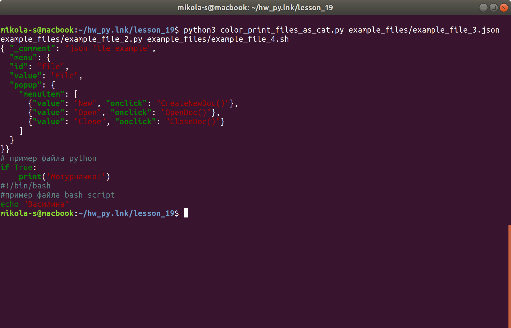

## Домашнее задание №19

### для создания окружения (virtualenv)

в проекте использованы:
- python 3.7
- pygment 2.4.2

Для установки окружения

    $ python3.7 -m venv .venv
    $ pip install -r requirement.txt

проект тестировал в Ubuntu 18.04 Bionic Beaver 

### 1 уровень
 
> Реализовать программу `cat` в питоне. 
> Программа должна принимать один аргумент 
> в виде файла, который необходимо считать построчно 
> и выдать результат на `stdout`. 
> Если файл пустой то выводиться ничего не должно.

-----------------
## print\_file\_as\_cat.py

Выводит в стандартный вывод содержимое одного файла с именем указанным в [<ПУТЬ>]<ФАЙЛ>

------------------

Применение:

    $ python3 print_file_as_cat.py [<ПУТЬ>]<ФАЙЛ>
 

--------------------
Если в [<ПУТЬ>]<ФАЙЛ> есть пробелы то [<ПУТЬ>]<ФАЙЛ> надо писать в кавычках (")

Пример:

    $ python3 print_file_as_cat.py "file with spaces.txt" 
    $ python3 print_file_as_cat.py "./dir with space/text.txt"

-------------------

Если параметр [<ПУТЬ>]<ФАЙЛ> не указан выводит print_file_as_cat.\_\_doc\_\_

```
Выводит содержимое файла в стандартный вывод

Применение:
$ python3 print_file_as_cat.py [<ПУТЬ>]<ФАЙЛ>

Дополнительная информация: <https://github.com/mikola-s/python_home_work/tree/master/lesson_19>

```
--------------------

Примеры использования:

```

$ python3 print_file_as_cat.py example_files/example_file_1.txt
пример текстового файла
для домашнего задания
к уроку 19

$ python3 print_file_as_cat.py example_files/example_file_2.py
#пример файла python
print('Мотурначка!')

``` 
    
-----------------
### Описание функций:

#### processing\_input(input\_str)

проверяет есть ли в `input_str` путь и является ли он путем к файлу
если файл не существует или путь неправильный возвращает сообщение об ошибке

    :param input_str: <строка содержащая путь и имя файла>
    :return: <путь и имя файла> 

-----------------------

#### open_and_read_file(path_file)

открывает файл на чтение и считывает его построчно в список

    :param path_file: строка содержащая [<ПУТЬ>]<ФАЙЛ>
    :return: список со строками файла

------------------
#### print_file(list_of_file):

выводит элементы списка в стандартный вывод

    :param list_of_file: <одномерный список>

---------------

#### print_file_as_cat(argument)

Основная функция реализуюцая остальные.  
Выводит содержимое файла в стандартный вывод

    :param argument: [<ПУТЬ>]<ФАЙЛ> 

------------


### 2 уровень 

> реализовать программу как с любым количество аргументов.

------------

## print\_files\_as\_cat.py

Выводит содержимое одного или нескольких файлов в стандартный вывод

В программе используется модуль `print_file_as_cat`

------------

Применение:

    $ python3 print_files_as_cat.py [<ПУТЬ1>]<ФАЙЛ1> [[<ПУТЬ2>]<ФАЙЛ2> ...]

-----------------

Если в [<ПУТЬ>]<ФАЙЛ> есть пробелы то [<ПУТЬ>]<ФАЙЛ> надо писать в кавычках (")

Пример:

    $ python3 print_files_as_cat.py "file with spaces.txt" "./dir with space/text.txt" 

-------------------

Если параметр [<ПУТЬ>]<ФАЙЛ> не указан выводит print_files_as_cat.\_\_doc\_\_

```
Выводит содержимое одного или нескольких файлов в стандартный вывод

Применение: $ python3 print_files_as_cat.py [<ПУТЬ>]<ФАЙЛ> [[<ПУТЬ>]<ФАЙЛ> ...]

Дополнительная информация: <https://github.com/mikola-s/python_home_work/tree/master/lesson_19>

```

----------------
            
Примеры использования:
```
$ python3 print_files_as_cat.py example_files/example_file_1.txt example_files/example_file_2.py 
пример текстового файла
для домашнего задания
к уроку 19
#пример файла python
print('Мотурначка!')
``` 
----------------

### описание функции:

#### print_files_as_cat(files_list)

Основная функция модуля. Печатает один или несколько файлов в стандартный вывод.

Поэлементно передает в функцию `print_files_as_cat` из модуля `print_files_as_cat` элементы списка `files_list`  

    :param files_list: [<ПУТЬ1>]<ФАЙЛ1>, [[<ПУТЬ2>]<ФАЙЛ2>, ...] 


----------------------

### 3 уровень 

> Реализовать программу cat с любым количеством аргументов 
> \+ добавить раскраску для вывода.
> Файл должен раскрашиваться в зависимости от типа файла. 
> Например у `json` должна быть одна раскраска, у `yaml` файла другая.
> Библиотека которая поможет в раскраске файля http://pygments.org/
---------------

## color\_print\_files\_as\_cat.py 

Выводит содержимое одного или нескольких файлов в стандартный вывод раскрашенное соответственно типу файла и коду в файле.

В программе используется модули `pygments` (http://pygments.org/) версия 2.4.2 и `print_file_as_cat`  

--------------

Применение:

    $ python3 color_print_files_as_cat.py [<ПУТЬ>]<ФАЙЛ> [[<ПУТЬ>]<ФАЙЛ> ...]
    
-----------------

Если в [<ПУТЬ>]<ФАЙЛ> есть пробелы то [<ПУТЬ>]<ФАЙЛ> надо писать в кавычках (")

Пример:

    $ python3 color_print_files_as_cat.py "file with spaces.txt" "./dir with space/text.txt" 

-------------------

Если параметр [<ПУТЬ>]<ФАЙЛ> не указан выводит color_print_files_as_cat.\_\_doc\_\_

```
Выводит содержимое одного или нескольких файлов в стандартный вывод
раскрашенное соответственно типу файла и коду в файле

Применение:
$ python3 print_files_as_cat.py [<ПУТЬ>]<ФАЙЛ> [[<ПУТЬ>]<ФАЙЛ> ...]

Дополнительная информация: <https://github.com/mikola-s/python_home_work/tree/master/lesson_19>

```

------------

Примеры использования:

    $ python3 print_files_as_cat.py example_files/example_file_1.txt example_files/example_file_2.py
    


-------------

### описание функций:

#### print_colored_file(file_path, file_list)

выводит содержимое файла, раскрашенное соответственно типу файла и коду в файле, в стандартный вывод 

    :param file_path: [<ПУТЬ>]<ФАЙЛ>
    :param file_list: <список со строками файла>
    
-------------
    
#### color_print_files_as_cat(files_list)

Основная функция модуля. Печатает один или несколько файлов, раскрашенных соответственно типу файла и коду в файле, в стандартный вывод.

    :param files_list: [<ПУТЬ1>]<ФАЙЛ1>, [[<ПУТЬ2>]<ФАЙЛ2>, ...]
    
    


    


